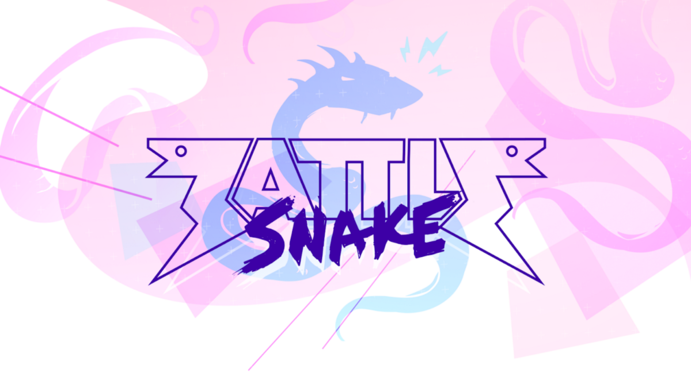
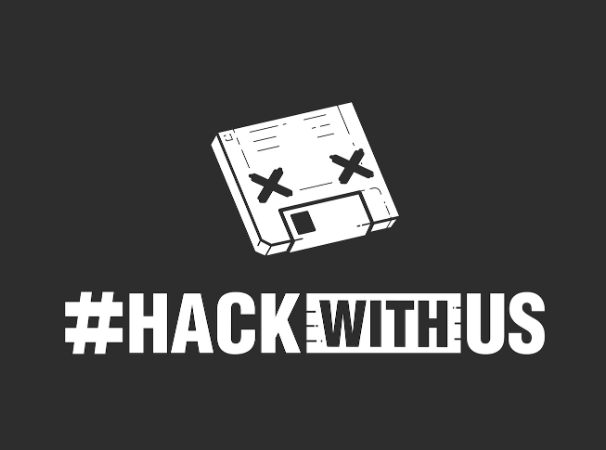
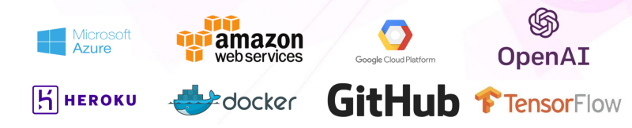
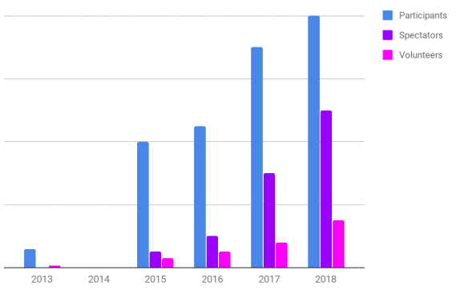
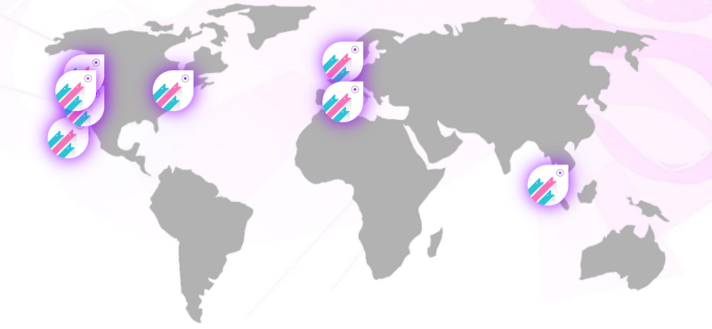
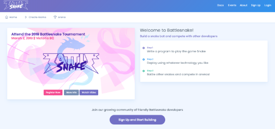
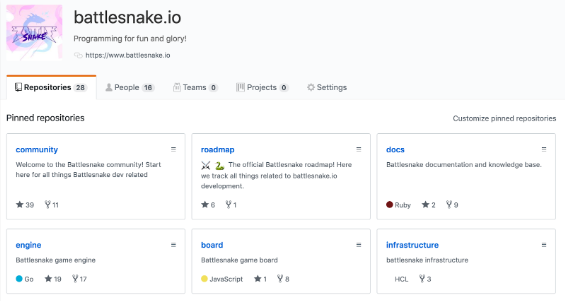

### What if programming was fun and accessible for **everyone**?

This past weekend we held the [5th Annual Battlesnake Tournament](https://events.battlesnake.io/tournament) in Victoria BC Canada. It was easily the best event we’ve ever organized, with over 200 teams registering to compete and nearly 1,000 participants, spectators, and sponsors attending throughout the day.

<!--truncate-->

If you weren’t able to attend and are curious about the event, the entire tournament is available to watch on [Twitch](https://www.twitch.tv/battlesnakeio). A quick note though: [nothing beats attending a Battlesnake event in person](https://www.twitch.tv/videos/389395340?t=00h27m00s).

This year’s event has us thinking hard about the future of Battlesnake, both what it has become and where it could go. We’re pretty excited about both and would like to share our thoughts with the Battlesnake community.

## **The Story So Far…**

Battlesnake started in 2013 when Matt Harris and I got together with some programmer friends (23, to be exact) and we challenged everyone to write programs to beat each other at [the game snake](https://en.wikipedia.org/wiki/Snake_%28video_game_genre%29). We affectionately called it “Hackwithus”, after our company Sendwithus.
Original Battlesnake Logo, 2013
In 2015 we held the first actual “Battlesnake” at the University of Victoria. The turnout was huge, and Matt and I knew then we had stumbled onto something very unique and incredibly fun.

Since then, Battlesnake has had over 3,000 developers participate and more than 1,250 friends, families, and spectators have come out to watch and cheer. We’ve outgrown two venues and three iterations of the game engine. We’ve also given away more than $50,000 in cash prizes.

This is all very, very cool, and entirely unexpected given our humble beginnings. But much more importantly, Battlesnake has also begun to have a broad, long-lasting impact on the community around it.

### **Battlesnake is helping programmers learn new skills every year.**

Almost all participants use Battlesnake as a reason to learn something new. Sometimes it’s a new programming language, a new cloud platform, or more recently, learning Machine Learning technologies. What’s extra interesting about this is that they aren’t learning alone. There’s always another team or another developer who’s learning at the same time, or has already built a snake using that particular technology. And because Battlesnake is immensely collaborative, everyone helps each other succeed in their learning.
Some of the technologies Battlesnake participants learn every year.
### **Battlesnake is helping developers get hired.**

Every year we see more resumes that list Battlesnake experience, win or lose. And it’s not just us; other founders and employers we talk to are seeing the same thing, and it’s working! We know of at least a dozen programmers who were hired into their current roles after competing in Battlesnake, and these are full-time roles, not just co-op or intern positions. This is very exciting and further indicative that we’re doing something right for the community.

### **Battlesnake is inspiring new programmers to start coding.**

We hear this all the time and this year was no exception. Friends and family members who attend Battlesnake get intrigued by the idea and return following years to participate. This happens for a couple reasons, but mostly because the game snake is a) universally recognizable, b) mechanically simple, and c) strategically complex. Anyone can watch a game and immediately understand who’s winning, why, and the strategies being used, and that inspires them think about how they’d play the game and to want to try it themselves.

### **Battlesnake is growing.**

It’s growing entirely organically, and frankly faster than we can handle. In fact Battlesnake is out-pacing other well-known global tech events, simply because it attracts such a wide audience.
Battlesnake Victoria Growth Since 2013
### **Battlesnake is growing globally.**

Not only is the Victoria event growing every year, but more and more programming groups around the world have asked us to help them run their own Battlesnake events. We get emails almost weekly about this sort of thing and we do everything we can to support them (including tech, branding, and sponsorship whenever we can).
Battlesnake events run in 2018
This is all incredibly inspiring for the entire Battlesnake team. We’d never imagined the impact we could have with what started as a silly, friend-only programming event.

If you were to ask us right now what Battlesnake is and why it exists, our answer would be simple: *“Battlesnake is making programming fun and accessible”*. And that’s what motivates us to keep growing it.

## This Year and Beyond

The question we’re faced with now is “what comes next?” We’ve thought about this long and hard, and there are many ideas for growth and new directions. The one that excites us the most though is both the simplest and probably the largest:

> **“What if Battlesnake made programming fun and accessible for ***everyone*?**”**

That’s a big, lofty goal and that’s exactly what we’re going to work towards. To that end, here are our plans for the coming year.

### Launch Our New Platform

First, we’re going to launch a new platform where anyone in the world can discover Battlesnake, quickly build a snake, and create games with friends. In fact we’ve already started! [It’s available now at play.battlesnake.io](https://play.battlesnake.io/), and anyone can sign up and participate.
play.battlesnake.io
This is the same platform that ran the 2019 Battlesnake Victoria event so it’s already been tested by the best snake developers out there. We have really big plans and ambitions for what this platform could become and we’re excited to get started.

### Create an Open Source Community

From this point forward, all Battlesnake platform and engine development will happen [publicly on GitHub](https://github.com/battlesnakeio). This means anyone can see what we’re working on, [what changes are coming up](https://github.com/battlesnakeio/roadmap), and get involved by submitting pull requests.

You can check it all out at [github.com/battlesnakeio](https://github.com/battlesnakeio/). We’ll also start running regular community meetups (more to come on that) and posting here about changes we make as things grow.

### Support Even More Global Events

Lastly, we want to support even more events run by companies, students, and developer groups around the world. We’re amazed at how many people have started their own Battlesnake communities and we want to do everything we can to help them grow.

This will take many forms over the coming year and we’re looking forward to working closely with event organizers and global sponsors to help these events have as much impact as possible.

And so that’s the future of Battlesnake. We want to make programming fun and accessible for everyone, and we’re going to work hard to make that happen. [You can learn more about this in our Mission Statement](https://play.battlesnake.io/about/mission/).

**Do you have ideas, or want to be involved? **Awesome, we need your help and we’d love to hear from you. You can connect with us directly on [Slack](https://play.battlesnake.io/slack/), [Twitter](https://play.battlesnake.io/twitter/), or [GitHub](https://github.com/battlesnakeio).

Thanks!
~ Brad
