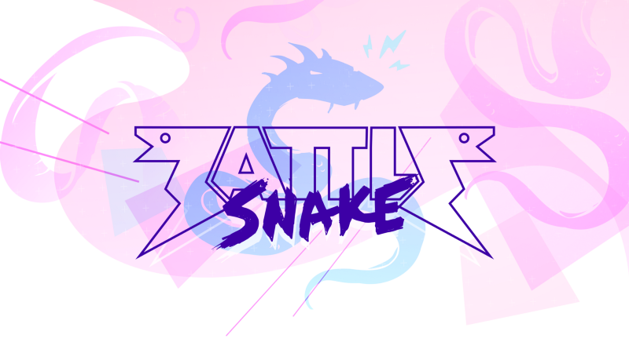
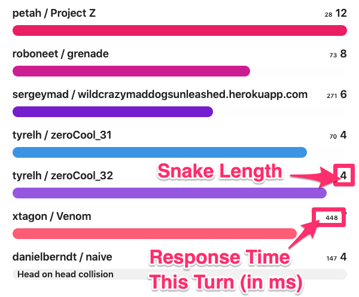
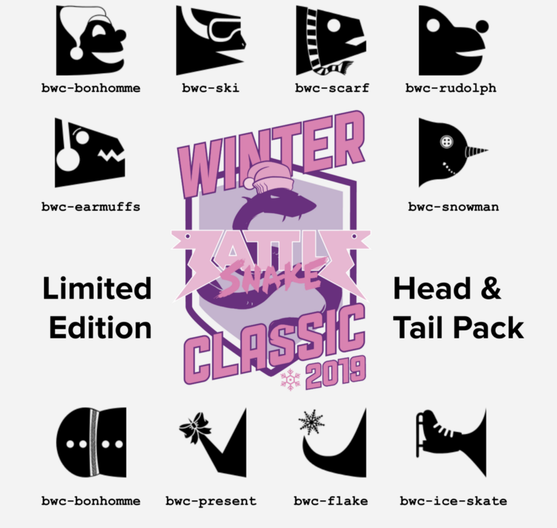

This is our first official Developer Update! We will be doing these regularly to outline some of the changes we are making to Battlesnake, whether those are exciting new features, system improvements or just bugs fixes.

<!--truncate-->

Here are some of the things we did in December 2019:

### News Feed

The site now has a news feed where we will post updates like this as well as other notices about what’s going on with Battlesnake. The blog will continue to exist but will be used for longer form content. The news feed is also available through RSS!

### New User Profiles

Everyone can now update their usernames! In addition, we have provided a few more data points that will let you tell us and other users more about yourself including a bio, your experience programming and where you are from. We hope to roll out updated public profiles for our users in the coming months.

Go to the [Account Settings](https://play.battlesnake.com/account/settings/) page to make the changes.

### Board Improvements

Snake lengths are now being displayed on the game boards. This should make it easier to know why some snakes die in head on collisions instead of needing to count tiles.

We have also added response times to the game boards. The small number next to the snake length is the time, in milliseconds, it took that snake to respond to the last move request. The number should make debugging strange snake behaviour a little easier. Keep in mind, when you see a *0 ms* result it means the snake failed to respond to the request inside of the 500 ms time cap or the request failed with a network error.

### New Heads and Tails

With the completion of the Battlesnake Winter Classic we have released a new set of winter themed snake heads and tails for everyone to use.

Go to the [Snake Customization](https://docs.battlesnake.com/snake-customization) page to check out how to use the new options.

### Github Repository Migration

We are currently in the process of migrating all of our public repositories on GitHub to a new organization called [BattlesnakeOfficial](https://github.com/battlesnakeofficial). The **board** and **engine** repos are already moved over and we expect to have the rest of them moved by the end of January, 2020. Be sure to update the origins of any local copies to ensure you keep getting the latest changes.

### Request for Comment: Food Spawning

We are researching some new ways to handle initial food spawning for tournament and arena games. Ideally, a new solution is needed that is more fair for all teams; no matter what the size of the board or distribution of snakes. We are looking for feedback on this problem and some potential solutions. If you are interested in contributing, check out the discussion [here](https://github.com/BattlesnakeOfficial/engine/issues/1).

---

That’s all for now. Thanks to everyone who supported Battlesnake in 2019 and we can’t wait to show you everything we have planned for 2020!
