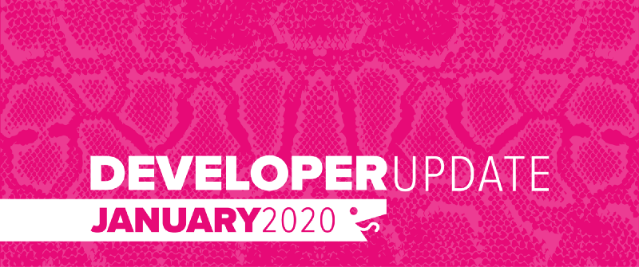

January had us working on internal systems to improve performance, stability and support some of the initiatives we have planned for the year. That said, we have managed to squeak in a few public changes to the system as well:

<!--truncate-->

### Engine Refactor

As part of our infrastructure changes, a portion of the [engine](https://github.com/BattlesnakeOfficial/engine) was split out into a new project call [Rules](https://github.com/BattlesnakeOfficial/rules). We wanted to differentiate between the code involved in game orchestration from the core game logic. This should allow us to do some interesting things in the future by running different kinds of rule sets dynamically in the same environment.

### New Food Algorithm

After soliciting some feedback in December, we have reworked the food spawn algorithm to be simpler and less deterministic. The previous iteration was much more predictable than we desired, so the new version adds more randomness. In simple terms, if there is no food on the board, food will spawn. If there is food on the board, then there is a 15% chance another piece of food will be spawned. Food spawn locations are randomized.

We will continue to review stats and feedback on the change, so expect to see further tuning over the next few weeks. You can review the changes in the [Rules](https://github.com/BattlesnakeOfficial/rules) project on Github.

### Github Repository Migration

As announced in last month’s developer update, we migrated all of our public repositories on GitHub to a new organization called [BattlesnakeOfficial](https://github.com/battlesnakeofficial). Over February we will be deprecating the old *battlesnakeio* organization. Be sure to update the origins of any local copies to ensure you keep getting the latest changes.

### Coming Soon: Teams!

We are introducing a new entity to the Battlesnake system called Teams. Teams represent a group of one or more developers who are engaging with our events and tournaments. In the past teams were ephemeral, lasting only for the duration of an event, but now teams can persist and build up a history of participation! Teams created for the Battlesnake Winter Classic will be migrated over to this system and associated with the appropriate users. Initial functionality will roll out early February, with additional features in the following weeks, in preparation for Battlesnake 2020 in Victoria.

That’s all for now. If you have any questions reach out to us on the [Battlesnake Slack](http://play.battlesnake.com/slack) workspace.
