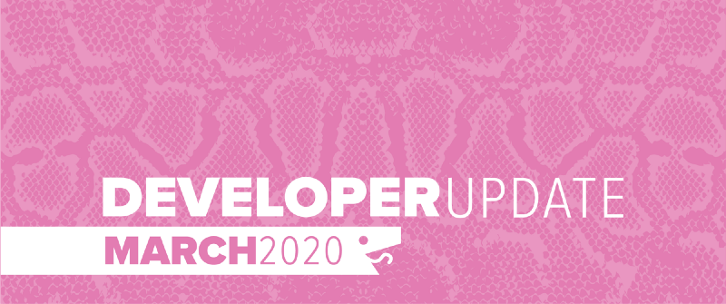

While March did not go as planned, we have redirected our energy to new features and improving the usability of the Battlesnake environment. Over the next few months, Battlesnake will be focusing on more virtual and streaming events, so keep an eye on both the [Events](https://play.battlesnake.com/events/) page and the [Battlesnake Twitch](https://www.twitch.tv/battlesnakeofficial) channel!

<!--truncate-->

### Global Arena

The new [Battlesnake Global Arena](https://play.battlesnake.com/arena/global/) went live at the start of March. Since then we’ve added numerous enhancements to the match and scoring algorithms to improve both the quality and fairness of the games. We are still working on improving the layout to be easier to use for everyone.
New Arena Layout
### New Feature: Team Snakes

As an extension to the Team system we introduced in February, we have now made it possible for Teams to register and manage their own Battlesnakes. A big part of Battlesnake is developers working together in groups and building a snake collaboratively. This feature will allow teams to compete in events and on the arenas using the team Battlesnake instead of a team member’s individual Battlesnake.
Team Snakes
### Revised Starter Snakes

All of the official Starter Snakes have received some major attention. We have standardized the READMEs for each snake to be consistent and act as a guide for getting started. We have also updated the code to be more consistent across the implementations. Our goal is to help users get a snake running quickly on play.battlesnake.com so that users can get their snake competing in events and on the global arena.

Check out the official starter snakes here:

- [Go Starter Snake](https://github.com/battlesnakeofficial/starter-snake-go)
- [Java Starter Snake](https://github.com/battlesnakeofficial/starter-snake-java)
- [JavaScript (Node) Starter Snake](https://github.com/battlesnakeofficial/starter-snake-node)
- [Python Starter Snake](https://github.com/battlesnakeofficial/starter-snake-python)
- [Ruby Starter Snake](https://github.com/battlesnakeofficial/starter-snake-ruby)

We have many Community Starter Snakes in [github.com/BattlesnakeOfficial](https://github.com/BattlesnakeOfficial) and are looking for open source contributors to update them as well. If you are interested in contributing, make sure to use the [Python Starter Snake](https://github.com/battlesnakeofficial/starter-snake-python) as a template and review our [contribution guidelines](https://docs.battlesnake.com/contribute).

### Documentation Updates

We are working through the documentation on [docs.battlesnake.com](https://docs.battlesnake.com) and cleaning up the content. You will notice a reorganization of pages and menus. We have also removed out-dated content in order to make the site the best possible resource for developing your Battlesnake. The very old *getting started guides* are now gone. Instead, we are focusing on the Starter Snakes to teach new users how to create a Battlesnake.

### Game Creation Enhancements

The game creation form has been reworked to make it both more user friendly and more useful for testing. The form now provides easy access to all of the Battlesnakes that you own, as well as the snakes that are registered with any of your teams.
Updated Game Creation Form
### Rematch Button

After viewing a game, there is now a Rematch button that will appear for games that can be run again. This is very useful for retesting your snake. The button will *only* appear if the game was created using snakes that you manage or are publicly accessible on the site.

---

That’s all for now. If you have any questions reach out to us on the [Battlesnake Slack](http://play.battlesnake.com/slack) workspace.
