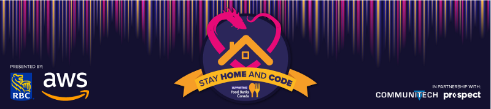
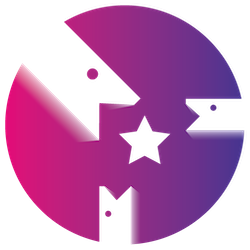
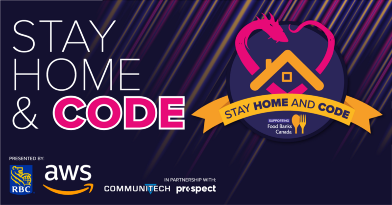

### Supporting Food Banks Canada. Presented by RBC and AWS.

The COVID-19 crisis in Canada has forced everyone into new realities and routines. For Battlesnake, this has meant [postponing all in-person events](https://medium.com/battlesnake/battlesnake-victoria-2020-postponed-8bf51b38c20f) until it is possible to hold them safely. It also means doing what we can to support all Canadians during these difficult times.

<!--truncate-->

Today we’re launching [Battlesnake: Stay Home & Code](https://play.battlesnake.com/events/stay-home-and-code/), an online programming league raising money for [Food Banks Canada](https://www.foodbankscanada.ca/).

### Event Details

Starting today developers of all skill levels can[**join the league**](https://play.battlesnake.com/events/stay-home-and-code/), enter their favourite Battlesnake into a ranked arena, and compete online with developers around the world — all for a great cause.

On April 25th, we’ll take the top teams and hold a large **Battlesnake Tournament**, live broadcast on the [Battlesnake Twitch Channel](https://twitch.tv/BattlesnakeOfficial). It’ll be filled with prizes and programming as we come together with our community to raise money for those in need.

Battlesnake: Stay Home & Code also features our first ever **“Parents and Kids” Division**, specifically for teams comprised of parents programming with their children. There is also a **Sponsor Division**, for tech companies that would like to donate money and participate as a team. If you are a tech company wishing to participate, please see links at the bottom of this post.
Stay Home & Code introduces a new “Parents and Kids” Division for parents programming with their children.
### We Couldn’t Do This Alone

We’ve partnered with [**RBC**](https://www.rbcroyalbank.com/personal.html)and [**Amazon Web Services**](https://aws.amazon.com/) to bring this event to life and we are deeply grateful for their support. We’re also working closely with [**Communitech**](https://www.communitech.ca/) and [**Prospect**](https://www.prospect.fyi/) to ensure all developers across Canada can get involved. These organizations are some of the best advocates for the Canadian tech community and we’re proud to be working alongside them.

### Why Are We Doing This?

Far beyond the challenges of remote work and stay-at-home fatigue, there are many Canadians whose basic needs are not being met during this crisis. A staggering 4.4M Canadians do not have access to the food required for essential dietary needs, and organizations tasked with combating food insecurity in Canada are already strained.

Our goal is simple. We want to rally our community to support organizations that are operating on the frontlines. We are proud to partner with Food Banks Canada in this effort, and thankful for the opportunity to help.

We also want to connect tech community members who have recently lost their roles with potential employers across all of Canada. We firmly believe that it’s important for us to do everything we can to keep everyone afloat and this is one way we can help.

---

**To learn more about Battlesnake: Stay Home & Code and our live stream schedule, **[**visit the official event page here**](https://play.battlesnake.com/events/stay-home-and-code/)**.**

If you’re interested in participating as a family, an individual, or a team, [visit the registration page here](https://play.battlesnake.com/events/stay-home-and-code/).

If you represent a company that would like to get involved or join the Sponsor Division, please contact us at [events@battlesnake.com](mailto:events@battlesnake.com).

And finally, if you’d like to **donate to Food Banks Canada** and support events like these, [please do so here](https://foodbankscanada.akaraisin.com/Donation/Event/DonationInfo.aspx?seid=22130&amp;mid=48). Your kindness will go a long way in helping all Canadians get through this crisis together.

Thanks, and stay safe.
The Battlesnake Team
