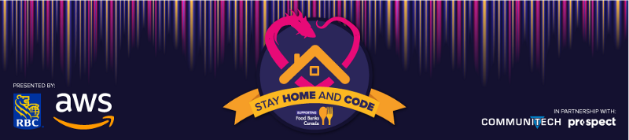
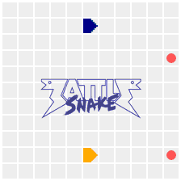
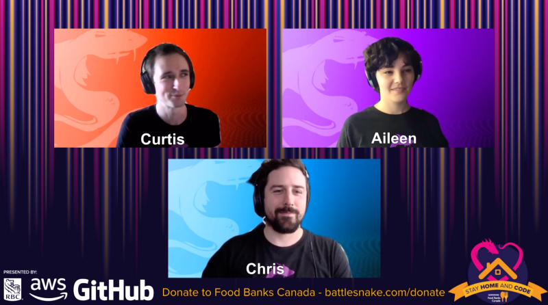

Throughout April we’ve been running an online programming league called [Stay Home and Code](https://medium.com/battlesnake/battlesnake-stay-home-and-code-123746cc04ea),raising money for Food Banks Canada.
Stay Home and Code was presented by RBC and AWS, in partnership with Communitech and Prospect.
Over 300 developers from all over Canada (and around the world!) stayed home to build, tweak, and fine-tune their Battlesnakes in preparation for a [live Battlesnake tournament](https://www.twitch.tv/videos/602731416?t=00h12m25s) held on April 25th. The event has been a lot of fun, and we were humbled by how our community rallied to support a great cause. Together we raised $25,000.

<!--truncate-->

Congratulations to all the teams who participated, especially [***Team Pixel***](https://play.battlesnake.com/events/stay-home-and-code/stay-home-and-code-parent-child/brackets/), [***Redbrick***](https://play.battlesnake.com/events/stay-home-and-code/stay-home-and-code-sponsor/brackets/), [***chkgang***](https://play.battlesnake.com/events/stay-home-and-code/stay-home-and-code-rookie/brackets/), and [***huntail***](https://play.battlesnake.com/events/stay-home-and-code/stay-home-and-code-veteran/brackets/) for taking the top prize in their divisions.
Team Pixel defeating Dragon in a Library in the Parent & Kids Finals
We’d like to thank our partners at [RBC](https://jobs.rbc.com/ca/en/featuredopportunities/technology-jobs) and [AWS](https://aws.amazon.com/) for making this event possible, as well as [Communitech](https://www.communitech.ca/) and [Prospect](https://www.prospect.fyi/) for supporting our community. We’d also like to thank everyone who volunteered their time to run workshops, tutorials, fireside chats, and more throughout the event.

In no particular order, thank you *Curtis Smith, Aileen O’Brien, Chris Cook, Brandon Brown, Aurora Walker, Joe Nash, Colin Walker, Daniel Steuernol, John Oram, Marianne Bulger, Kathryn Christie, Xavier Raffin, Gage Pacifera,**Dr. Andrew Maxwell, Anthony Vacca, Jeremy Lim, Sandra Jennings, and Riyan Mody.*
Battlesnake Casting Crew doing analysis on the highly competitive Sponsor Division
Our goal was simple: engage our community and rally to support organizations operating on the frontlines of the COVID-19 crisis, and we’re proud and thankful to have such an opportunity.

Thank you, and stay safe!

The Battlesnake Team
