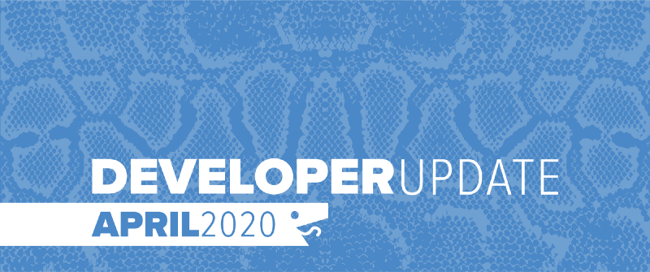

In April, our development focus was on features supporting virtual events and tournaments, more specifically our Stay Home and Code event. Out of that came a lot of site enhancements, quality of life improvements and several bug fixes to the arena system. Battlesnake will be launching several new virtual streaming events over the coming months, so keep an eye on the [Events](https://play.battlesnake.com/events/) page.

<!--truncate-->

## Virtual Events

There is now a new interface for virtual events on the site that allows users to register for these events, view content schedules and enter into online tournaments. We will continue to enhance this interface so that it becomes the primary hub to interacting with each event we have planned.

## Tournament Arenas

With the Stay Home and Code event we have introduced a new type of qualifier arena that lets registered users trial their Battlesnakes well before tournament day. We then use the results of these arenas to setup the brackets on tournament day.

## New Tutorials

As part of Stay Home and Code we created a collection of new tutorial content to help those new to Battlesnake get started building their own snake. There are tutorials focused on Python, Go, JavaScript as well as some on more advanced topics like early strategies and setting up unit testing for your snake.

You can find them all on the [BattlesnakeOfficial Twitch Channel](https://www.twitch.tv/battlesnakeofficial/videos).

---

That’s all for now. If you have any questions reach out to us on the [Battlesnake Slack](http://play.battlesnake.com/slack) workspace.
