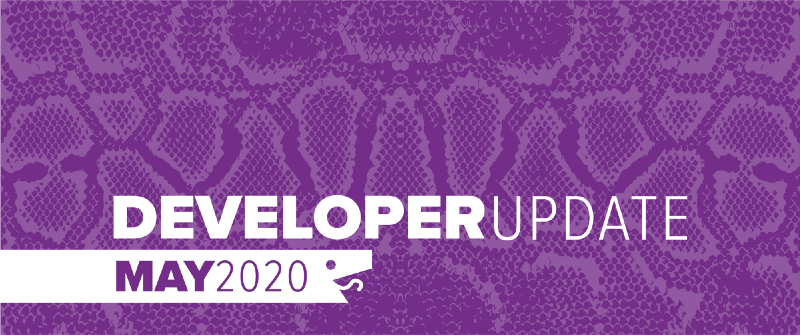
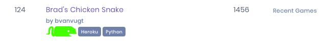
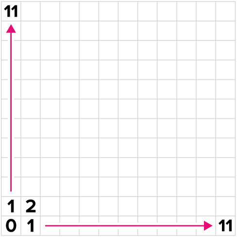
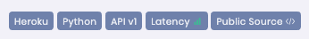

May was all about helping new Battlesnake developers get started on the platform and creating their Battlesnakes. We have introduced a new version of the API and associated documentation, as well as fixed a few legacy design issues that we saw as road blocks.

<!--truncate-->

## Fresh Docs

[Docs.battlesnake.com](https://docs.battlesnake.com) is now rebuilt and hosted on GitBooks, a great platform that has really improved the quality and consistency of our documentation. As part of the migration we have done another pass on the docs, revising many of the pages and removing several deprecated documents. This new system is still using GitHub as a backend which allows our community members to continue contributing to our documentation via pull requests.

## Battlesnake API 1.0

The Battlesnake API has gone through a major revision and we have versioned it 1.0. Legacy snakes will be marked as API version 0 and will continue to work as normal on the platform.

This new version of the API makes several important changes.

### New Index Command

The old *POST /ping* endpoint is no longer used and now we require Battlesnakes to implement a new *GET /* endpoint that will return metadata about the Battlesnake. This is now how snakes can be customized and where they will will identify their supported API version. A bonus feature of this change, is the site can now display snakes customizations on the [Global Arena](https://play.battlesnake.com/arena/global/) and in tournaments. Check out the docs for how to implement this new command: [https://docs.battlesnake.com/references/api#undefined](https://docs.battlesnake.com/references/api#undefined)
Snake customization in the Global Arena
### New Coordinate System

Battlesnakes that utilize the new API will now receive the board data with a coordinate system origin (0,0) located in the bottom left corner of the board. We found this layout more intuitive for new Battlesnake developers and better matches how people expect the board to work.

For more details check out the docs: [https://docs.battlesnake.com/references/api#board](https://docs.battlesnake.com/references/api#board)
Updated Coordinate System
### Battlesnake Data Shortcuts

The snake data now provides root properties for the head location and snake length. Both of these concepts are very important for building a snake and users no longer have to infer the value from the *body* array.

    {
     “id”: “totally-unique-snake-id”,
     “name”: “Sneky McSnek Face”,
     “health”: 54,
     “body”: [
       {“x”: 0, “y”: 0}, 
       {“x”: 1, “y”: 0}, 
       {“x”: 2, “y”: 0}
     ],
     “head”: {“x”: 0, “y”: 0},
     “length”: 3,
     “shout”: “why are we shouting??”
    }

### Timeouts

The Battlesnake Engine will now provide a timeout value to your server with every request, defining how long the snake has to send a response back. The default continues to be 500 ms, but big processing snakes should start inspecting this value and be responsive to games where it is not set to 500 ms.

For more details check out the docs: [https://docs.battlesnake.com/references/api#game](https://docs.battlesnake.com/references/api#game)

## Updated Starter Projects

The official Battlesnake starter projects have all been upgraded to use Battlesnake API 1.0 and in some cases refined to be easier to understand and build from.

[Python Starter Project](https://github.com/BattlesnakeOfficial/starter-snake-python)

[Node Starter Project](https://github.com/BattlesnakeOfficial/starter-snake-node)

[Go Starter Project](https://github.com/BattlesnakeOfficial/starter-snake-go)

We are looking for assistance to do similar upgrades to the [Ruby Starter Project](https://github.com/BattlesnakeOfficial/starter-snake-ruby/issues/8) and the [Java Starter Project](https://github.com/BattlesnakeOfficial/starter-snake-java/issues/5). If you are interested in helping, check out the associated issues on GitHub for requirements.

## Public Source Snakes

If you have a Battlesnake you are especially proud of, you can now link your Battlesnake to your public source code and share it with everyone. Just edit your Battlesnake and add a Project URL linking to your open source repo. A new public source tag will appear on your snake that other developers can click on and check out what you made.
New Public Source tag
## Developer Advisory Group

We have established a group of Battlesnake developer volunteers to help us review new features and updates that we have planned for the Battlesnake ecosystem. They have been a great resource to help us refine the Battlesnake API changes as well as some interesting new game modes that are coming soon!

---

That’s all for now. If you have any questions reach out to us on the [Battlesnake Slack](http://play.battlesnake.com/slack) workspace or on [Battlesnake Discord](https://play.battlesnake.com/discord/).
