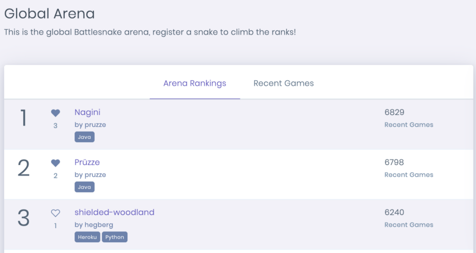

June had us investing heavily into the platform, both improving the user experience and adding new features to make life easier for Battlesnake developers. Many of these changes are already live, with more of them being revealed as we launch the [Battlesnake Summer League](https://play.battlesnake.com/events/summer-league/?ref=dujune) on July 6th.

<!--truncate-->

## Email Authentication

In order to make it easier for people to participate in Battlesnake we have added email authentication as an alternative to GitHub for our user accounts. Even if you have already authenticated with your GitHub credentials, you can now set a password on your account and use email authentication as an alternative way to login to [play.battlesnake.com](https://play.battlesnake.com)

## Arena Cheers!

Are you a fan of a Battlesnake on the Global Arena and want to show your support? You can now cheer on all those Battlesnakes with great names and even greater algorithms.

Just find the Battlesnake you like and click on the heart icon to cheer for them.
Updated Arena UI with Cheers
## New Division: Elite

The Elite Division is a new top-level division that we are adding to many of our Battlesnake competitions going forward. We know that some developers have been on the platform for years and spent a long time perfecting their algorithms. This new division will provide a place for those high performing Battlesnakes to complete. This change will subsequently open up the Veteran division making it more competitive and allow many developers to graduate out of the Rookie tier.

## Battlesnake on Twitch

We love doing live streams and we are working hard to bring new ideas to our channel on Twitch. This includes new features for our competition broadcasts such as an arena game livestream as well as enhanced visuals for our tournaments. Subscribe to the [BattlesnakeOfficial](https://twitch.tv/BattlesnakeOfficial) channel on Twitch.tv to get notified on all the content we are putting out over the next few months.

---

That’s all for now. If you have any questions reach out to us on the [Battlesnake Slack](http://play.battlesnake.com/slack) workspace.
