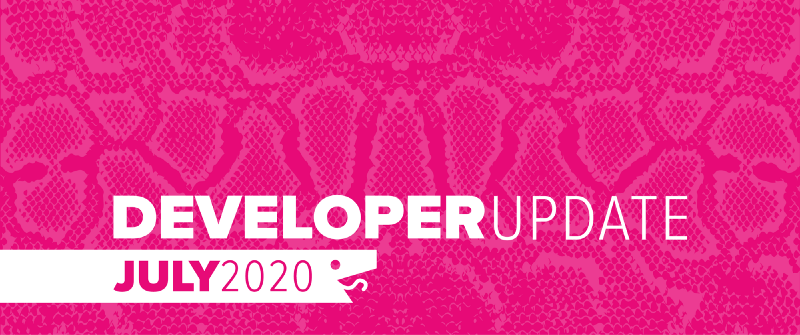
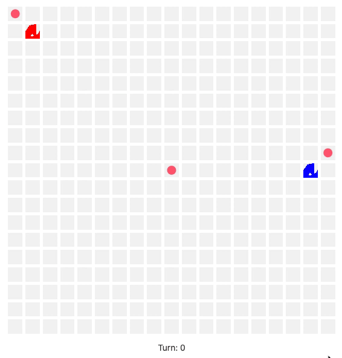
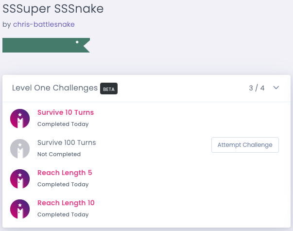
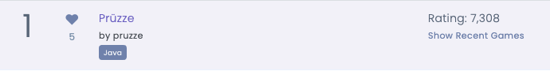
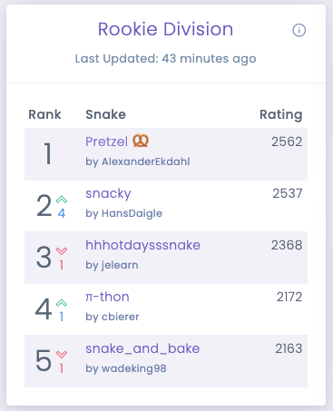

July was all about giving our users more to interact with on B[attlesnake.com](https://play.battlesnake.com)! With the [Battlesnake Summer League](https://play.battlesnake.com/events/summer-league/?ref=dujuly) in full swing we have added several new ways to show off your Battlesnake development skills.

<!--truncate-->

## Battlesnake Royale

With the Summer League August Challenge Arena, we introduced a new game mode called Battlesnake Royale. In this mode, hazard zones will begin growing randomly from the sizes of the board at regular intervals. Battlesnakes whose heads start their turn on a hazardous area will take damage. Algorithms will need to be adjusted to determine when it is worth moving into the hazard zone in order to grab food or out maneuver another a foe.

Check out the [Battlesnake API docs](https://docs.battlesnake.com/references/api#board) to see how to update your Battlesnake to react to the new hazard data provided in */move* requests.
Sample Battlesnake Royale Game
## Battlesnake Challenges are now in open Beta

We’ve been working on a new way to develop and improve your Battlesnake, before you go try out one of our competitions. These new Challenges offer some interesting scenarios and milestones for you to test your Battlesnake’s code and decision making early on.
A Battlesnake with some challenges completed
Head to your Battlesnake’s profile page and you will see the list of available challenges that the Battlesnake can attempt! This feature is still in beta and will be refined over the coming weeks.

## Cheers

Are you a fan of a Battlesnake with a really cool name or innovative algorithm? You can now show support for these Battlesnakes by cheering for them in the arenas. Just find the interesting Battlesnake on the arena leaderboard and then click on the heart icon to cheer for them.
Prüzze with some cheers
## Social Profile Links

Battlesnake developers can now update their profile page to include links to their Twitch.tv, LinkedIn, Twitter and Github profiles. You can also link to your personal website which could contain your resume or showcase some side projects.
Active social links on a Battlesnake profile
Many prospective employers, especially Battlesnake competition sponsors, are looking at Battlesnake developers as candidates for jobs. [Updating your profile](https://play.battlesnake.com/account/settings/) to add these profile links may open up some doors!

## Arena Snapshots

We have started experimenting with displaying snapshots of our arena leaderboards instead of always showing live data. Given the volatility of Battlesnake leaderboards, snapshots are better at showing trends and can be used to display how Battlesnakes are moving around on the leaderboard. An example of these snapshots can be seen on the mini-leaderboards, on the Summer League event page.
Leaderboard snapshot from the Summer League Rookie Division Arena
Going forward we will be expanding this out and converting our Global Arena to show snapshots by default and we will be building some new UI around this system

---

That’s all for now. If you have any questions reach out to us on the [Battlesnake Discord](https://play.battlesnake.com/discord/) server or our [Battlesnake Slack](http://play.battlesnake.com/slack) workspace.
