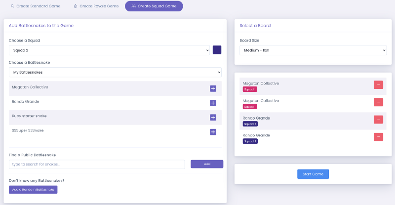

This summer, our goal is to make Battlesnake development more fun and exciting. To that end, we introduced some new features to give users of all skill levels more to do on [Battlesnake.com](https://play.battlesnake.com).

<!--truncate-->

## Battlesnake Challenges

Over the last couple of months, we have iterated on a new Battlesnake Challenges system, which has finally reached a point where it can come out of beta. Challenges provide a set of original scenarios that you can attempt to solve. Each challenge comes with a built-in leaderboard and trophy system, rewarding those who solve the problem the most effectively. Challenges are now tied directly to your account, which means you can build different kinds of Battlesnakes to solve each challenge and aggregate all of the accolades

Head to the [Challenges](https://play.battlesnake.com/challenges/) page to see the leaderboards and try your hand at one of the challenges

## Squad Mode

With the reveal of the final Challenge Arena for the Battlesnake Summer League, we have announced a whole new way to compete with your Battlesnakes: *Squad Mode*.

In this mode, Battlesnakes will compete in cooperative squads against one another. Squad members share core attributes like length and health, growing whenever either snake eats food. Squad members even have the ability to pass over each other’s bodies, allowing for some tricky maneuvers.
Example Squad Mode Game
Squad Mode will require developers to come up with whole new strategies for their Battlesnakes to succeed. To try it out, head to the [Create Squad Game](https://play.battlesnake.com/account/games/squad/create/) page.
Create Squad Mode Game Page
## Custom Royale Games

There was a lot of positive feedback on the Battlesnake Royale challenge arena for the Summer League, we decided to make this game mode available for everyone to continue experimenting with. There is a new [Create Royale Game](https://play.battlesnake.com/account/games/royale/create/) page that will let you setup a game using the Battlesnake Royale ruleset.
Create Royale Game Page
## Live Game Graphs

There is a new panel now displayed below every game board that will show stats related to the game on a turn by turn basis. This can be a fun way to find trends in snake behaviours and identify interesting events during a game.
Game Statistics — Health Graph
## Deprecating API v0

Over the next few months, we will be deprecating support for Battlesnakes that still use Version 0 of the Battlesnake API. There is no cutoff date for support at this time, but new features on the site may not work for these older Battlesnake implementations going forward.

If you need help updating your Battlesnake to the API v1, check out our [Migration Guide](https://docs.battlesnake.com/guides/migrating-to-api-version-1).

---

That’s all for now. If you have any questions, reach out to us on the [Battlesnake Discord](https://play.battlesnake.com/discord/) server or our [Battlesnake Slack](http://play.battlesnake.com/slack) workspace.
