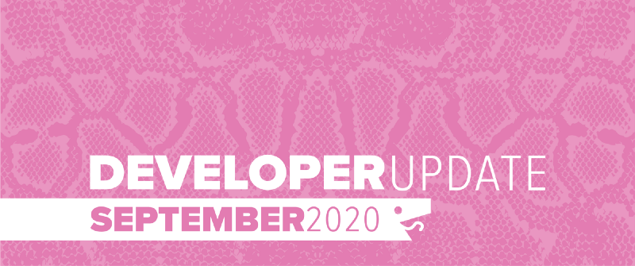
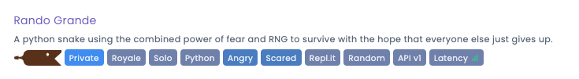

For September we implemented more quality of life improvements for developers and started laying the groundwork for some new features coming this fall.

<!--truncate-->

## API Update: Ruleset

With the new game modes like Battlesnake Royale, Squads and the new challenges, it became important to send information to the Battlesnakes notifying them what kind of game they are participating in. That way developers can alter their AIs to be situational.

The Game object in the data payloads from the engine now look like this:

    "game": {
      "id": "",
      "ruleset" : {
       "name": "royale",
       "version": "v1.2.3",
      },
      "timeout": 500
    }

## Battlesnake Tags

We have added new tags to the system to allow developers to further customize and categorize their Battlesnakes. Beyond expanding the list of languages and platforms, we have added tags for game modes, core strategies and personality types!
So many tags!
## Notifications

Notifications are a new communication channel added to the site to provide a way to better relate timely information to your developer accounts. It will be used by the system to notify you of important changes to your Battlesnake, results of tournaments and any other offline state changes that affect your account.
Notifications button in the navigation bar
## Awesome List

User [xtagon](https://play.battlesnake.com/u/xtagon/) has created an [Awesome List](https://github.com/xtagon/awesome-battlesnake) resource for all Battlesnake developers. He has compiled a variety of guides, documentation and tools that will help both new and experienced Battlesnake developers.

## Battlesnake Developer Survey

A new [survey](https://play.battlesnake.com/survey) was released and will be open until October 31st, 2020. We are collecting information on how to make Battlesnake a more fun, engaging and inclusive experience for everyone.

By participating in the survey you can help us improve Battlesnake as well as enter to win a [$50 Amazon gift card](https://play.battlesnake.com/survey)*.*

## Deprecating API v0

With the completion of Battlesnake Summer League it is time to start moving forward with reducing support for API v0 snakes. A deprecation plan will be published in October on [docs.battlesnake.com](https://docs.battlesnake.com). The expectation is that API v0 snakes will no longer by supported by the system as of December 31st, 2020.

If you need help updating your Battlesnake to the API v1, check out our [Migration Guide](https://docs.battlesnake.com/guides/migrating-to-api-version-1).

---

That’s all for now. If you have any questions, reach out to us on the [Battlesnake Discord](https://play.battlesnake.com/discord/) server or our [Battlesnake Slack](http://play.battlesnake.com/slack) workspace.
