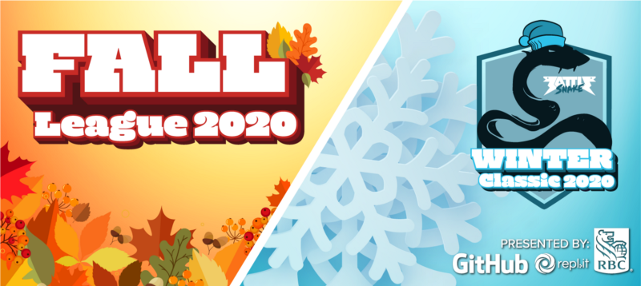
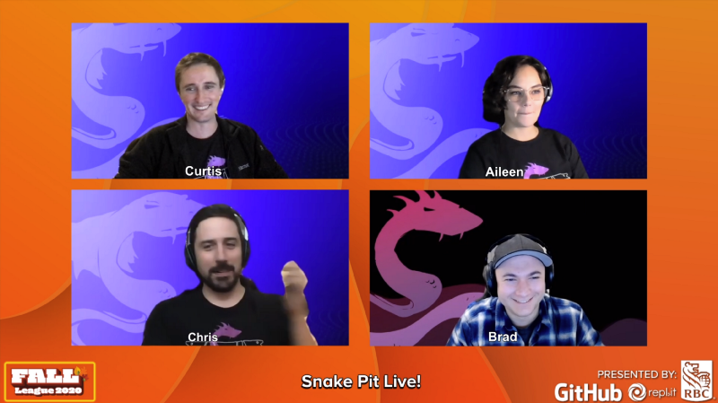
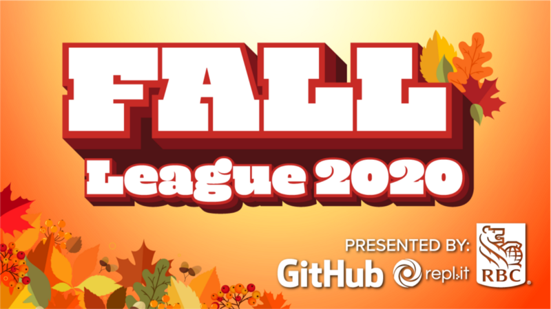
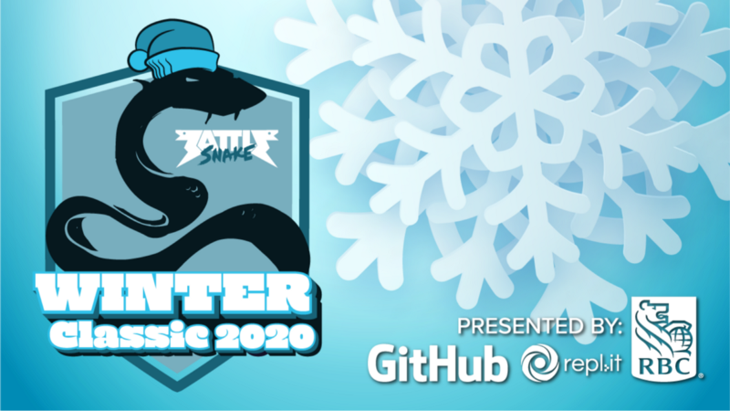
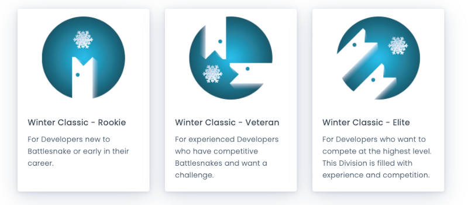

Presented By RBC, GitHub, and Repl.it
During [last Friday’s Snake Pit Live](https://www.twitch.tv/videos/780518995) we announced TWO new competitions: the first ever **Battlesnake Fall League** and the second annual **Battlesnake Winter Classic Tournament**. Both competitions are presented by our partners at RBC, GitHub, and Repl.it.
<!--truncate-->

Snake Pit Live! Friday October 23, Twitch.tv

## Battlesnake Fall League 2020

[Battlesnake Fall League](https://play.battlesnake.com/fall-league) builds on the fun and success of our Summer League with new Challenge Arena modes, live Twitch shows, and Battlesnake Prize Packs.

And for the first time ever, developers can earn exclusive Battlesnake customizations just by participating — starting with the spooooooooky Jack O’Lantern head!

Battlesnake Fall League begins now and runs until December 5th. [Register for the competition here](https://play.battlesnake.com/fall-league) and make sure to [watch us live on Twitch](https://www.twitch.tv/battlesnakeofficial) for your chance to win Fall League Prize Packs.

## The 2020 Winter Classic Tournament

Last year we held the first ever Battlesnake Winter Classic and this year we’re back with the second annual snow-filled showdown. Will [Ravioli](https://play.battlesnake.com/u/joprogrammer/ravioli/) and [Niedersächsische Kreuzotter (a.k.a. Niedersnake)](https://play.battlesnake.com/u/maximilianschier/niedersachsische-kreuzotter/) defend their titles?

This year’s [Winter Classic Tournament](http://play.battlesnake.com/winter-classic) will be broadcast live on December 19th, and will feature tournaments across three divisions: Rookie, Veteran, and the new Elite Division for top-tier Battlesnakes.

**New this year!** Participants must pre-qualify for the tournament by competing in the Qualifier Arenas between now and Dec 18th. Every two weeks, the top Battlesnakes in each division will qualify for the tournament, meaning that everyone has up to four chances to qualify.

Qualifying developers will be announced [live on Twitch](https://www.twitch.tv/BattlesnakeOfficial) during our biweekly Snake Pit Live broadcast, so tune in for updates!

---

As always, a huge thank you to our wonderful partners at [RBC](https://jobs.rbc.com/ca/en/featuredopportunities/technology-jobs), [GitHub](https://github.com/), and [Repl.it](https://repl.it/) who make these competitions possible ❤️

Remember to [follow us on Twitch](https://www.twitch.tv/BattlesnakeOfficial) to be notified when we broadcast live!

Cheers, and happy Battlesnaking!
