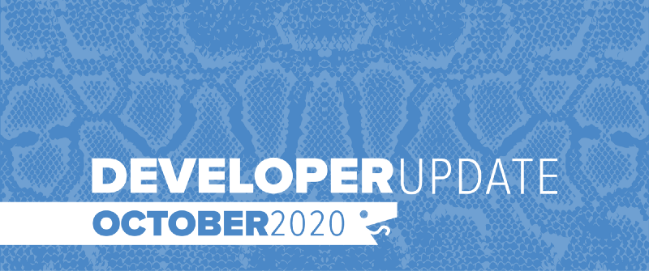

October saw the launch of [Fall League 2020](https://play.battlesnake.com/fall-league) and the opening of qualifiers for this year’s [Battlesnake Winter Classic](https://play.battlesnake.com/winter-classic). We have implemented several changes on the Battlesnake platform to support both of these competitions and the user experience for Battlesnake Developers.

<!--truncate-->

## New Arena Mode

There is a new way for Battlesnake Developer to interact with arenas. In this mode there are no automated arena games, instead users can choose to initiated “Ranked” or “Practice” games. When these games are started, the arena will find appropriate matches for your Battlesnake and initiate a game. Battlesnakes only lose or gain rating for games that they initiate. While on the leaderboard, your Battlesnake will still participate in games started by other developers.

We are hoping this feature gives users more control over how and when they are playing competition games, giving them real time feedback on how their strategies are working.

This is a new experimental way to play Battlesnake and we are open to feedback!

## New Community Starter Projects: Scala and Julia

Thanks to the efforts of [Nettogrof](https://github.com/Nettogrof) and [horrox](https://github.com/horrox), there are two new Community Starter Projects available to help developers build new Battlesnakes.

[Julia Starter Snake](https://github.com/Nettogrof/starter-snake-julia) by [Nettogrof](https://github.com/Nettogrof)

[Scala Starter Snake with Heroku](https://github.com/horrox/battlesnake-starter-scala) by [horrox](https://github.com/horrox)

## Battlesnakes and Teams in Competitions

Developers are no longer required to create a Team in order to register for divisions on competions and can instead enter a Battlesnake directly. The Battlesnakes registered can belong to either a user or a team, but the game history and participation in the competition will be linked directly to the Battlesnake. While competing the Battlesnake name will be displayed prominently on leaderboards and tournament brackets.

This should reduce confusion when participating in competitions and make the Battlesnakes themselves more visible and memorable during livestreams.

## Deprecating API v0

On October 12th, we began deprecating Version 0 of the Battlesnake API. You can find the details on the plan and timeline in [Ending Support for Battlesnake API Version 0](https://docs.battlesnake.com/announcements/ending-support-for-battlesnake-api-version-0) announcement.

As of October 30th, API v0 Battlesnakes no longer support personalized appearances and are prevented from entering competitions and challenges.

All platform support for API v0 snakes will be removed on December 31st, 2020. If you need help updating your Battlesnake to the API v1, check out our [Migration Guide](https://docs.battlesnake.com/guides/migrating-to-api-version-1).

## Discord Community Server

We have upgraded the [Battlesnake Discord Server](https://play.battlesnake.com/discord) to a community server to get access to some new features that will better serve the Battlesnake developer community. There is now a welcome screen to guide new members and new channels such as *#rules* outlining our code of conduct.

Over the next few weeks, we will be looking for a few experienced community members to help with moderation, if you are interested feel free to reach out.

---

That’s all for now. If you have any questions, reach out to us on the [Battlesnake Discord](https://play.battlesnake.com/discord/) server or our [Battlesnake Slack](http://play.battlesnake.com/slack) workspace.
