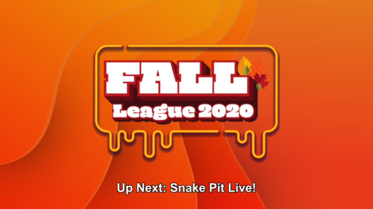
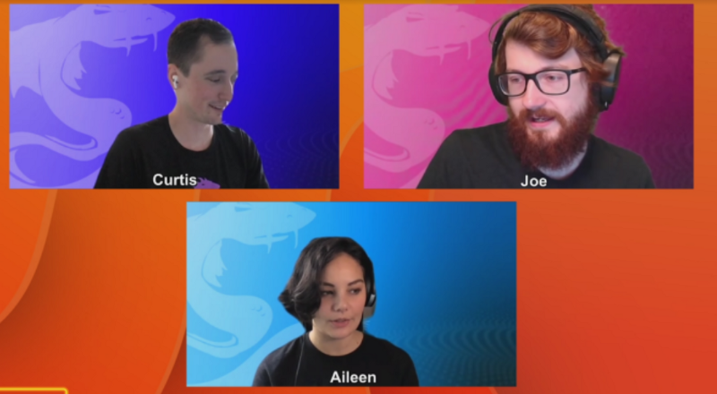
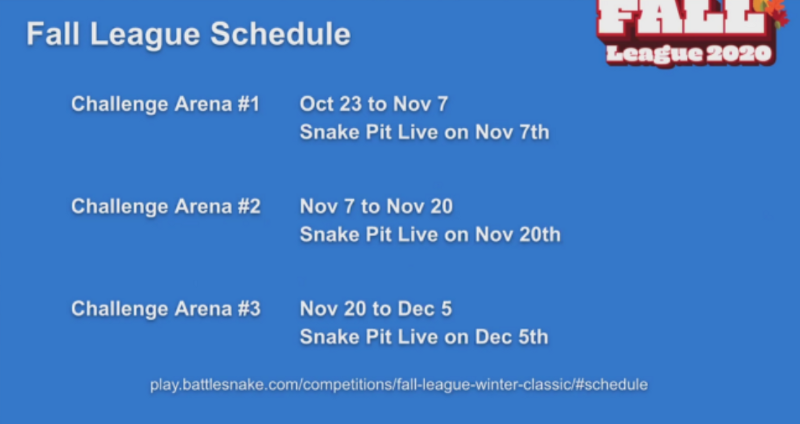
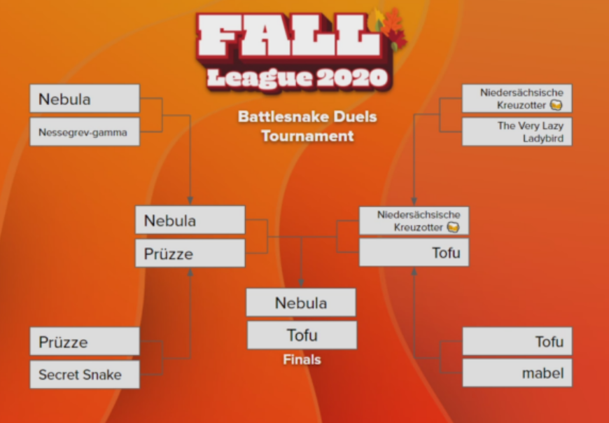
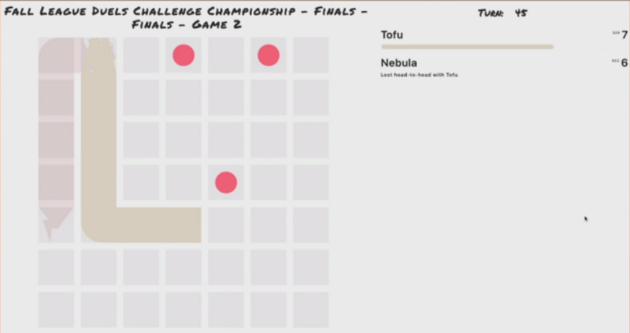
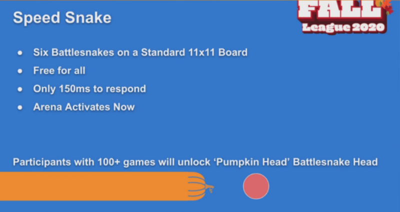
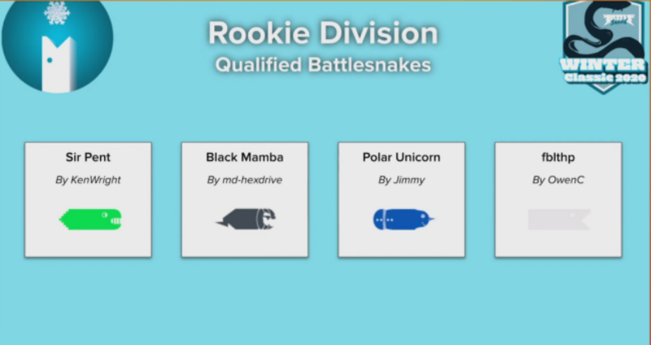
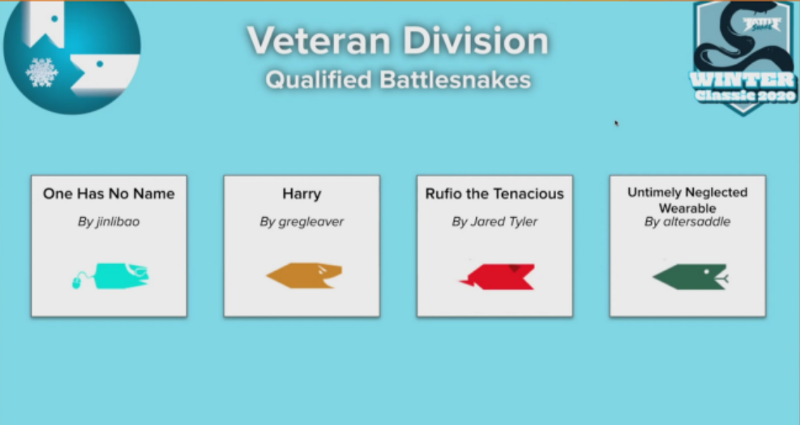
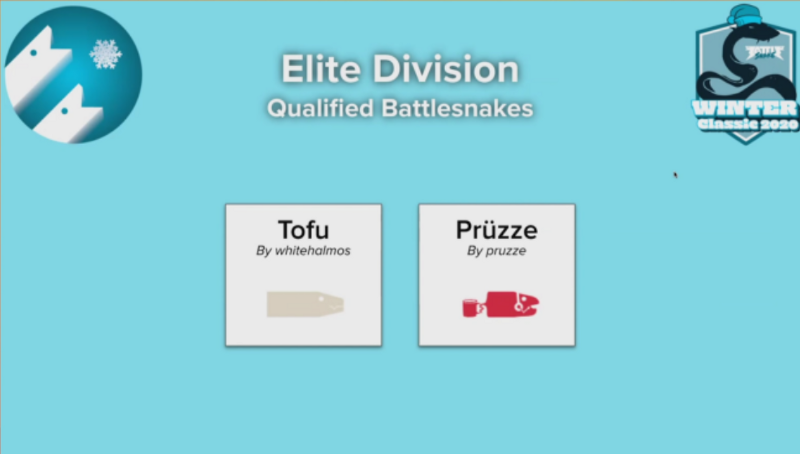
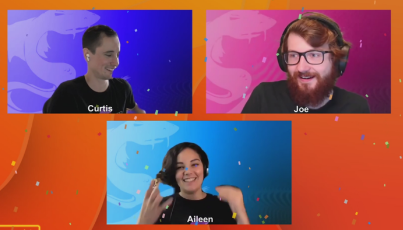

## Snake Pit Live! Fall League Edition

Fall League 2020 is in full swing here at [Battlesnake](https://play.battlesnake.com/), and nowhere was that more obvious than the latest Snake Pit Live! which streamed on [twitch.tv/battlesnakeofficial](http://twitch.tv/battlesnakeofficial) last Saturday, November 7, 2020.

**Check out this blog post to find out more about what was featured on the stream including:**

<!--truncate-->

- Fall League Format
- Fall League Duel Arena Winners
- Fall League Duel Mini-Tournament Winners
- Winter Classic Qualifiers
- Social Media Giveaway Winners

## Fall League 2020 Format

[Battlesnake](https://play.battlesnake.com)’s Fall League 2020, runs October 23 to December 5, involving a series of challenges released each two-week period. Challenge arenas require you to write a new snake to compete under different rules, and let you unlock new, limited-edition challenge skins (if you play 100+ games) and even win some awesome prize packs!

## Winner of Fall League Duels Arena

The first challenge of the 2020 Fall League was the **Duels Arena:**

> *Two *[Battlesnake](https://play.battlesnake.com)’s *on a small board and nowhere to hide. Time to focus on those end game algorithms to out maneuver your opponent.*

Running from October 23 to November 7, competition in this inaugural arena was intense, with [Battlesnake](https://play.battlesnake.com)*Tofu *ultimately winning the first Fall League Champion Prize Pack.

## Winner of Fall League Duels Mini Tournament

While *Tofu *reigned supreme over the Duels arena during the first two weeks of the Fall League, Snake Pit Live! gave competing [Battlesnake](https://play.battlesnake.com) Developers another chance to fight for the crown in the Duels Mini-Tournament which took place live on the stream.

Despite a valiant effort by other Snakes, *Tofu *managed to hold on to the title, winning another Prize Pack and becoming the reigning Fall League Champion with his impressive Game 2 win in the 2020 [Battlesnake](https://play.battlesnake.com) Fall League Duels Challenge Championship Finals.

## New Fall League Speed Snake Challenge

While the Duels Challenge was certainly a highlight of this Snake Pit Live! the stream also featured the launch of our newest Fall League challenge running November 7–20th, **Speed Snake:**

> The time for thinking is over! Build a Battlesnake with fast reflexes and good instincts to compete in this Challenge Arena. Six Battlesnakes must not only contend with each other but a blistering 150 millisecond limit on response times for moves.

As usual, participants who compete in 100+ games are able to unlock custom, limited-edition skins, in the case of the Speed Snake Challenge, unlocking the ‘Pumpkin Head’ [Battlesnake](https://play.battlesnake.com) Head.

While the announcement of the challenge by Caster Joe was definitely highly anticipated by those watching the stream, nowhere was the excitement more evident than through Caster Aileen hinting at what the challenge name would be throughout the stream, specifically her hints showcasing an appreciation of Point Break era Keanu Reeves, the star of the 1995 movie *Speed*.

## Winter Classic Tournament Qualifiers

Running alongside the Fall League has been a series of Qualifiers for the upcoming Winter Classic Tournament taking place on December 19th.

Dozens of [Battlesnake](https://play.battlesnake.com) competitors competed for these coveted tournament spots, with 10 snakes ultimately qualifying in the first round, including:

### In the Rookie Division:

- **Sir Pent***by KenWright*
- **Black Mamba***by md-hexdrive*
- **Polar Unicorn***by Jimmy*
- **fbithp ***by Owen C*

### In the Veteran Division:

- **One Has No Name ***By jinlibao*
- **Harry ***By gregleaver*
- **Rufio the Tenacious***By Jared Tyler*
- **Untimely Neglected Wearable***By altersaddle*

### In the Elite Division:

- **Tofu ***By whitehalmos*
- **Pruzze ***By pruzze*

## Social Media Giveaways

No Snake Pit Live! would be complete without some Prize Pack Giveaways and this SPL was no exception, with winners announced for both the Twitch Draw and the Instagram Contest.

### **Twitch Contest**

Inspired by Keanu Reeves, and of course the upcoming [Battlesnake](https://play.battlesnake.com) Fall League *Speed Snake* Challenge, Keanu was the word of the day for the Twitch Chat Draw with *@nessegrev* winning the Viewer Prize Pack of a Notebook, Mask, Stickers, but Caster Aileen ultimately winning the contest through her unmatched love for Point Break era Keanu.

### **Instagram Contest**

Caster were also winner’s of sorts in the Instagram Contest, with *@Xtagon* taking home the Viewer Prize Pack, but the Casters taking home some awesome images of how Snake Pit Live! viewers enjoy these awesome [Battlesnake](https://play.battlesnake.com) streams at home.

Last but not least, thank you to all the viewers, and the [Battlesnake](https://play.battlesnake.com) supporters who have made Fall League and Winter Classic 2020 possible.

Stay tuned to all of the [Battlesnake](https://play.battlesnake.com) social media channels for updates on all things Fall League and Winter Classic, and in the meantime, stay safe and battle on!
