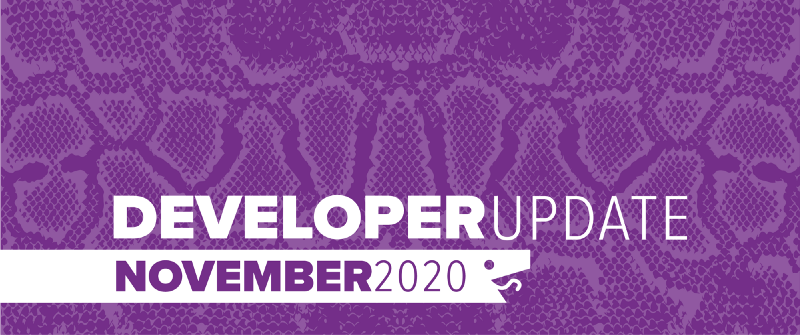
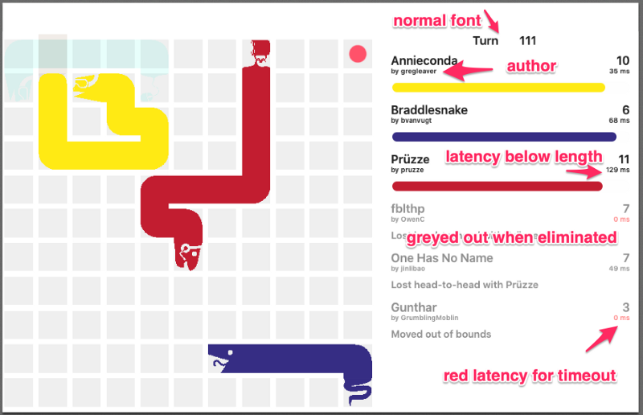
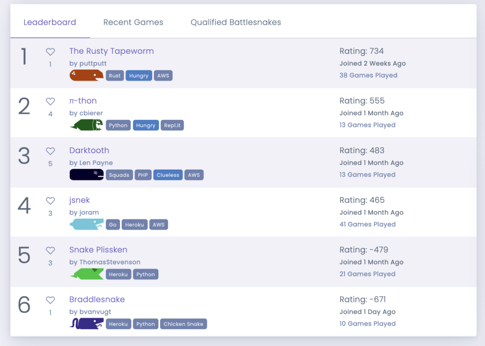
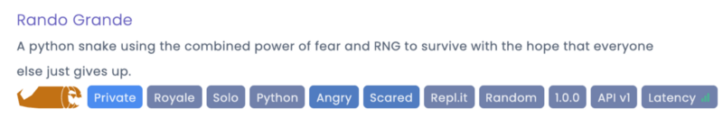

Much of the development in November was behind the scenes as we improve and refine the new features added for both the [Fall League 2020](https://play.battlesnake.com/fall-league) and [Battlesnake Winter Classic 2020](https://play.battlesnake.com/winter-classic) competitions. We also made some major performance enhancements to the platform after our servers barely held on as a result of being featured in some prominent developer communities this month

<!--truncate-->

## Game Board Improvements

The game board has undergone a series of improvements to both add more information and make it more readable. A major change is that we now display the author (user or team) along with the Battlesnake name to give everyone some more visibility. We also tweaked the layout to make it more legible at a glance.
Game Board Changes
In addition, we fixed several critical problems with the GIF exporter, so it should now generate a lot fewer 500 errors when generating animated gifs for games.

## Arena Upgrades

We have made several changes to the Arena system to improve the performance of both page loads and matching. In some cases everyone should be seeing a 5X improvement in load times for the leaderboards. Also the arena leaderboards are also now displaying negative scores. The TrueSkill system can generate negative ranking values, which are completely valid, but we initially decided to set the minimum score to 0 to make the leaderboards look better. Since then we noticed that this has only caused confusion as it reduces score granularity and obscures how Battlesnakes sort at the bottom of the leaderboard. We are looking to address ranking and scoring further before the next competition season begins in 2021.

## Custom Snake Versions

Developers can now provide a version number for their Battlesnake in the JSON data from the / endpoint. This data value will be shown as a tag on your snake and supports any short string. It can be a great way to track iterations of your snake or just let everyone know why your Battlesnake comes out of *beta.*

    {
      "apiversion": "1",
      "color": "#d4770d",
      "head": "bfl-jackolantern",
      "tail": "hook",
      "version": "1.0.0"
    }

Example Version Tag
## New Snake Customizations

Two new heads and a new tail customization were revealed with the Fall League Challenge Arenas: Jack O’Lantern, Pumpkin Head and Maple Leaf.

Unlike previous customizations, these new options are locked and must be earned by participating in the Fall League competition. Going forward we will be releasing even more customizations, some open for all and others unlocked by earning achievements on the site.

## Discord Widget

We love the community we are building on [Discord](https://play.battlesnake.com/discord) and are experimenting with how to integrate that community better into the Battlesnake platform. To that end we have embedded Discord directly into the website. Using the floating button on the bottom right of the screen you can launch a chat window and chat on Discord directly.

## Deprecating API v0

We have continued with the deprecation of Battlesnake API Version 0. As of November 30th, API v0 Battlesnakes can no longer be entered into the Global Arena and existing Battlesnakes still using the old version were removed.

You can find the details on the plan and timeline in [Ending Support for Battlesnake API Version 0](https://docs.battlesnake.com/announcements/ending-support-for-battlesnake-api-version-0) announcement.

All platform support for API v0 snakes will be removed on December 31st, 2020. If you need help updating your Battlesnake to the API v1, check out our [Migration Guide](https://docs.battlesnake.com/guides/migrating-to-api-version-1).

---

That’s all for now. If you have any questions, reach out to us on the [Battlesnake Discord](https://play.battlesnake.com/discord/) server or our [Battlesnake Slack](http://play.battlesnake.com/slack) workspace.
