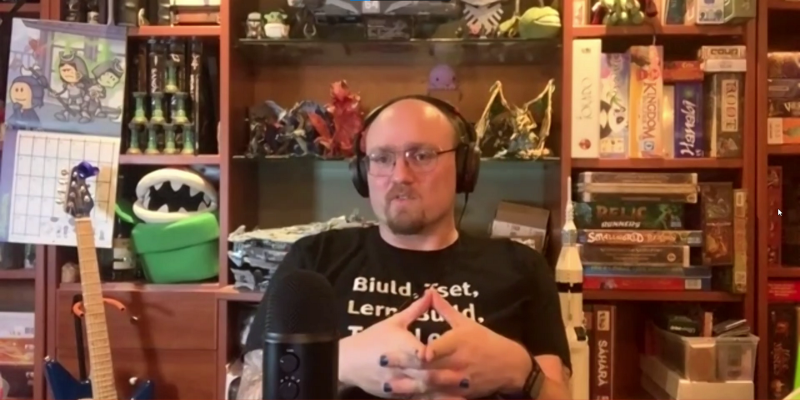
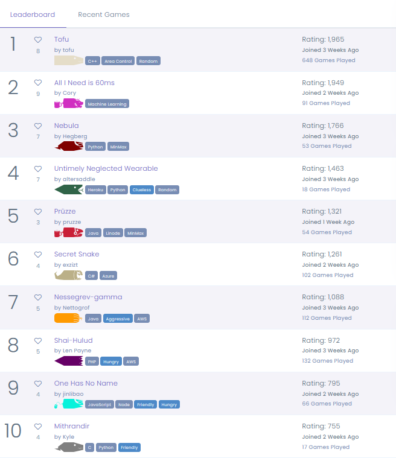
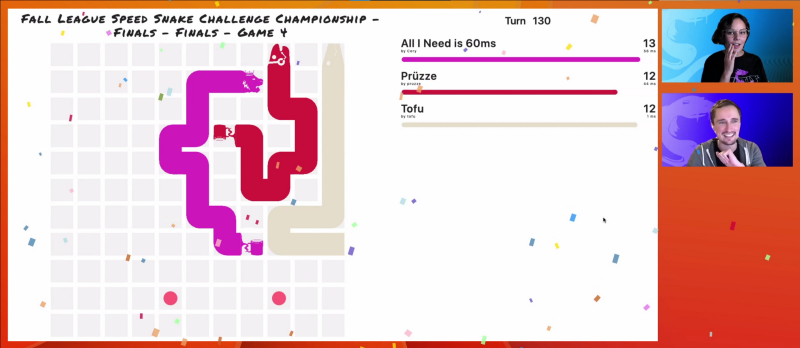
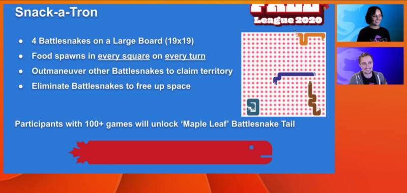
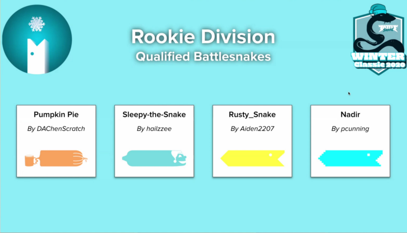
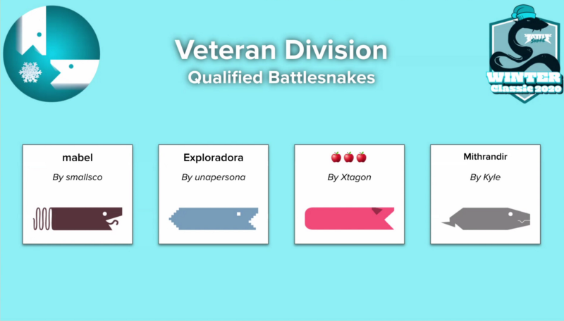
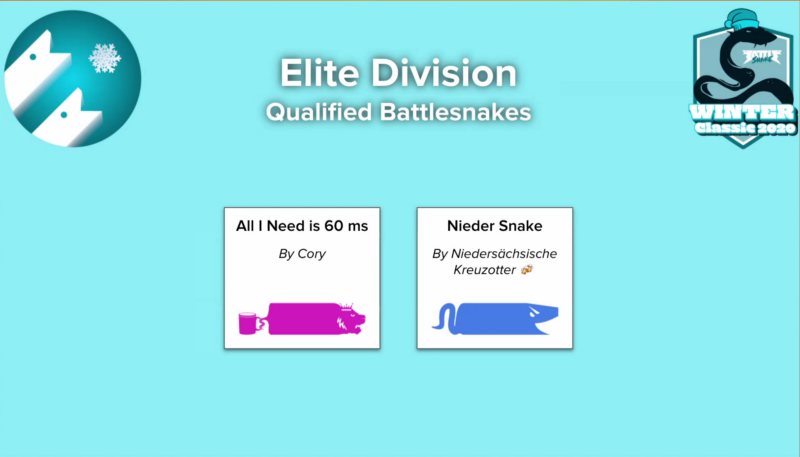
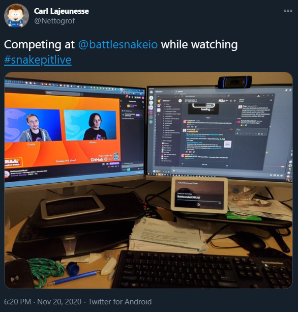
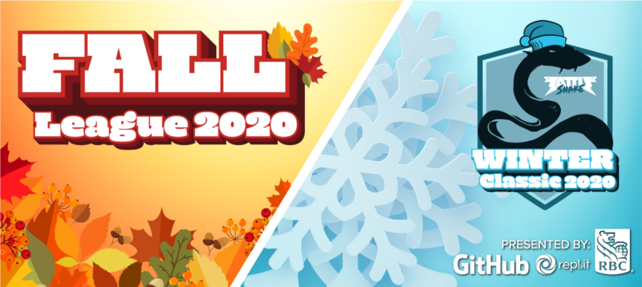

### Did you miss the last episode of Snake Pit Live! or just can’t get enough of the 2020 Battlesnake Fall League and Winter Classic?

Then be sure to check out this recap of the latest Snake Pit Live! which streamed on [twitch.tv/battlesnakeofficial](http://twitch.tv/battlesnakeofficial) last Friday, November 20, 2020.

<!--truncate-->

**This Episode featured:**

- Geoffrey Peart, Senior Director of Omni Technology from RBC
- Fall League Speed Snake Arena Winners
- Fall League Speed Snake Mini-Tournament Winners
- Fall League Snake-a-tron Challenge Launch
- Winter Classic 2020 Qualifiers
- Aileens’ Prize Corner Winners

Alongside Casters Curtis and Aileen, Geoffrey Peart, Senior Director of Omni Technology from RBC kicked off the show, with an overview of working on the technology stack behind the Royal Bank of Canada (RBC).

## Winner of Fall League Speed Snake Arena

The show then continued into announcements of the winners for the second challenge of the 2020 Fall League, the **Speed Snake Arena:**

> The time for thinking is over! Build a Battlesnake with fast reflexes and good instincts to compete in this Challenge Arena. Six Battlesnakes must not only contend with each other but a blistering 150 millisecond limit on response times for moves.

Running November 7th to 20th, competition in this arena continued to be tough, with [Tofu](https://play.battlesnake.com/u/tofu/tofu/)[by tofu](https://play.battlesnake.com/u/tofu/)revealed as the top snake in the arena, winning another Champion Prize Pack and holding onto the Fall League crown.

**In addition to **[**Tofu**](https://play.battlesnake.com/u/tofu/tofu/)[**by tofu**](https://play.battlesnake.com/u/tofu/)**, other Top 5 members of the Leaderboard included:**

[2. All I Need is 60ms](https://play.battlesnake.com/u/cory/all-i-need-is-60ms/)[by Cory](https://play.battlesnake.com/u/cory/)

[3. Nebula](https://play.battlesnake.com/u/hegberg/nebula/)[by Hegberg](https://play.battlesnake.com/u/hegberg/)

[4. Untimely Neglected Wearable](https://play.battlesnake.com/u/altersaddle/untimely-neglected-wearable/)
[by altersaddle](https://play.battlesnake.com/u/altersaddle/)

5. [Prüzze](https://play.battlesnake.com/u/pruzze/pruzze/)[by pruzze](https://play.battlesnake.com/u/pruzze/)

## Winner of Fall League Speed Snake Mini Tournament

With [Tofu](https://play.battlesnake.com/u/tofu/tofu/)[by tofu](https://play.battlesnake.com/u/tofu/) moving into the Mini Tournament as the top seated snake, all eyes were on [Tofu](https://play.battlesnake.com/u/tofu/tofu/) to continued its domination on Snake Pit Live!

Despite a valiant effort; however, it was [All I Need is 60ms](https://play.battlesnake.com/u/cory/all-i-need-is-60ms/)[by Cory](https://play.battlesnake.com/u/cory/) who took the crown in Game 4 of the Speed Snake Mini Tournament finals against [Prüzze](https://play.battlesnake.com/u/pruzze/pruzze/) and [Tofu](https://play.battlesnake.com/u/tofu/tofu/), winning a Fall league Champion Prize Pack, and bragging rights moving into the final two-weeks of the 2020 Fall League.

## New Fall League Snack-a-tron Challenge

With two challenges complete, and the 2020 Fall League in the home-stretch, one of the most anticipated events of the stream was the launch of the final Fall League challenge running November 20th–December 5th, **Snack-a-tron:**

> The time for thinking is over! Build a Battlesnake with fast reflexes and good instincts to compete in this Challenge Arena. Six Battlesnakes must not only contend with each other but a blistering 150 millisecond limit on response times for moves.

As usual, participants who compete in 100+ games are able to unlock custom, limited-edition skins, in the case of the Snake-a-tron Challenge, unlocking the ‘Maple Leaf’ [Battlesnake](https://play.battlesnake.com) Tail.

## Winter Classic Tournament Qualifiers

Alongside the Fall League Arenas in the weeks leading up to this Snake Pit Live! a series of Qualifiers have continued for the upcoming 2020 Winter Classic.

Taking place on December 19th, competition for a place in the 2020 Tournament has continued to be tight, with another 10 fierce snakes qualifying of this episode of SPL, including:

### In the Rookie Division:

- Pumpkin Pie By DAChenScratch
- Sleepy-the-Snake By hailzzee
- Rusty_Snake By Aiden2207
- Nadir By pcunning

### In the Veteran Division:

- mabel By smallsco
- Exploradora By unapersona
- 🍎🍎🍎 By Ztagon
- Mithrandir By Kyle

### In the Elite Division:

- All I Need is 60 ms By Cory
- Nieder Snake By Niedersachsische Kreuzotter

## Aileen’s Prize Corner Winners

Finally, no Snake Pit Live! would be complete without the Prize Corner with Aileen and some awesome Battlesnake Prize Pack Giveaways!

### Twitch Chat Contest

A nod to the upcoming Battlesnake Fall League Snack-a-tron Challenge, and inspired by Kevin Flynn, the computer programming star of 1980s movie *Tron*, *whitishmeteor *was the winner of this episodes Twitch Chat contest, taking home a Viewer Prize Pack full of awesome Battlesnake merch including a Notebook, Mask, and (of course) Stickers!

### Twitter Contest

This episode also saw the return of the “Home Viewing Setup” Social Media Challenge, this time on Twitter, with Battlesnake Developer and Snake Pit Live! fan *nettogrof*, taking home a Viewer Prize Pack and sharing with the world how they enjoy Snake Pit Live! from the comfort of their own home!

## Thanks — and See You Next Time!

Last but not least, thanks to all the viewers, Battlesnake Developers and Supporters who have made Fall League and Winter Classic 2020 possible.

Stay tuned to all of the [Battlesnake](https://play.battlesnake.com/) social media channels for updates on all things Fall League and Winter Classic, and in the meantime, stay safe and battle on!

