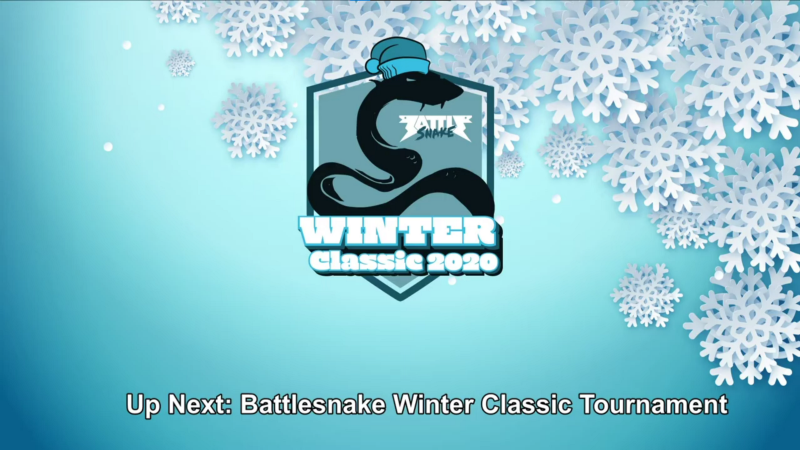
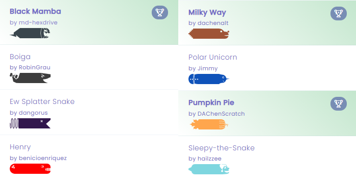
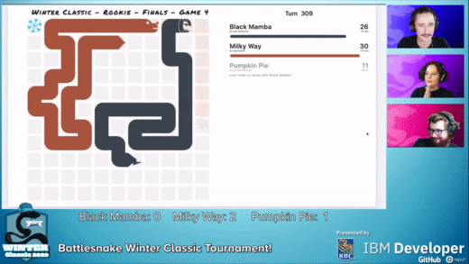
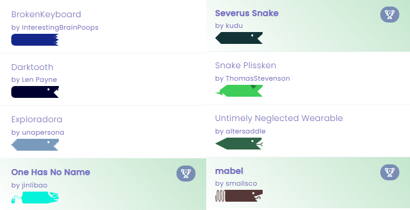
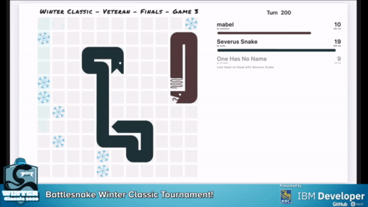
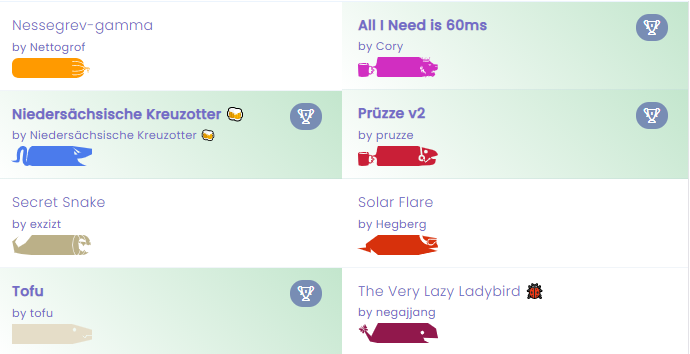
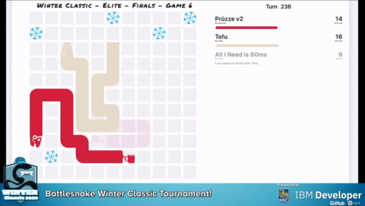

While for many, including ourselves, December marked the final month of what can only be described as a tumultuous year, it also marked the return of an exciting annual Battlesnake competition, the [2nd annual Winter Classic Tournament](https://www.youtube.com/watch?v=ePlA62wJVfo&amp;t=219s), which streamed live on [twitch.tv/battlesnakeofficial](http://twitch.tv/battlesnakeofficial) on Saturday, December 19, 2020.

<!--truncate-->

**Check out this blog post to discover who claimed the Winter Classic Champion Prize Pack in each of the Rookie, Veteran & Elite Divisions.**
2020 Battlesnake Winter Classic Opening Screen
### Rookie Division

The tournament began incredibly strong, with the Rookie Division showcasing some exceptional Battlesnake Developers, and all 24 snakes in the division entering the arena ready to fight for their place in the competition.

After some great games across all four rookie brackets, the top eight competitors that emerged represented a stellar group of Snakes and Developers, with both well-known names and new faces amongst the pack.
Top 8 Snakes from the 2020 Winter Classic Rookie Division
Despite the many stellar snakes who entered the finals, in the end, only one could claim the Rookie Division crown & the Champion Prize Pack with [**Milky Way**](https://play.battlesnake.com/s/snk_DQjJxqpTkgd76bFqWXWyDBj4/)[by dachenalt](https://play.battlesnake.com/u/dachenalt/milky-way-not-competing-anymore/) defeating [**Black Mamba**](https://play.battlesnake.com/s/snk_cWCywVChHkgJVhBRVPPb8VgP/)[by md-hexdrive](https://play.battlesnake.com/u/md-hexdrive/black-mamba/) and [**Pumpkin Pie**](https://play.battlesnake.com/s/snk_y4k9Qr7xR7T76HfyMCvKgrXR/)[https://play.battlesnake.com/s/snk_y4k9Qr7xR7T76HfyMCvKgrXR/](https://play.battlesnake.com/s/snk_y4k9Qr7xR7T76HfyMCvKgrXR/)[by DAChenScratch](https://play.battlesnake.com/u/dachenscratch/pumpkin-pie-not-competing-anymore/) in Game Four of the “Battle of the Gourds” Rookie Division finals.

### Veteran Division

With such a strong showing from the Rookie Division, expectations were high for Veteran competitors, and they certainly did not disappoint, with all 16 snakes entering the arena ready to show what it takes to compete in a Battlesnake tournament at this level.

The top developers in the Veteran Division certainly helped to deliver that message to fans and fellow competitors alike, with the eight snakes competing in the semi-finals showcasing the type of competition and gameplay we have all come to expect from Battlesnake tournaments.
Top 8 Snakes from the 2020 Winter Classic Veteran Division
While it only took three games for [**Severus Snake**](https://play.battlesnake.com/s/snk_RxgTPrDrF9Kd6JCM9Cwtp6Wb/)[by kudu](https://play.battlesnake.com/u/kudu/severus-snake/) to overtake [**mabel**](https://play.battlesnake.com/s/snk_RRjqPTGKpkFSVqhXJ4F4hfb6/)
[by smallsco](https://play.battlesnake.com/u/smallsco/mabel/) and [**One Has No Name**](https://play.battlesnake.com/s/snk_6cmWxp3fJHyKtYCfjgHRm8Y8/)[by jinlibao](https://play.battlesnake.com/u/jinlibao/one-has-no-name/) in the Veteran Division finals, they were certainly an incredible three games to watch, setting the stage for an even more awesome ending to the day with the Elite Division competitors.

### Elite Division

Despite being the smallest of the three divisions, with only eight snakes qualifying for the 2020 Winter Classic, competition was incredibly tough, with each and every game demonstrating the strategy and talent it takes to become an Elite Battlesnake Developer.
Qualifying Snakes from the 2020 Winter Classic Elite Division
Nowhere was this strategy and talent more evident than in the Elite Division finals between [**Tofu**](https://play.battlesnake.com/s/snk_84VYKTSWFffMXMTgW9YfgwB3/)[by tofu](https://play.battlesnake.com/u/tofu/tofu/), [**Prüzze v2**](https://play.battlesnake.com/s/snk_BjJCCT7gH48SvQ8VYpthTHCC/)[by pruzze](https://play.battlesnake.com/u/pruzze/pruzze-v2/) and [**All I Need is 60ms**](https://play.battlesnake.com/s/snk_fy3yVt3h4fyJ8MJbWxXrVdyS/)[by Cory](https://play.battlesnake.com/u/cory/all-i-need-is-60ms/), where everyone from fans at home to the Casting Crew were on the edge of their seats as [**Tofu**](https://play.battlesnake.com/s/snk_84VYKTSWFffMXMTgW9YfgwB3/)[by tofu](https://play.battlesnake.com/u/tofu/tofu/), claimed the Elite Division crown and Champion Prize Pack after 261 moves in Game Six.

## Thank You — and See You Next Year!

This was certainly an exceptional tournament to end a difficult year, and we are so thankful for the equally exceptional Battlesnake Community which helps to make these competitions, and Battlesnake as a whole, possible.

With that in mind, we want to send a huge thank you out to all of the Battlesnake Developers, Competitors, and Fans who helped to make the 2020 Winter Classic a success.

Stay tuned to all of the [Battlesnake](https://play.battlesnake.com/) social media channels for updates on what is coming in 2021, and in the meantime, stay safe and battle on!
