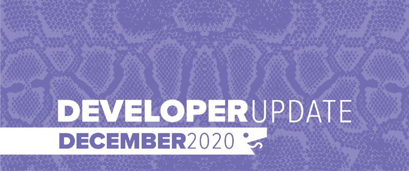
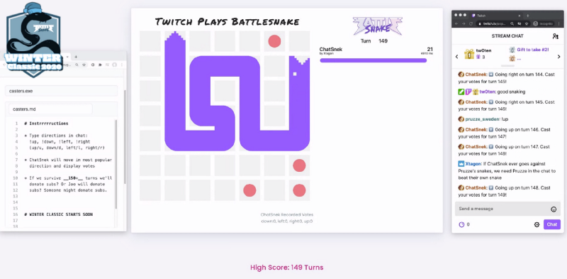
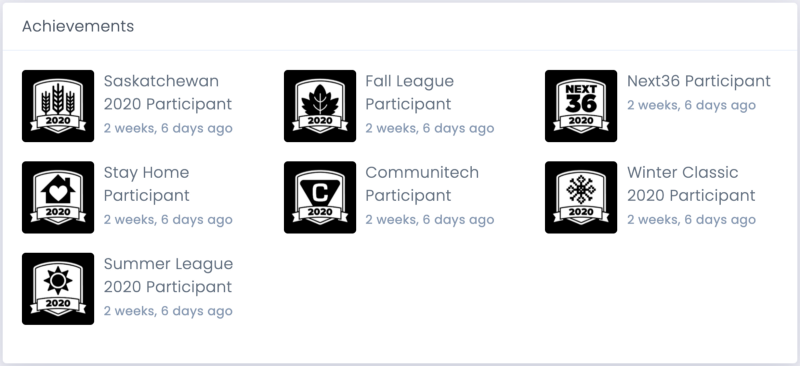

This was an amazing year for Battlesnake with the platform growing and evolving in so many ways. We have added new game modes, changed API versions, expanded the engine and run over a dozen different virtual competitions. For December, the team focused on some of the tech debt, bugs and performance issues that came from all that new stuff. Even so, we still managed to introduce a few new improvements for everyone.

<!--truncate-->

## New Global Arenas

To hold everyone over until the 2021 Competitive Season starts we have added two new Global Arenas for everyone to test their Battlesnake development skills in.

### [Global Duels](https://play.battlesnake.com/arena/global-duels/)

We really liked the high level competition that came out of the Battlesnake Duels challenge arena during the Fall League and this arena is an evolution of that. 1v1 competition between Battlesnakes provides some of the most interesting games with regards to strategy and tactics.

### [Global Royale](https://play.battlesnake.com/arena/global-royale/)

By far the most fun and chaotic game mode we introduced in 2020 was Battlesnake Royale during the Summer League. The added challenge of the expanding hazard area created all new problem spaces to explore around maneuvering and risk-reward calculations.

Both arenas are open right now and support a single Battlesnake per user, so choose wisely!

## Twitch Plays Battlesnake

Thanks to veteran Battlesnake user [Xtagon](https://play.battlesnake.com/u/xtagon/), we have a way for our audience to collaboratively play Battlesnake together via Twitch Chat. This game mode runs slow enough that users can enter their votes for moves directly in twitch chat. The most popular move each turn will define how the Battlesnake moves. [So far the longest that chat has kept a snake alive is 154 turns!](https://www.twitch.tv/videos/855399711)
Twitch Plays Battlesnake from the Winter Classic 2020 Tournament — Dec 19, 2020
We will be periodically putting *Twitch Plays Battlesnake* live on our [Twitch channel](https://play.battlesnake.com/twitch) so make sure to follow the channel for notification on when it goes live.

## Achievements

We have released an alpha version of our new Achievements system. Currently, we are using achievements to showcase which competitions users have participated in and how they have placed in recent tournaments. This feature will grow over the next few months and provide all users with some new goals and ways to unlock new Battlesnake head and tail customizations.
Example competition achievements
You can find the achievements you have earned on your [Battlesnake Profile](https://play.battlesnake.com/me#achievements) page.

## API v0 now Deprecated

All platform support for API v0 snakes was removed on December 31st, 2020. If you need help updating your Battlesnake to the API v1, check out our [Migration Guide](https://docs.battlesnake.com/guides/migrating-to-api-version-1).

---

That’s all for now. If you have any questions, reach out to us on the [Battlesnake Discord](https://play.battlesnake.com/discord/) server or our [Battlesnake Slack](http://play.battlesnake.com/slack) workspace.
