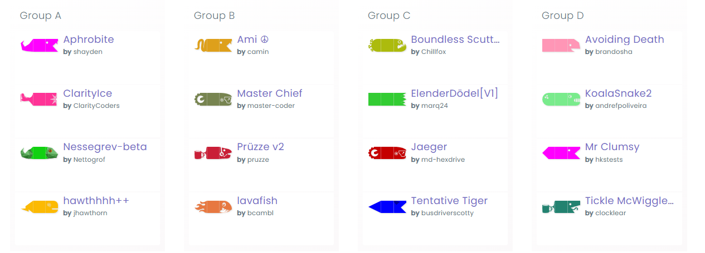

With the leaderboard officially closed, let’s take a look at the *Top Tier Bhumbas* that qualified for the [2022 Spring League Tournament](https://play.battlesnake.com/competitions/spring-league-2022/)—Don’t miss it this **Saturday, March 19th at 9am PT / 12pm ET/  5pm CET**.

## Platinum Tier

An incredible [32 Battlesnake's qualified in the Platinum tier](https://play.battlesnake.com/competitions/spring-league-2022/spring-league-2022-platinum/brackets/) of the 2022 Spring League Tournament which will take place on March 19th.

[**Learn more**](https://play.battlesnake.com/competitions/spring-league-2022/spring-league-2022-platinum/brackets/) about the Platinum Tier Tournament Brackets

## Elite Tier

With some fierce competition throughout the competition, [16 of this seasons best Battlesnakes qualified](https://play.battlesnake.com/competitions/spring-league-2022/spring-league-2022-elite/brackets/) for the 2022 Spring League Elite Tournament.

**[Learn More](https://play.battlesnake.com/competitions/spring-league-2022/spring-league-2022-elite/brackets/)** about the Elite Tier Tournament Brackets

## Tournament Format

### Spring League Platinum Tournament (March 19th)

Part one of the 2022 Spring League tournament will take place on **Saturday**, **March 19th at 9am PT / 12pm ET / 5PM CET** on the [Battlesnake Twitch Channel](https://twitch.tv/battlesnakeofficial) with the 32 Platinum Qualified Battlesnakes.

In this phase, to advance in the first round, a Battlesnake must get 2 wins instead of 1. Once they earn 2 wins and advance, additional games are played (without them) until a second snake accrues 2 wins and also advances. 

Each group in the initial stage will play 4-6 games to determine the two winners that move onto the next stage of the tournament.

In the next two stages of competition (i.e the Quarterfinals and Semifinals), 2 wins are again required in each round to advance to the finals. Once there, the remaining 4 snakes face their final battle (a race to 3 wins). And the victor will crowned the Platinum Spring League Champion.

### Spring League Elite Tournament (March 26th)

In the second day of competition, streaming live on **Saturday, March 26th at 9am PT / 12pm ET / 5PM CET**, we are back again with 2 wins required in each round leading up to the finals, but this time with the qualified Battlesnakes competing for the title of 2022 Spring League *Elite *Champion.

## Fan Favorite Finalists

While both[ Pea Eater](https://play.battlesnake.com/u/alxv/pea-eater/) and[ Hovering Hobbs](https://play.battlesnake.com/u/coreyja/hovering-hobbs/) qualified for the Elite Tournament, they garnered a total of 21 cheers during the stream —making them top contenders for the “Spring League Fan Favorite”. 

Take a peek at the stats of the two popular competitors below. It’s still anyone's competition (so go and cheer on your favorite Battlesnake)!

#### Learn more about [Pea Eater](https://play.battlesnake.com/u/alxv/pea-eater/)

**Country**: 🇺🇸 | **Standing: 5**th**| **Games****: 2,484 | ****Win Rate****: 31.56%

#### Learn more about [Hovering Hobbs](https://play.battlesnake.com/u/coreyja/hovering-hobbs/)

**Country**: 🇺🇸 | **Standing: **14th** | **Games****: 2,608 | ****Win Rate****: 28.6%

## Caster Cup Update

Although this weekend marks the first of the Spring League touranments, last Saturday we celebrated our first event of the Battlesnake Competitive Season at the [2022 Spring Caster Cup Tournament](https://play.battlesnake.com/competitions/caster-cup-spring-2022/).

With the weight of their continent resting on their shoulders, 32 Battlesnakes entered the area (equally representing **North America** and **Europe**) but only one could survive to claim the first title of the season...

:::danger Congratulations!
Congratulations to [Shapeshifter](https://play.battlesnake.com/u/jonathanarns/shapeshifter/) (and [jonathanarns](https://play.battlesnake.com/u/jonathanarns/)) who survived those many battles, snatching the 2022 [Spring Caster Cup](https://play.battlesnake.com/competitions/caster-cup-spring-2022/) for the European Conference.
:::

Check out [Shapeshifter](https://play.battlesnake.com/u/jonathanarns/shapeshifter/)'s final battle of the 2022 [Spring Caster Cup](https://play.battlesnake.com/competitions/caster-cup-spring-2022/) below.

---

## Thanks for Competing & See You Saturday!

Before we close, we want to thank you for reading and thank all of the amazing [Spring League](https://play.battlesnake.com/league/spring-league-2022/) competitors!

A big shoutout to our amazing community and our amazing Community, and to our wonderful 2022 partners at [RBC](https://play.battlesnake.com/partner/rbc), [New Relic](https://play.battlesnake.com/partner/newrelic), [DigitalOcean](https://play.battlesnake.com/partner/digitalocean) and [Twilio](https://play.battlesnake.com/partner/twilio) who make these competitions possible ❤️‌

