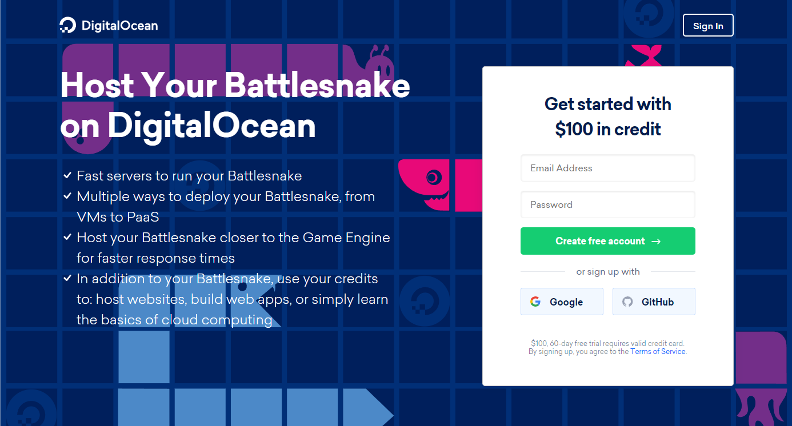

Are you new to [Battlesnake](https://play.battlesnake.com), or just looking to try out a new technology stack?

Then be sure to check out this quick start guide to help you get started with building your first [Battlesnake](https://play.battlesnake.com) using the [DigitalOcean App platform](https://play.battlesnake.com/partner/digitalocean).

For this guide you will need the following accounts:

- A free [GitHub](https://github.com) Account
- A free [Battlesnake](https://play.battlesnake.com) Account
- A [DigitalOcean](https://play.battlesnake.com/partner/digitalocean ) Account

If you don't already have a [DigitalOcean](https://play.battlesnake.com/partner/digitalocean) account, be sure to take advantage of our 2022 Promo Code at [play.battlesnake.com/partner/digitalocean](https://play.battlesnake.com/partner/digitalocean)

[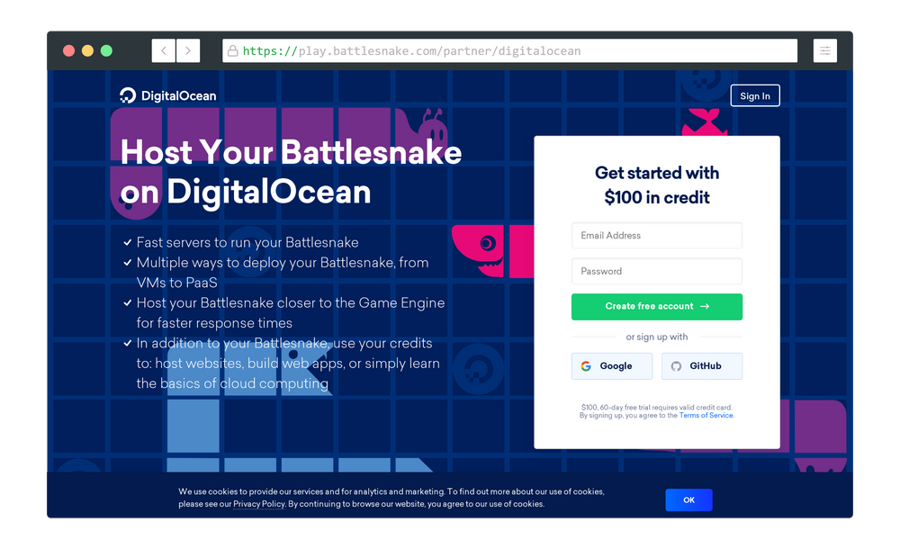](https://play.battlesnake.com/partner/digitalocean)

Get started with $100 Credit to [Host Your Battlesnake on DigitalOcean](https://play.battlesnake.com/partner/digitalocean)

## Step 1

### Setup Your GitHub Repository

To begin, head over to the [Battlesnake Python Starter Snake ](https://github.com/BattlesnakeOfficial/starter-snake-python)repository on GitHub, log-in, then select the green "Use this template" button.

:::note Info

While other Starter Snake repositories may also work following this guide, it has only been tested on the **Python Starter Snake**.

:::

[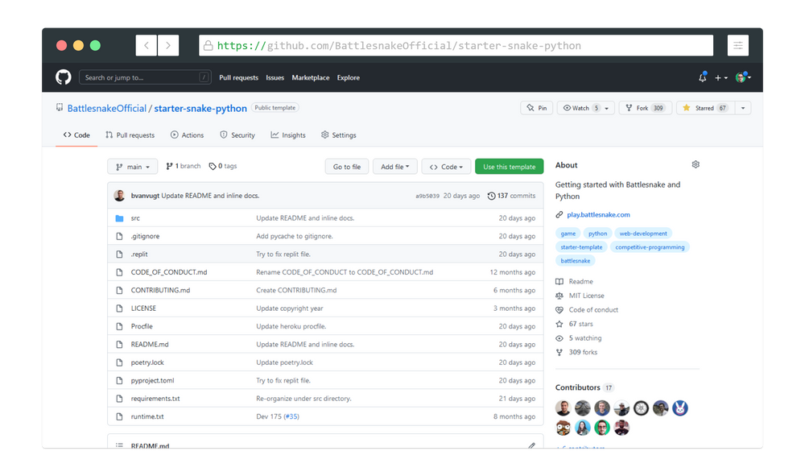](https://github.com/BattlesnakeOfficial/starter-snake-python)
Check out the Python Starter Snake at [github.com/BattlesnakeOfficial/starter-snake-python](https://github.com/BattlesnakeOfficial/starter-snake-python)

As with any GitHub repository, choose an memorable and appropriate name (i.e. digitalocean-battlesnake) and whether you would like the code to be Public/Private, then select the "Create repository from template" button at the bottom of the screen.

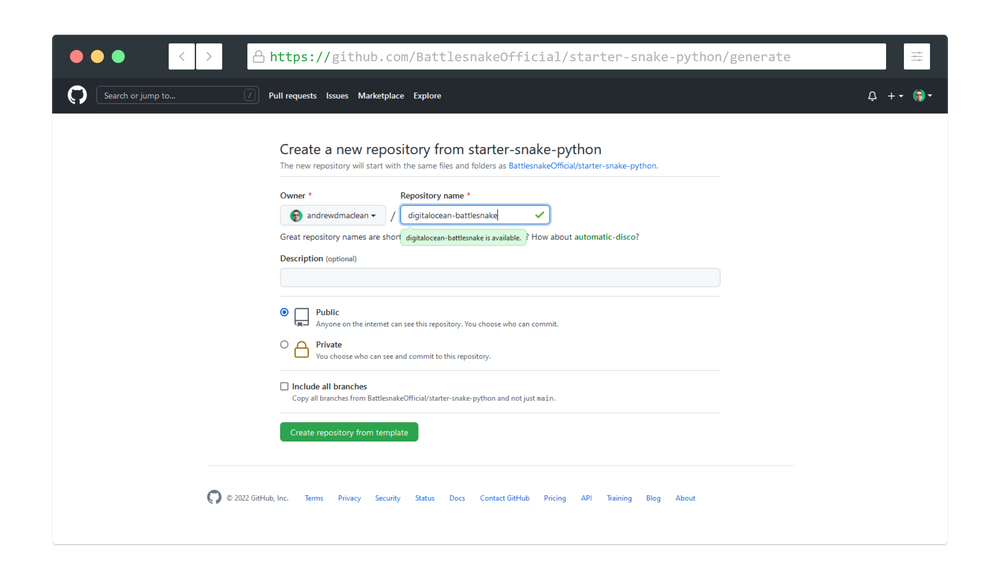Creating a new repository from the [Python Starter Snake Repository](https://github.com/BattlesnakeOfficial/starter-snake-python)

:::danger Congratulations!
You have successfully completed Step 1 of 3 👏
:::

## Step 2

### Authorize the DigitalOcean GitHub Application

Next head over to your [DigitalOcean dashboard](https://cloud.digitalocean.com), and click the green "Create" drop-down button in the top navigation bar and select "Apps". 

Alternatively, you can select "Apps" from the sidebar menu and then select the blue "Create App" button in the main window. 

[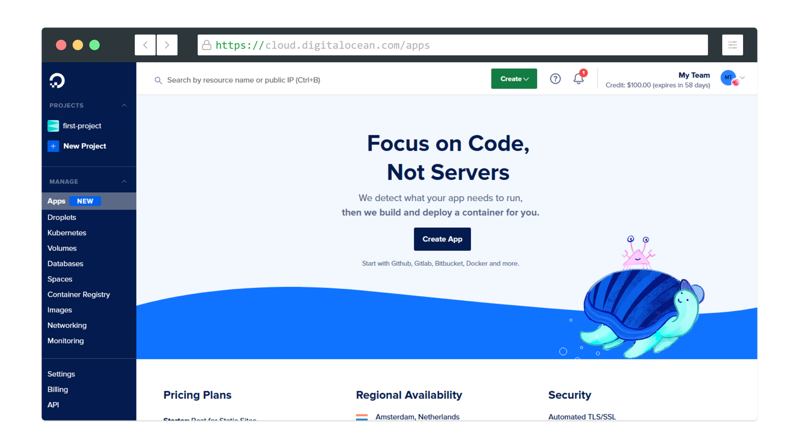](https://play.battlesnake.com/partner/digitalocean)App Management Menu on the [DigitalOcean](https://play.battlesnake.com/partner/digitalocean) 

Once you have successfully accessed the App creation screen in the [DigitalOcean](https://play.battlesnake.com/partner/digitalocean)[dashboard](https://cloud.digitalocean.com/apps), select the source for your [Battlesnake](https://play.battlesnake.com) code, which in our case will be the GitHub repository that you created earlier.

[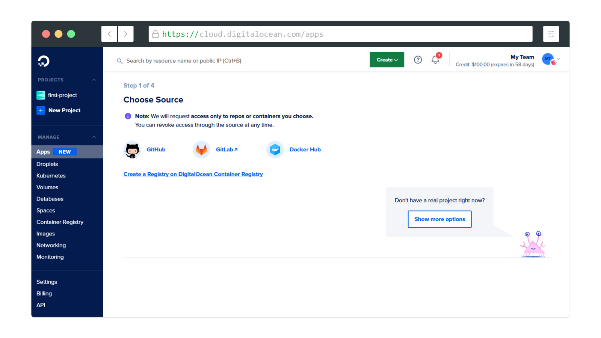](https://play.battlesnake.com/partner/digitalocean)

Choose the Source for Your Battlesnake Code, in our case GitHub.

After selecting "GitHub" you will either be immediately redirected to GitHub to Install and Authorize the [DigitalOcean](https://play.battlesnake.com/partner/digitalocean) app (see first image below), or you may be prompted with the following:

> "Sorry, we're having trouble finding your repos. Please check your authorizations for this service."

If you receive the above prompt, select "Manage Authorization" and you should be redirected to the "Install & Authorize [DigitalOcean](https://play.battlesnake.com/partner/digitalocean)" page.

:::info
While you may choose to authorize the [DigitialOcean](https://play.battlesnake.com/partner/digitalocean) app to access all of your repositories, we recommend limiting its access to only relevant code.
:::

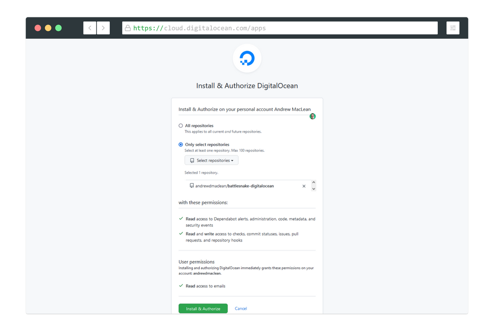

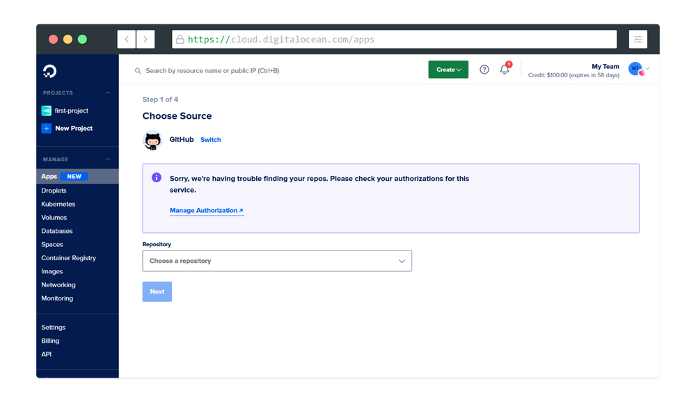

Install & Authorize [DigitalOcean](https://play.battlesnake.com/partner/digitalocean) to connect with your GitHub Repository
After the authorization process is complete, you should be redirected back to the [DigitalOcean App](https://cloud.digitalocean.com/apps) creation page where you began, as seen below. 

Once here, select the relevant repository on your GitHub account, the branch you would like to deploy (i.e. main), and check the "Autodeploy" box to enable CI/CD when you push changes to your selected branch.

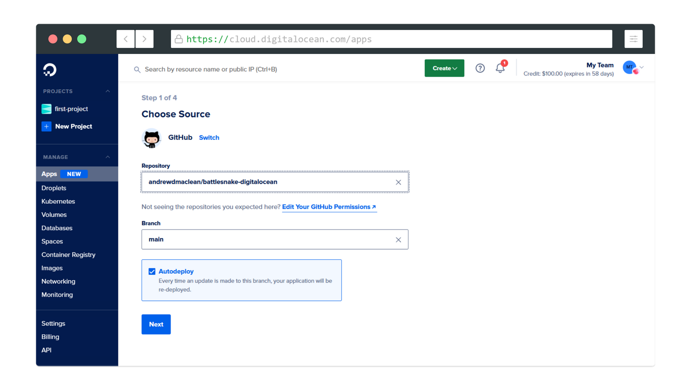Select the appropriate GitHub Repository containing your Battlesnake Starter Snake Code.
After clicking next, you will be presented with the "Configure your app" settings which will automatically populate based on the chosen Starter Snake.

:::info
Note that you should not need to change any of the settings in 'Configure your app" when you first setup, but they may need to be changed later.
:::

You will then need to choose your web service "Name" and "Region" in order to move forward to the final stage of the App creation process.

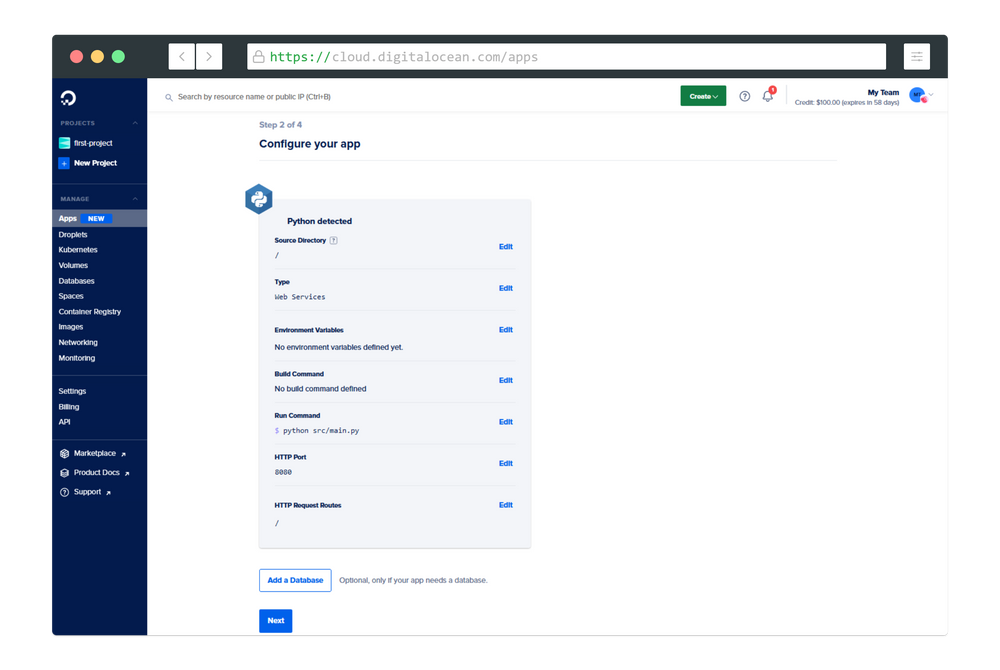

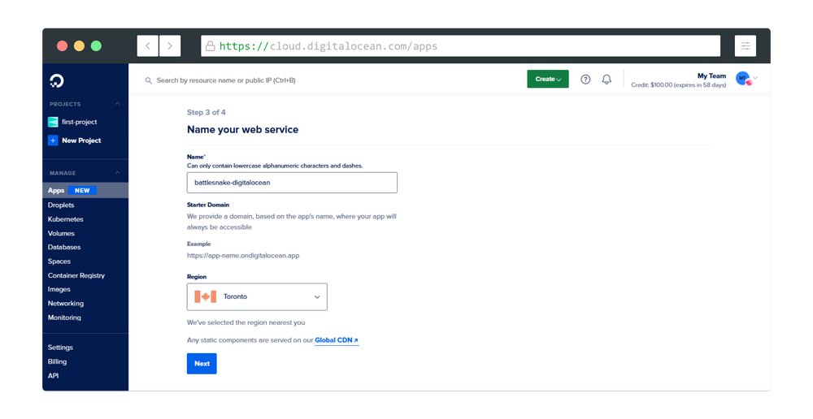

Configure your [DigitalOcean](https://play.battlesnake.com/partner/digitalocean) App Web Service with a Name and Region.
The final stage of launching your [Battlesnake](https://play.battlesnake.com) with the [DigitalOcean](https://play.battlesnake.com/partner/digitalocean) App Platform will be to select a plan and container size.

With that $100 in credits you can feel free to max out your app settings, but to get started with this tutorial you can also choose the basic settings:

- **Plan**: Basic
- **Containers**: 1 @ $5.00/mo (512 MB RAM | 1 vCPU) 

:::info
Please note that the $100 Promotional Credit mentioned above is only valid for 60 days from sign-up, so choose your timing appropriately.
:::

Once you have selected the plan and container sizes, click the blue "Launch Basic App" button at the bottom of the screen to start the deployment.

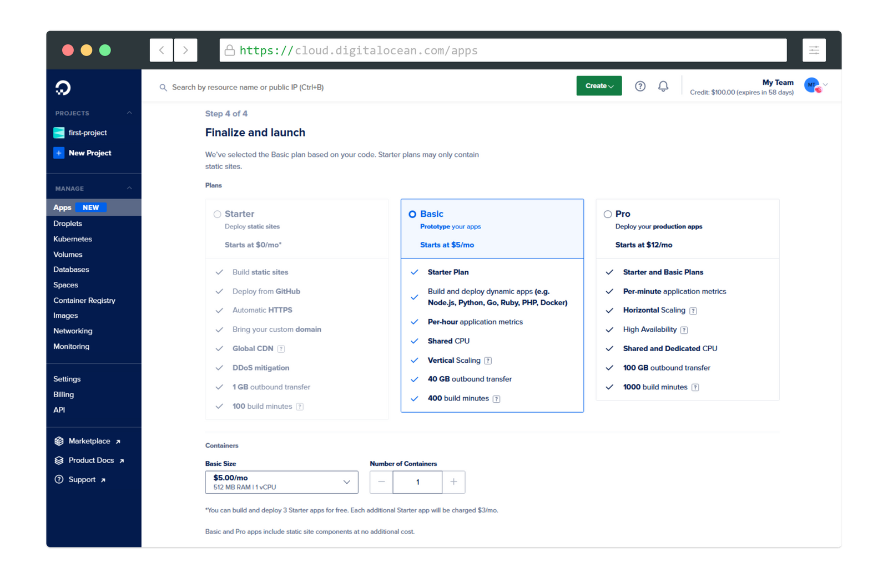Select Your [DigitalOcean](https://play.battlesnake.com/partner/digitalocean) Plan and Container Size
After launching your app, you should be redirected to the main [DigitalOceans App Platform dashboard](https://cloud.digitalocean.com/apps) where you will see the following prompt:

**Building service:****[your-server-name]...** [your-email] pushed a deployment at [current-time]

It will take a few minutes (up to 10), but if everything goes according to plan you should eventually see a prompt which reads:

**[your-email]'s **deployment went live at [current-time]

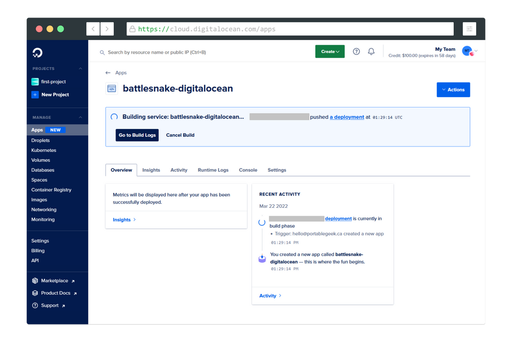

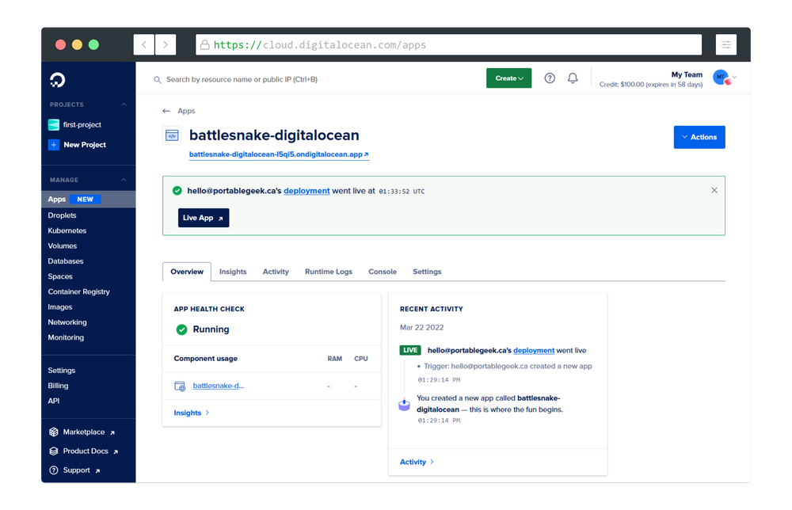

Battlesnake Web Server deployment process updates on the [DigitalOcean](https://play.battlesnake.com/partner/digitalocean) App Platform Dashboard

Once you see the above prompt, either select the URL provided below your app name (i.e. ending in **.ondigitalocean.app**), or select the "Live App" button, and you should see something similar to what is found below.

:::info
If you don't see this below, be sure to head over to the [Battlesnake Discord Server](https://play.battlesnake.com/discord) where we would be happy to help you get setup.
:::

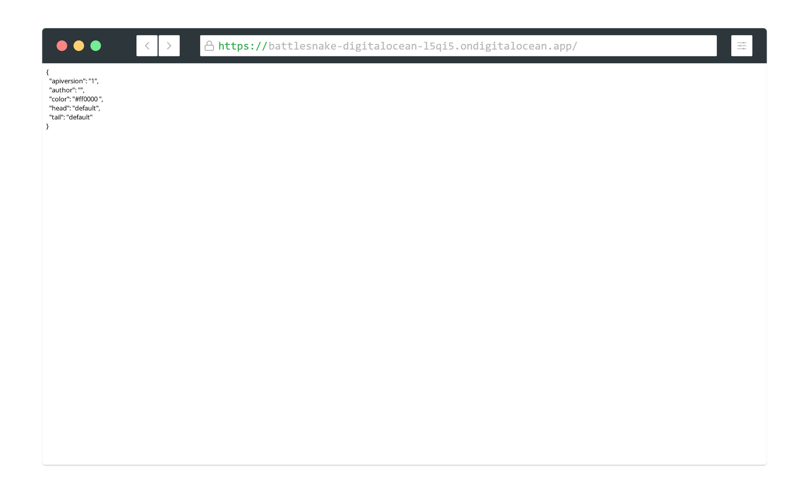Preview of a Successful [Battlesnake](https://play.battlesnake.com) Deployment on the [DigitalOcean App Platform](https://play.battlesnake.com/partner/digitalocean).

:::warning Congratulations!
You have successfully completed Step 2/3
:::

## Step 3

### Register your New DigitalOcean Battlesnake

Once you have setup your [Battlesnake](https://play.battlesnake.com) Web Server on the Digital Ocean App Platform and confirmed the server is live, the final step is to head over to [play.battlesnake.com/account/snakes/create](https://play.battlesnake.com/account/snakes/create/) and add the new [Battlesnake](https://play.battlesnake.com) to your account (ensuring to add the "DigitalOcean" tag).

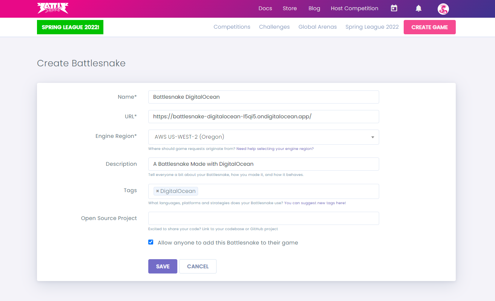Add Your new DigitalOcean Battlesnake to Your Account.

:::warning Congratulations!
You have successfully completed Step 3/3
:::

### What's Next?

**Looking to make changes to your Battlesnake? **If you selected "Autodeploy" in Step 2 you just need to push to the "main" branch of your GitHub repository and the [DigitalOcean](https://play.battlesnake.com/partner/digitalocean) integration will re-deploy your changes!