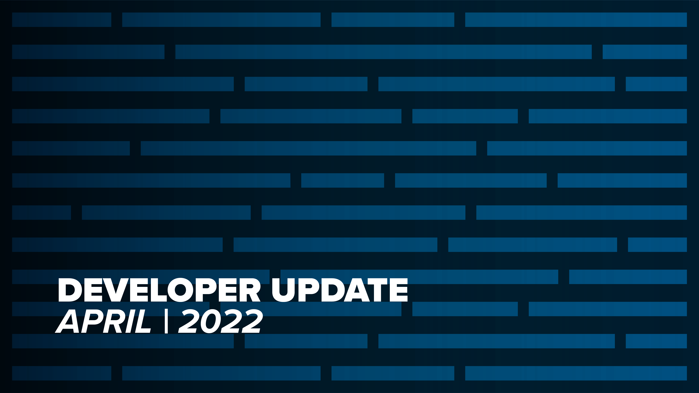
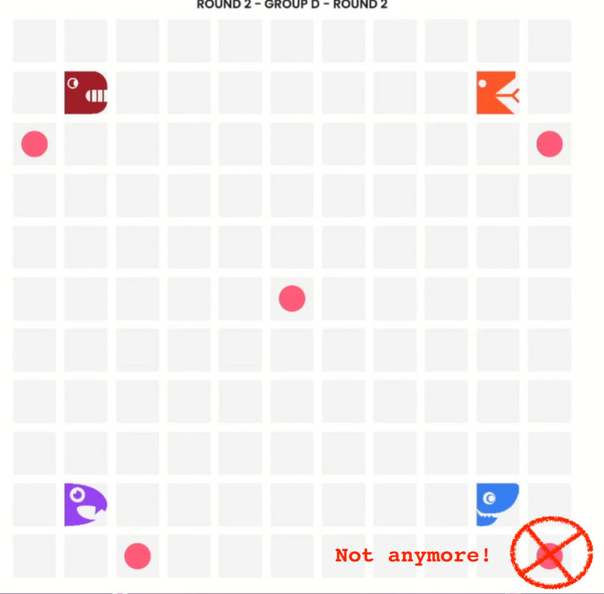
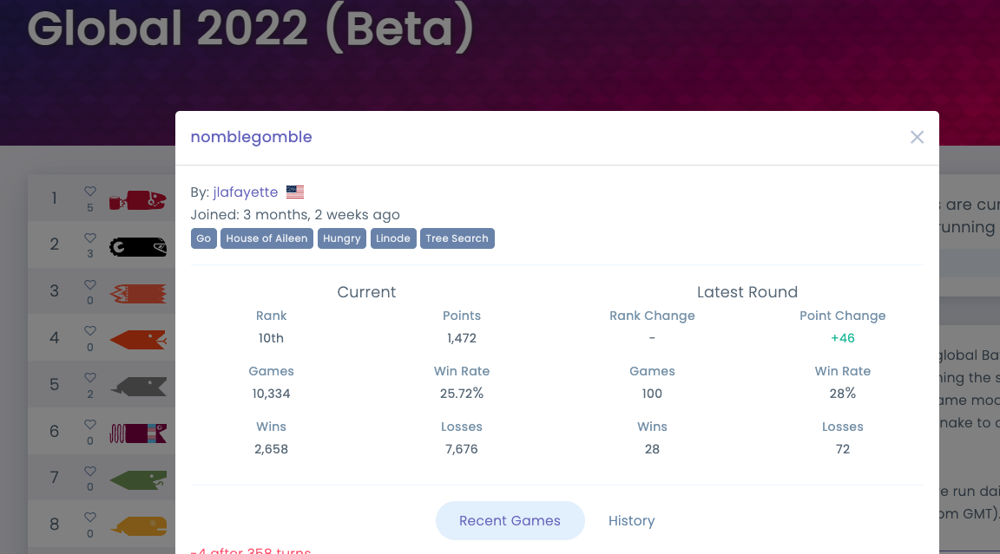
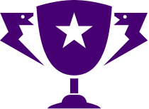

Happy end of April everyone! For your reading pleasure, please allow me to present to you a review of what the Battlesnake team has cooked up this month.

## No More 1st Turn Corner Food

One should always have a healthy suspicion of a random number generator, and while we do appreciate the unpredictability and opportunities for delight and tragedy that can happen when a food spawns in *just* the right (or wrong!) place during an intense game, that doesn't mean we should let the old RNG make absolutely every decision.

On the first turn of a Battlesnake game, where food is positioned such that there is one near the head of each Battlesnake and one located in the center of the board, the corners of the board are no longer valid locations for those initial foods to spawn. This is to remove a slight starting state disadvantage for any Battlesnake whose "first food" was positioned this way.

A now invalid first turn board configuration, as starting food may not be placed in the corners

## New Progression Data on Leaderboards

As a part of [Spring League 2022](/), and in a few Beta Global Arenas, we introduced the concept of 'Matchmaking Windows', which uses a scheduler to run a fixed number of games on a Ladder during a pre-determined time window. Now that a regular schedule is in place, this has given us an opportunity to compare changes for individual Battlesnakes participating in a Ladder between these windows, and display some juicy new stats to help in your monitoring and when checking the impact of code changes. There are now details about the "Latest Round" that highlight the rank, point changes, win rate, and more for the last run window of games.

If you click on any Battlesnake listed in a Ladder, you can see the new information that has been added. Please let us know what you think and if you find this information to be helpful!

New data for Battlesnake progression on any Ladder

## API Updates

In response to a comment from community member *mawif* in the Discord server, new values have been added to the `Game.source` field on the Battlesnake API. We're now providing more descriptive values, such that when a game originates from a League Ladder, vs a Global Arena Ladder, you can now tell the difference and prioritize or handle your game as you see fit (perhaps you want to make sure those League games get all your CPU cycles!). You can see the full list of possible values for `Game.source` in the [documentation for the `Game` object](https://docs.battlesnake.com/references/api#game).

We also fixed a small bug in the API code. When a Battlesnake responds to the **/move** API endpoint, the [documentation clearly states that it must return an HTTP 200 Response Code](https://docs.battlesnake.com/references/api#post-move), however, the truth was that it did accept other values. Our mistake! We don't think anyone noticed, or that any active Battlesnakes were returning non-200 values, but that isn't an excuse for an untidy API! A fix is in place, and the code and documentation now correctly agree. 

## Community Contributions

The Battlesnake community continues to be delightfully active and engaged, and I'm starting to think I will always need to reserve space to report on the 'Community Contributions' made each month!

For April, a warm thank you to [jlafayette](https://github.com/jlafayette) who authored a pull request to improve the project documentation for the [Rules CLI](https://github.com/BattlesnakeOfficial/rules/pull/69), as well as to [fwc](https://github.com/fwc) who caught and fixed a typo in the [Battlesnake API Docs](https://github.com/BattlesnakeOfficial/docs/pull/31). Also a shout out to *Jonathan *in Discord who caught some incorrect data labeling on the 'Winter Classic 2020 Participant' Achievement and gave us a chance to fix it. 

Thanks everyone for your contributions and assistance! You are the champions of our hearts.

A Battlesnake trophy, for you, the community

## Announcing Community Council

Speaking of community contributions, we've launched the new 'Community Council', inviting members who expressed interest on last year's *Annual Survey* in providing additional feedback to Battlesnake this year.

 The Community Council will get a sneak peek at upcoming and in-progress features so that they can provide early input and feedback, and help us make Battlesnake more accessible and fun for everyone.

We were absolutely blown away by the number of people who were willing to give us some of their time and help us out in this manner, so thank you to everyone involved!

---

That's all for now. If you have any questions, reach out to us on the [Battlesnake Discord](https://discord.battlesnake.com/) server.
