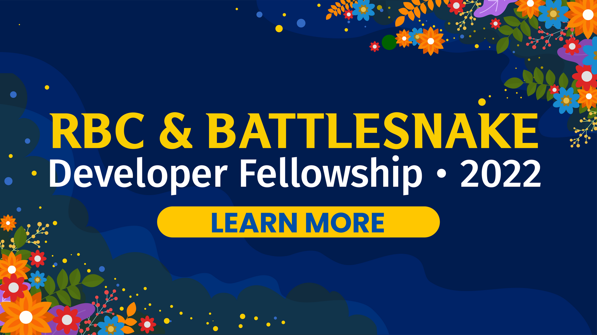
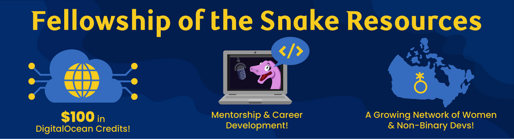

[Applications are now open](https://fellowship.battlesnake.com) to join the Summer 2022 cohort of the [RBC & Battlesnake Developer Fellowship](https://fellowship.battlesnake.com), a collaborative initiative that supports women and non-binary developers from across Canada in taking the next step in their journey as a professional developer through Battlesnake.

### Eligibility Criteria:

- ****Woman or non-binary developer ****(includes but not limited to: non-binary, gender non-conforming, transgender, genderfluid, intersex, genderqueer, and agender).
- Currently living, working or studying ****in Canada.****

** An existing Battlesnake account is ******not required****** to apply.*

### Fellowship recipients gain access to resources including:

- **One-on-one mentorship and career development support **from experienced industry professionals at [Tech @ RBC](https://play.battlesnake.com/partner/rbc/).
- **A community of like-minded women and non-binary developers **working to improve their skills.
- **Bi-weekly networking and learning meetups** to explore new technologies and build competitive Battlesnakes.
- **A ton of Battlesnake and [RBC](https://play.battlesnake.com/partner/rbc/) swag!**

Learn more about the [Developer Fellowship](https://fellowship.battlesnake.com), its benefits, and how you can become a member of the Summer 2022 cohort.

:::danger Important Update

**Application deadline has been extended to Saturday, May 28th at 11:59pm PST**

:::

