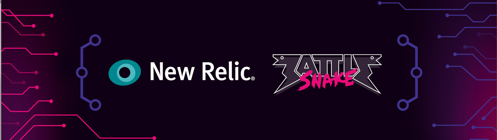

As anyone who has written any software knows, the next emotion you experience (after the elation of your program running successfully the first time), is mild puzzlement as you whisper to yourself *"Why did it do that?"*

Battlesnake is certainly no exception. As your code grows in complexity, the likelihood of uttering those words significantly increases. 

Okay! So you've solved the initial problems (or learning opportunities as I prefer to call them) of understanding the game rules and how to deploy and host your Battlesnake. Now it's time to start exploring ways to monitor and understand its behavior so you can start building a seriously competitive Battlesnake! 

[New Relic](https://newrelic.com/) is a great tool to get you there. They've even kindly provided us with some pre-built guides and dashboards tailor-made for Battlesnake developers. We're here to guide you through the setup. 

If you prefer video learning, you can also watch the quickstart guide below! 

Once you're set up, you can check out our follow-up video on using New Relic to help in [troubleshooting and customizing your Battlesnake to make it more competitive. ](https://youtu.be/IAQUJu0z1Yc)

## Requirements

### Battlesnake and Battlesnake Account

To monitor a Battlesnake, one must already have a Battlesnake. You can learn how to create and set up your first Battlesnake through our [Quick Start Coding Guide](https://docs.battlesnake.com/guides/getting-started). You will need to run your Battlesnake on a service that does not combine the IDE and host (as Replit does) so that you can install the necessary libraries to integrate with New Relic. Check out the [Hosting Suggestions](https://docs.battlesnake.com/references/hosting-suggestions) for ways to do this.

For this walkthrough, I used the Battlesnake [Official Starter Project for Python](https://github.com/battlesnakeofficial/starter-snake-python), and hosted my Battlesnake on my local machine, using a free [ngrok](https://ngrok.com/docs/getting-started) account. 

### New Relic Account

The free-tier New Relic account is more than enough to start monitoring our Battlesnake and no credit card is required when making an account. You can [signup](https://newrelic.com/signup) for a New Relic account or [login](https://login.newrelic.com/login) to an existing one.

## Overview

The smart folks at New Relic have built some default dashboards and provided code samples to quickly gather common data and present it in a useful way. 

**To use these great pre-built tools we will need to:**

1. Add the default New Relic APM Agent to our Battlesnake code to send data to the New Relic servers
2. Add the custom pre-built Battlesnake Dashboards to our New Relic account
3. Edit our Battlesnake code (using the provided code sample!) to gather custom data to feed into the Battlesnake New Relic Dashboards

## Add the New Relic APM Agent

Adding in the APM Agent depends on what programming language your Battlesnake is written in. The [New Relic install documentation](https://docs.newrelic.com/docs/new-relic-solutions/new-relic-one/install-configure/install-new-relic/) provides a quickstart UI-driven guide for various scenarios as well as access to the manual information.

For this walkthrough and my Battlesnake, I selected the UI-guided path for Python.

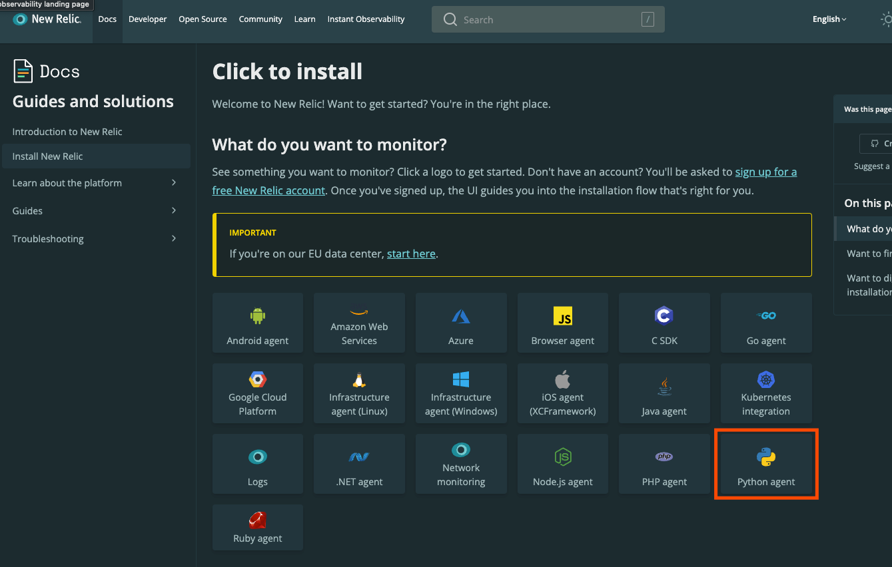

Helper flow to install the Python APM on the [New Relic documentation](https://docs.newrelic.com/docs/new-relic-solutions/new-relic-one/install-configure/install-new-relic/) site

If you scroll down the page, you'll have the option to start exploring more detailed explanations in the 'Manual Installation Paths' (which is also a great spot for more information after completing the guided version!)

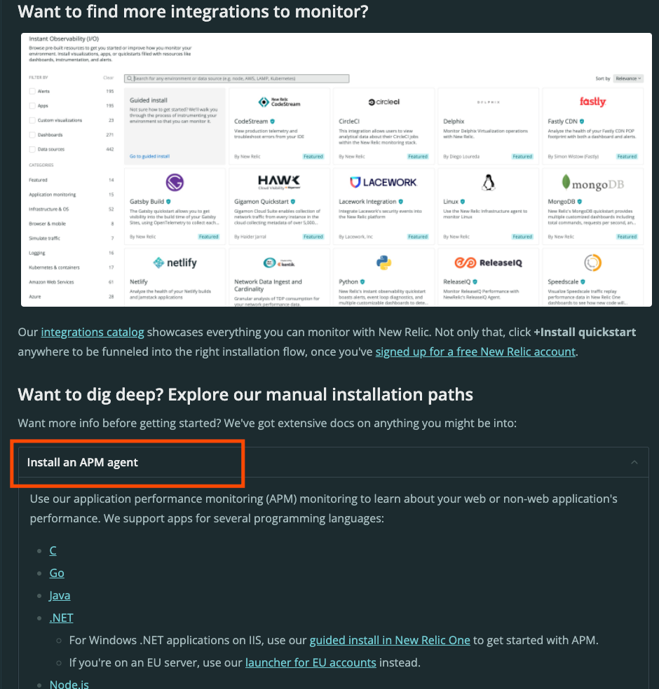
Manual instructions for installing an APM agent for New Relic are further down the page

The prompts and instructions will vary depending on your programming language, but this is the one for Python.

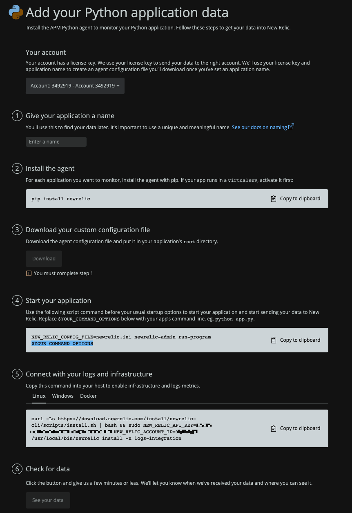Guided UI for installing the APM for a Python project

Once you *'Give your application a name*', the necessary support files and commands are generated for you, you just need to follow these steps!

After completing **Step 2**, I was feeling fancy, so I added the `newrelic` library to my `requirements.txt` file for the project, so the dependency and version was saved for future reference. 

:::note
The downloaded `newrelic.ini` file from **Step 3** contains your licence key. If you are following these Python instructions, you ***do not*** want to commit this to your code repository where it would become public! For Python, I would recommend adding this file to your [.gitignore](https://git-scm.com/docs/gitignore), but depending on your programming language, you will want to take note of where and how the licence key is used, and make sure that it is kept private (such as by using an environment variable to store it). You can learn more about [New Relic API keys and licence keys](https://docs.newrelic.com/docs/apis/intro-apis/new-relic-api-keys/) in their documentation.
:::

Once the `newrelic.ini` file was safely in the top folder of my Battlesnake code, I was able to start my Battlesnake with the following command (your command may differ if you are using a different Starter Project!)

The command to run the Python Starter Project with the basic New Relic APM

**Step 5** is optional. While not strictly required for powering the pre-built Battlesnake Dashboards, doing it will give you access to extra information in the default New Relic tools. You can absolutely return to this step later to explore infrastructure logs with New Relic! 

With my Battlesnake running, it was now time to start running some games so I could collect data. You can do that by running some [ad-hoc games](https://play.battlesnake.com/account/games/create/), completing [Challenges](https://play.battlesnake.com/challenges/), joining a ladder in [Battlegrounds](https://play.battlesnake.com/battlegrounds/), or even joining a [Competition or League](https://play.battlesnake.com/competitions/) (if one's running). There is no bad place to start watching and monitoring your Battlesnake games!

It takes a few minutes for the data to start showing up, but once it does, you can verify that everything is working correctly by checking some of the default New Relic tools.

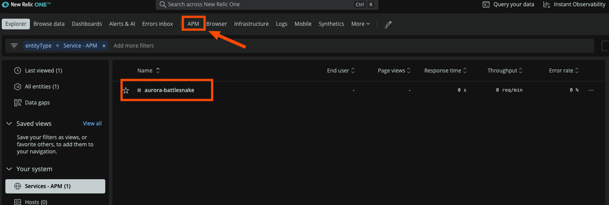Pick your Battlesnake Application to see the APM data you are now sending!

After logging into your New Relic account, navigate to the 'APM' tab and then select your application (which should match the name you picked earlier). You will be presented with the most basic, raw APM data that your Battlesnake is sending.

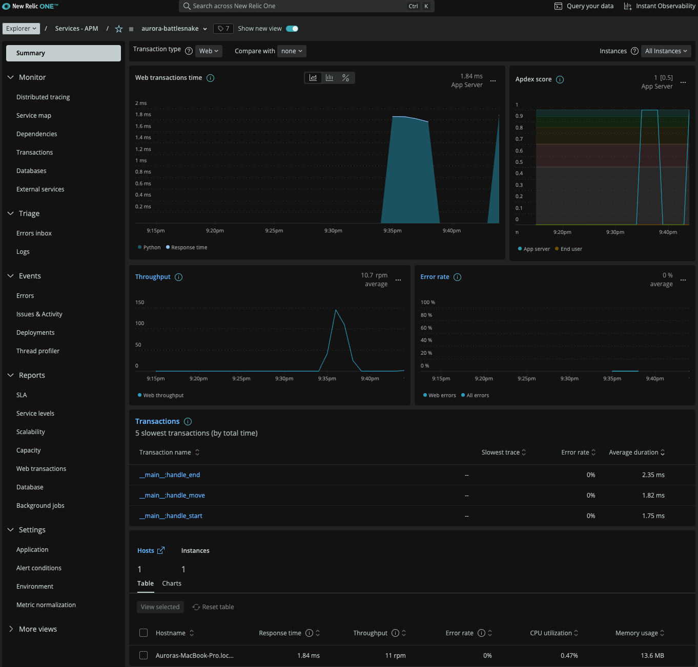The default New Relic APM Dashboard. It works!

If you see something like this, you've successfully completed a standard New Relic integration!

## Add custom Battlesnake Dashboards

While the default APM data is already useful, we can go one step further and take advantage of custom data specifically for Battlesnake.

First, add some pre-built [Battlesnake Dashboards.](https://newrelic.com/instant-observability/battlesnake/63a65857-a25e-4654-9174-928e5894b3b9) From that site, click the "**+ Install Quickstart**" button and follow the prompts in the new tab that opens in your browser.

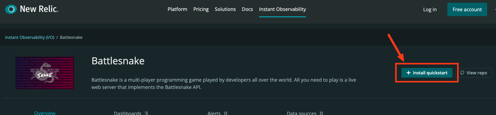

Start with the '+ Install quickstart' button

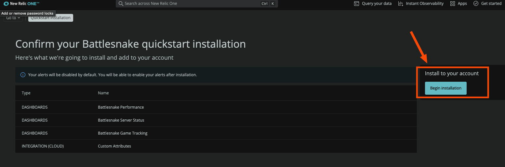

Confirm and 'Begin Installation'

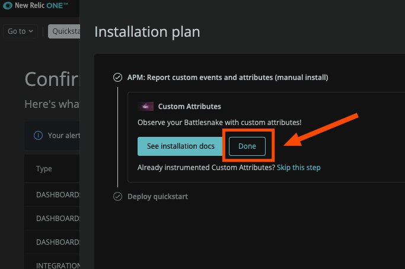Finish Installation by clicking 'Done'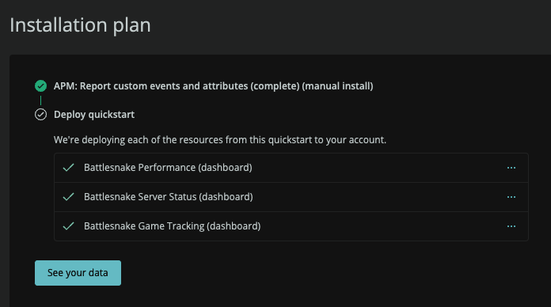

And finally see confirmation that the Three Battlesnake Dashboards have been installed.

Once the Dashboards have been added to your account, you can click on the '**See your Data' **button to go straight to them, or from your New Relic account you can find them by navigating to the 'Dashboards' tab.

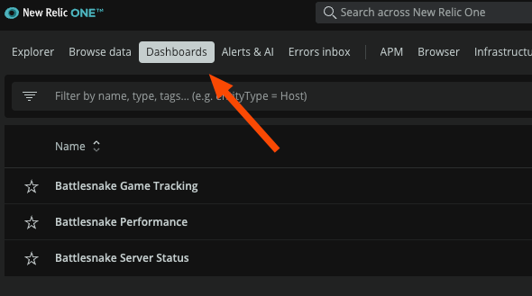Always find your Battlesnake Dashboards from the 'Dashboards' tab!

Take a look at the 'Battlesnake Server Status' Dashboard first, and you should see it already populated with some information from your base APM Data!

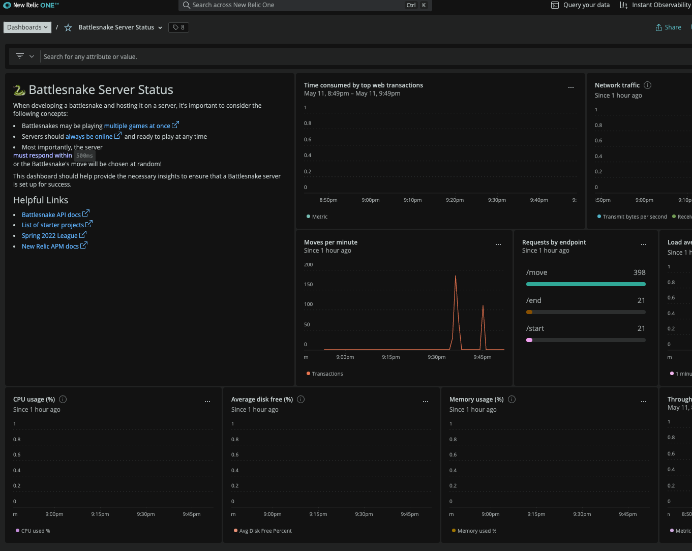

The Battlesnake Server Status Dashboard, with some basic information. It works!

## Update your Battlesnake to send Custom Data

The other dashboards will look pretty empty. This is because they rely on your Battlesnake code sending custom attributes to New Relic to power them. You can read more about [New Relic Custom Attributes](https://docs.newrelic.com/docs/data-apis/custom-data/custom-events/apm-report-custom-events-attributes/) in their documentation.

The good news is there is some sample code to help us out!

If you navigate to either the 'Battlesnake Performance' or 'Battlesnake Game Tracking' Dashboard, you'll find a tab for 'Instructions' that provide more information on how to set these up.

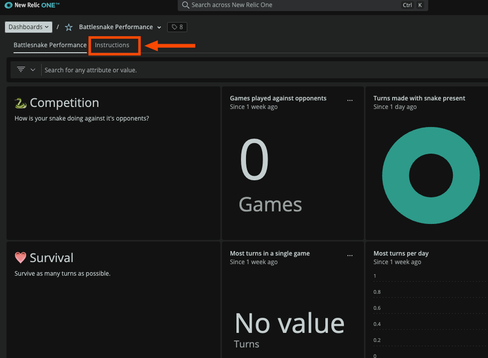

My empty 'Battlesnake Performance' Dashboard does have a helpful 'Instructions' tab!

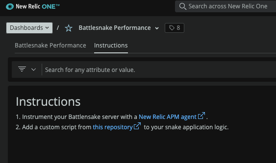

Instructions include the work needed to power this Dashboard

The instructions provide a link to the documentation for adding the New Relic APM Agent (which we have already done!) and a link to a code repository where a helpful custom script exits (this we will need to do).

Visiting [the repository](https://github.com/zstix/nr-battlesnake-attributes ) will provide you with extra code you will want to include in your Battlesnake. Currently there are only instructions for Python and Javascript that can be copied, however they can be used as a template for other programming languages. If you are feeling like you have the itch to do some Open Source Contributions, the authors note that they welcome pull requests to add instrumentation scripts for any undocumented language!

I followed the ReadMe instructions for [Python](https://github.com/zstix/nr-battlesnake-attributes/tree/main/python) and did the following:

- Copied the entirety of the `getCustomAttributes.py` file and added it in the same folder as my `main.py` for my Battlesnake.
- Edited my `main.py` file to add the `import newrelic.agent` line, as well as `from getCustomAttributes import getCustomAttributes, getCustomAttributesEnd`
- Added the for loops that call `getCustomAttributes()` and `getCustomAttributesEnd()` to my `handle_move()` and `handle_end()` functions.

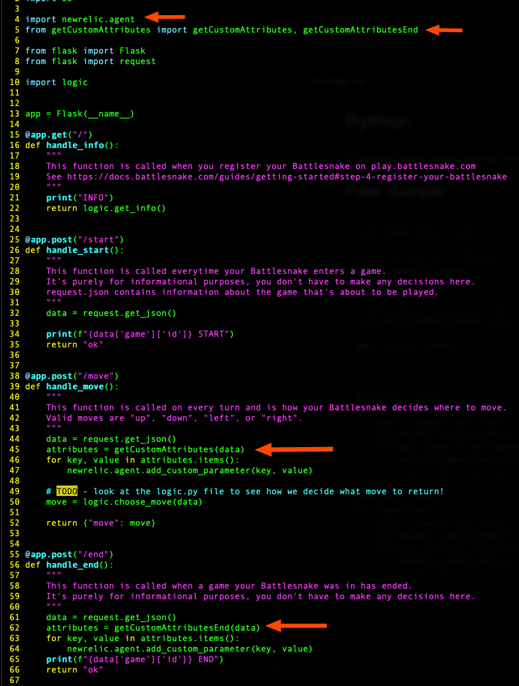

Code edits made to main.py file for the Python Starter Project

You can (and should!) take a look at the `[getCustomAttributes.py](https://github.com/zstix/nr-battlesnake-attributes/blob/main/python/getCustomAttributes.py)` file (or equivalent for your programming language) to see how the helper takes the standard [Battlesnake data](https://docs.battlesnake.com/references/api#object-definitions) and prepares it for delivery to New Relic. This code can also act as a base for your own edits, to add more or different data and create or expand your New Relic Battlesnake Dashboards.

Once my code changes were complete, I had to restart my Battlesnake server (using the earlier command that includes the NEW_RELIC_CONFIG_FILE!) and return to [play.battlesnake.com](https://play.battlesnake.com) to trigger more games so I could see new data coming in.

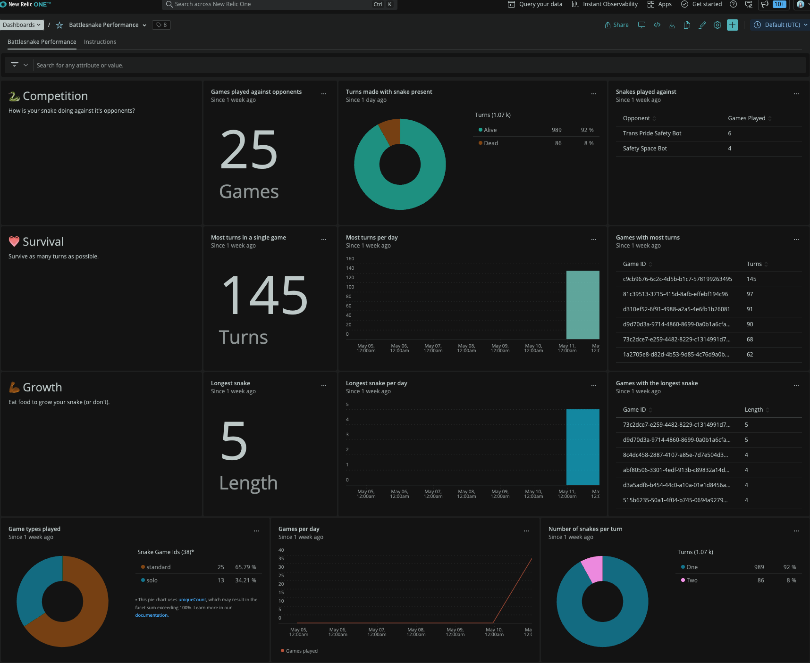Success! Game data now populating on the Battlesnake Performance Dashboard
All the Battlesnake Dashboards are now fully powered. As long as my Battlesnake is sending data, I can review the performance of my Battlesnake through these very handy New Relic Dashboards.

## Next Steps

While the Quickstart gets us up and running with some pre-built information and dashboards, after this you may want to learn a bit more about how to add more [New Relic Custom Attributes](https://docs.newrelic.com/docs/data-apis/custom-data/custom-events/apm-report-custom-events-attributes/). You can also explore the pre-built dashboards (click on the '**...**' to see how each widget works!) to see some examples of how individual widgets are created and use that knowledge to modify them or make your own.

See all the secrets of any individual widget on the Battlesnake Dashboards by editing them and seeing how they work!

The pre-build Dashboards act as an incredible starting point, but can be modified to suit your personal needs.

Now with more powerful tools at your disposal, I hope you feel ready for the next Battlesnake competition!

---

If you found this guide helpful, you might also be interested in our follow-up video where we dive into troubleshooting and customizing your Battlesnake.

