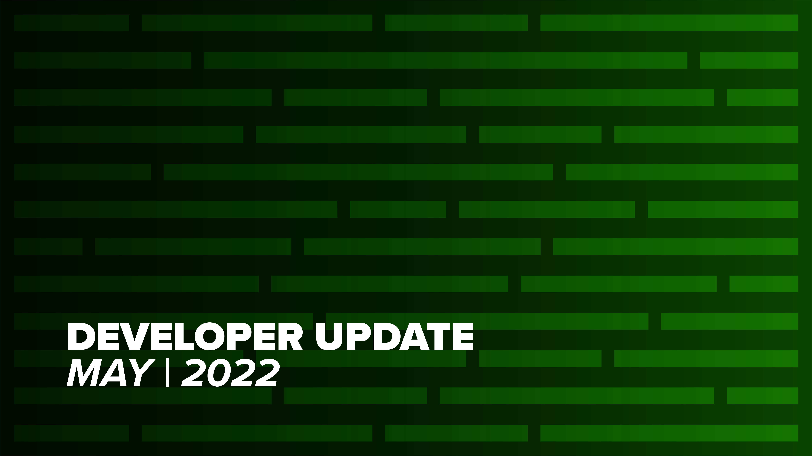
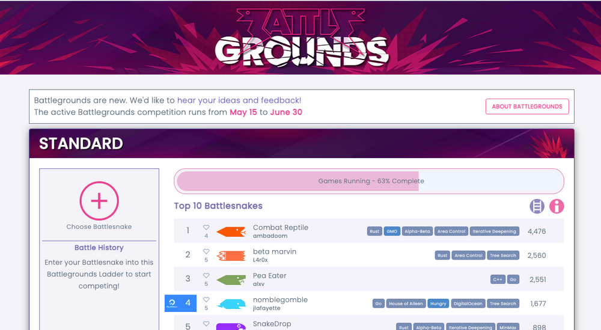
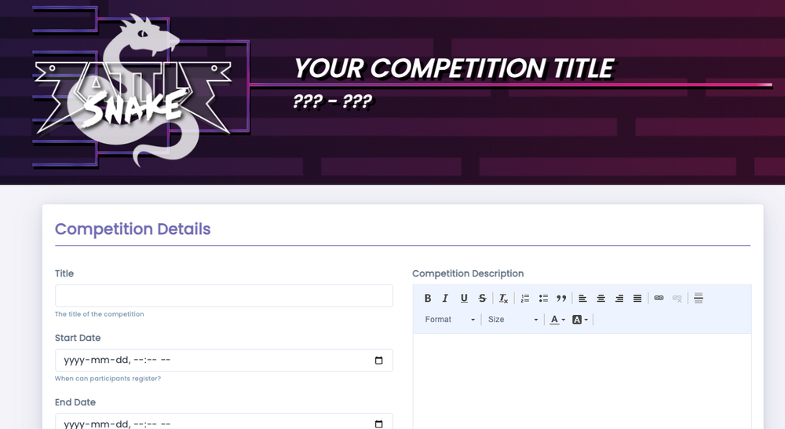
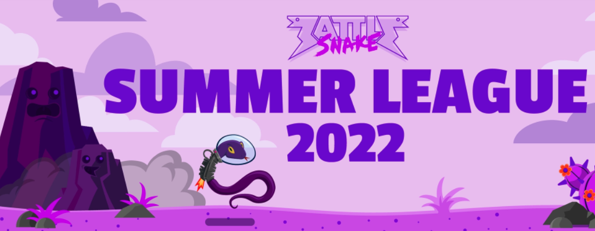

I am pleased to open the May Developer update with an introduction to [Lorne](https://play.battlesnake.com/u/llourn/), our newest Battlesnake employee! Lorne has joined us on the development team, specializing in front-end work. We find him to be an inquisitive and dedicated life-long learner, who totally understands the opportunities for experimenting, creativity, and growing your skills while also playing Battlesnake - and that is why we just had to have him join the team. Welcome Lorne!

## Battlegrounds

After hinting for a while that something was coming soon, we are proud to announce the launch of [Battlegrounds](https://play.battlesnake.com/battlegrounds/), the details of which are fully captured in a [blog post](__GHOST_URL__/welcome-to-battlegrounds/) from earlier this month. Chris has worked very hard on this for many weeks, and we're really happy with the results!

Battlegrounds is the next step in providing competitive play between Leagues, replacing the Global Arena system. The old Global Arenas will be shutting down on May 31st, so be sure to move your Battlesnakes over to the Battlegrounds!

## Running your own Competition

[Last November](/) we ran a Beta-Test for folks to be able to run their own Battlesnake Competition, and had some fabulous community members take this new feature out for a spin for us.

**Interested in hosting your own tournament? **This feature is still in limited access but if you are interested in giving the beta a whirl, **[apply here! ](tinyurl.com/ymuevkfa )**We've created a minor version release of assorted improvements, from bug fixes to workflow adjustments. Keep an eye on [Discord](https://play.battlesnake.com/discord/) for opportunities to play in these community-run tournaments. And thanks to everyone who has already run or participated in one of these events - your feedback has been very helpful!

Sneaky peek of the UI for creating your own competition!

## Rules Changes

Rob has been busy hacking away in the [Rules repository,](https://github.com/BattlesnakeOfficial/rules) and recently released [version 1.1.4](https://github.com/BattlesnakeOfficial/rules/releases/tag/v1.1.4), which includes the following changes:

- Support for maps via the `--map` flag
- Existing named [rulesets](https://docs.battlesnake.com/api) (standard, royale, etc) now have food spawn handled by the maps
- All int32 types have been changed to int
- Squad mode support has been removed

Some of these changes may be breaking for folks, so please let Rob know in the [#rules-updates](https://discord.com/channels/689979228841836632/978649366879404072) channel on Discord if you encounter any issues while upgrading.

## Instrumenting your Battlesnake with New Relic 

One of the *most fun* parts of my job is getting the chance to jump on a livestream or put together a video to share the joy of learning with all your fine Battlesnake friends. A very cool project this May was being able to work with certified awesome dude Alec from New Relic, creating some tutorial videos on how to add New Relic to your Battlesnake, specifically with some custom-made (and freely available!) Battlesnake Dashboards.

If you have never used New Relic to monitor a web system before, we have you covered with this quick start video:

Once you've mastered that, we have a second video about how to go further, tweaking your collected data and demonstrating how New Relic can be used to help you find bugs and solve mysteries in your Battlesnake code.

If you prefer learning by reading, there is also a companion [blog post](__GHOST_URL__/how-to-monitor-your-battlesnake-with-newrelic/) that walks through the quick start process. However you like to consume knowledge, please check it out and let us know what you think! Don't forget to add the `New Relic` tag to your Battlesnake once you've integrated.

## Community Updates

This month, shoutout to community member [Nick](https://github.com/Nick-NCSU) for catching and updating some missing types on the official [Battlesnake Typescript Starter project](https://github.com/BattlesnakeOfficial/starter-snake-typescript/pull/5). Thanks for your sharp eyes and quick fingers in getting this patch done!

## Summer League is almost here!

Setup scripts have been written. Prizes have been selected. A new and ambitious game mode has been built. Art has been rated. Summer League 2022 launches June 3rd, and we look forward to enjoying another great League event with you all.

If you loved the expressive hills from Spring League, you'll be delighted by the Summer mountains.

If you have not yet participated in a League, then there is no time like today! Check out the [League Guide](https://docs.battlesnake.com/guides/playing/leagues) to get an idea of what to expect, make sure your Battlesnake can complete the [Training Program Challenges](https://play.battlesnake.com/challenges/), and then start working on handling hazards [(like in Royale) and Wrapped mode](https://docs.battlesnake.com/guides/game/modes). Everyone should keep an eye out for opportunities to practice the new Summer League map when creating custom games, which is coming soon.

---

That's all for now. If you have any questions, reach out to us on the [Battlesnake Discord](https://discord.battlesnake.com/) server.
