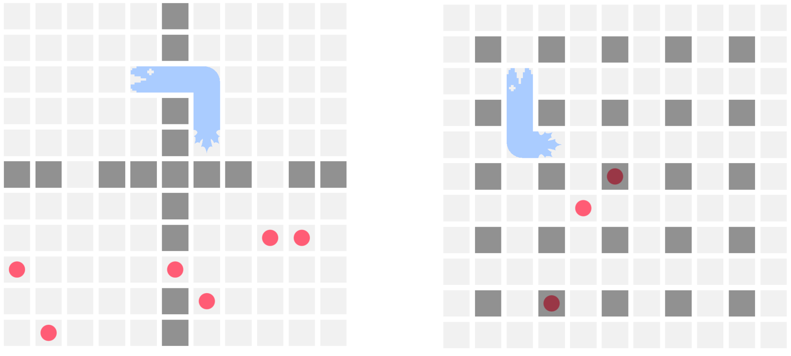

June was a busy month for the team with getting Summer League off the ground and making some big improvements to the platform!

## Summer League Launched

Summer League is live and we are halfway through the competition. In addition to wrapped mode, Summer League has introduced a completely new aspect to league competition: the massive Arcade Maze game map.

### Arcade Maze Map

The Arcade Maze map is a 19 x 21 board filled with pathways that Battlesnakes must strategically navigate. Unlike previous hazard maps, these hazards are deadly, causing 100 damage when a Battlesnake enters the space. This has created a whole new set of challenges to navigate for Summer League!

We have also added some new [Arcade Maze Challenges](https://play.battlesnake.com/challenges/#arcade-maze) to help developers figure out how to update their Battlesnake to understand this hazard map.

### Update League UI

Sherri and Lorne have been working hard to polish the new [League Dashboard](https://play.battlesnake.com/league/summer-league-2022/arenas/summer-league-2022/) interface as we continue to level up the Battlesnake user experience. The new leaderboard shows an animated match timer and recent round stats which provides you with easy access to your Battlesnakes recent game history!

We have plans to do a lot more updates to the Battlesnake UI/UX over the summer!

## Game Maps

Rob has spent June refining the new Game Map system in Rules to better support new features including snake placement and food placement. In addition, we have added a variety of new maps in the system to try out such as *Rivers and Bridges* and *Rings*.

Implementation of all game maps, including the Summer League Arcade Maze map, are open source and can be viewed in the [Rules](https://github.com/BattlesnakeOfficial/rules) repo!

## Build your own Battlesnake Maps

We've made it easier to build your own maps in code, and register them to be used with the local CLI.

## Battlesnake CLI Improvements

With all the updates to Rules in May and June we have implemented several improvements to the [Battlesnake CLI](https://github.com/BattlesnakeOfficial/rules/tree/main/cli) to help developers test their Battlesnakes in different situations.

### New Browser Feature

If you are tired of trying to debug your snake using the ASCII board, the CLI can now render games in a browser using our game board renderer!

Just add the `--browser` flag to your CLI command and it will load up the game in a web browser in real time.

### Game Maps

Using the `--map <name>` flag on the CLI command you can create a game with any of the game maps build into the Rules repository. This can be combined with the `--browser` flag to get a fully rendered game using any map!

### Solo Mode

The CLI now supports running single Battlesnake games (aka solo games) using all of the game modes provided in the Rules.

---

That's all for now. If you have any questions, reach out to us on the [Battlesnake Discord](https://discord.battlesnake.com/) server.
