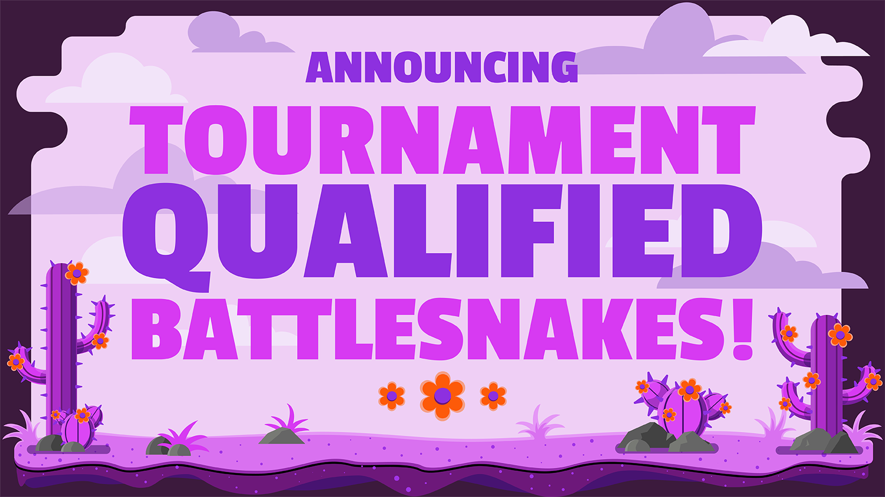
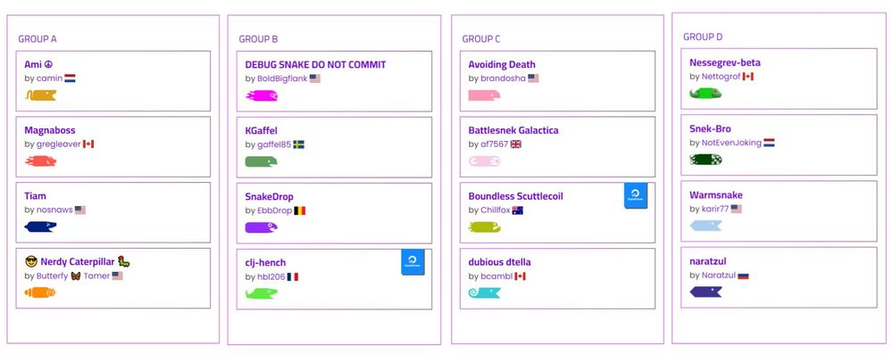
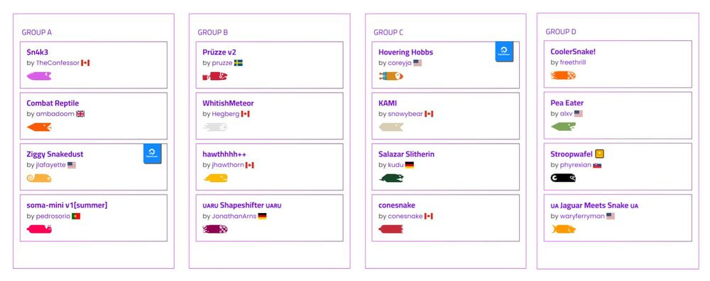
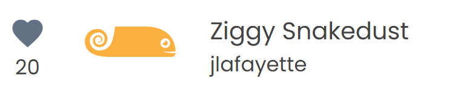
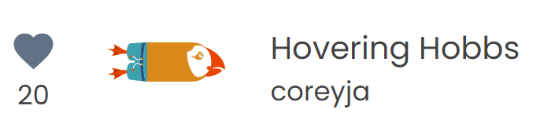
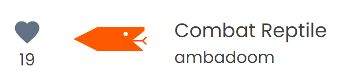
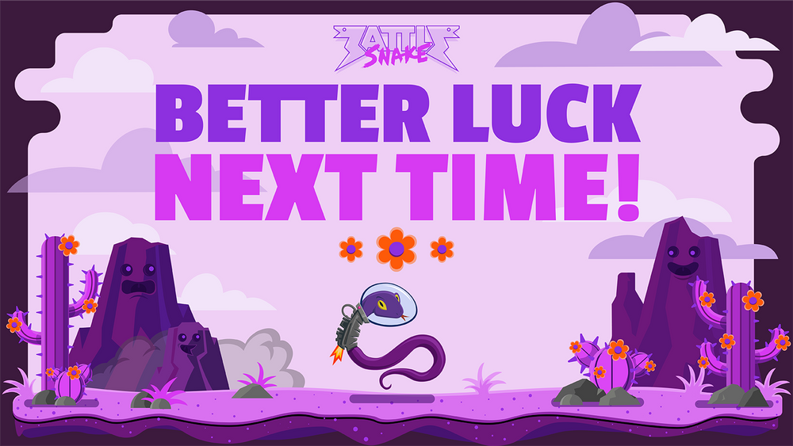
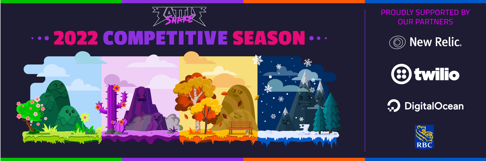

import Admonition from '@theme/Admonition';

With the Summer League leaderboard official closed, let’s take a look at the top tier Battlesnakes who qualified for the live tournaments on **Saturday, July 23rd** and **Saturday, July 30th** on [Twitch.TV/BattlesnakeOfficial](https://twitch.tv/battlesnakeofficial) 🏆

:::info What's inside this announcement?

- Tournament Format
- Platinum Qualified Battlesnakes
- Elite Qualified Battlesnakes
- Peoples Choice Award Contenders

:::

## Tournament Format

The 2022 Summer League Tournament's will kick off on **Saturday, July 23rd beginning at 9am PT / 12pm ET on **[**Twitch.TV/BattlesnakeOfficial**](https://twitch.tv/battlesnakeofficial) with the Platinum Qualified competitors.

:::note 

Throughout this day of competition, 2 wins will be required to move onto the next stage, right up until the finals where it will be a race to 3 to determine who will be crowned as the Tournament Champion.
:::

Then we'll return for the exciting finale to the Summer League on **Saturday, July 30th beginning at 9am PT / 12pm ET on **[**Twitch.TV/BattlesnakeOfficial**](https://twitch.tv/battlesnakeofficial) where we will crown both the Elite Champion and the Peoples Choice Winner.

## Platinum Tournament

### Saturday, July 23rd at 9am PT / 12pm ET

An incredible 16 Battlesnake's qualified in the Platinum tier of the 2022 Summer League Tournament which will take place **Saturday, July 23rd** on Twitch.

#### [Check out the Brackets](https://play.battlesnake.com/league/summer-league-2022/tournaments/summer-league-2022-platinum/) for the Summer League Platinum Tournament

## Elite Tournament

### Saturday, July 30th at 9am PT / 12pm ET

With fierce competition throughout the competition, 16 of this seasons best Battlesnakes qualified for the 2022 Summer League Elite Tournament.

#### [Check out the Brackets](https://play.battlesnake.com/league/summer-league-2022/tournaments/summer-league-2022-elite/) for the Summer League Elite Tournament

## Peoples Choice Contenders

While Battlesnake is about code, it is also about community, and that is one of the reasons why the Peoples Choice award was created back in 2020.

:::info

Decided by Cheers on the League Leaderboard, People Choice winners may not walk away with a cash prize, but they do walk away with the ability to create their own bespoke Battlesnake customization.

:::

Take a peek at the current top three contenders for the Peoples Choice award below, but remember there is still plenty of time to vote, so go ahead and cheer on your favorite Battlesnake today!

#### Learn more about [Ziggy Snakedust](https://play.battlesnake.com/u/jlafayette/ziggy-snakedust/)

#### Learn more about [Hovering Hobbs](https://play.battlesnake.com/u/coreyja/hovering-hobbs/)

#### Learn more about [Combat Reptile](https://play.battlesnake.com/u/ambadoom/combat-reptile/)

## Thanks & See You Soon!

Before we close, we want to thank all of the Summer League competitors, both those who qualified and those who didn't make it to the tournament 🙏

We'd also like to send a big shoutout to our amazing community and our wonderful 2022 partners at [RBC](https://play.battlesnake.com/partner/rbc), [New Relic](https://play.battlesnake.com/partner/newrelic), [DigitalOcean](https://play.battlesnake.com/partner/digitalocean) and [Twilio](https://play.battlesnake.com/partner/twilio) who help to make these spectacular competitions possible ❤️‌

> [See you at the Live Tournaments on July 23rd and 30th](https://twitch.tv/battlesnakeofficial) 👋
