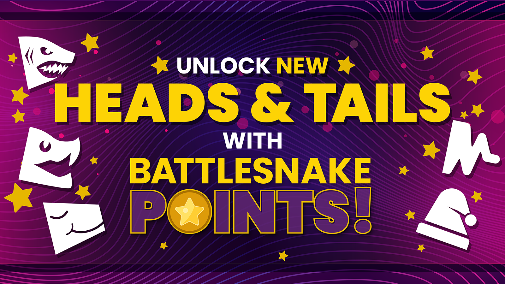
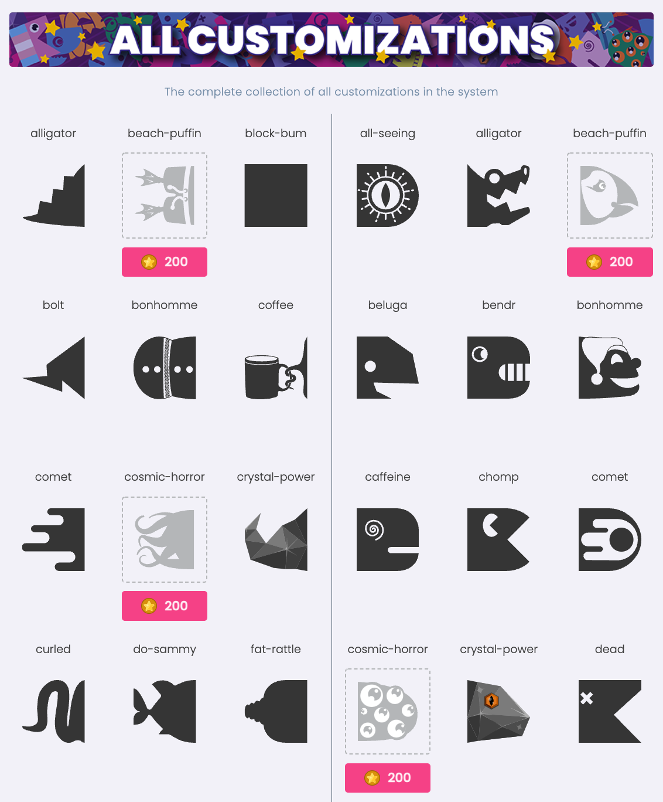
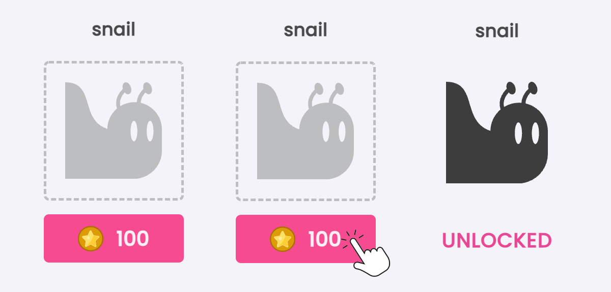
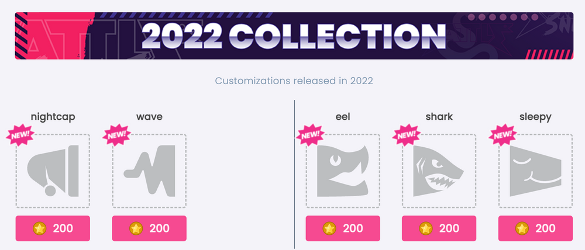

Introducing **Battlesnake Points!** Which can be used unlock new head and tail customizations for your Battlesnake. There are over 100 customizations to collect and new heads and tails being released regularly.

In this post, we'll cover what Battlesnake Points are, how to earn them, and where to spend them.

## The New "Customizations" Page

This new page shows all of the [customizations](https://play.battlesnake.com/customizations/) you've collected during your adventures with Battlesnake. Anything you unlocked via a reward code, received from an achievement or earned as a prize is visible there. It's also where you'll have access to **new** customizations.

## Unlocking New Customizations with Battlesnake Points

We are introducing **Battlesnake Points**, which you can use to unlock new head and tail customizations for your Battlesnake! There are over 100 customizations to collect, with new heads and tails being released regularly.

To unlock a customization, find one that is not in your collection and click on the unlock button. If you have enough points, the head or tail will be added to your account and is ready to use on your Battlesnake!

Just click on the unlock button to use your points to unlock a new customization!

### How Do I Get Battlesnake Points?

Battlesnake Points are gained by participating in various Battlesnake activities. As you explore the Battlesnake platform and complete goals, you will automatically earn points. 

There are many ways to earn Battlesnake Points:

- Create a Battlesnake
- Complete challenges
- Participate in Battlegrounds
- Join a league
- Compete in a tournament
- Be active in the community

### Bonus!

To get everyone started we have analyzed every existing user account and rewarded them points for all activities they have completed since December 2021!

## 5 New Customizations Now Available

To celebrate this new mechanism we are releasing**[5 new, never-before seen](https://play.battlesnake.com/customizations/)**, head and tail customizations as part of the 2022 Collection!

---

We will continue to iterate on this new system and introduce new customizations. We will be actively listening to feedback on the [Battlesnake Discord](https://discord.battlesnake.com/) server and the [Battlesnake Discussions](https://github.com/BattlesnakeOfficial/feedback/discussions) forum as we explore what is and isn't working! You're also welcome to email us at hello@battlesnake.com
