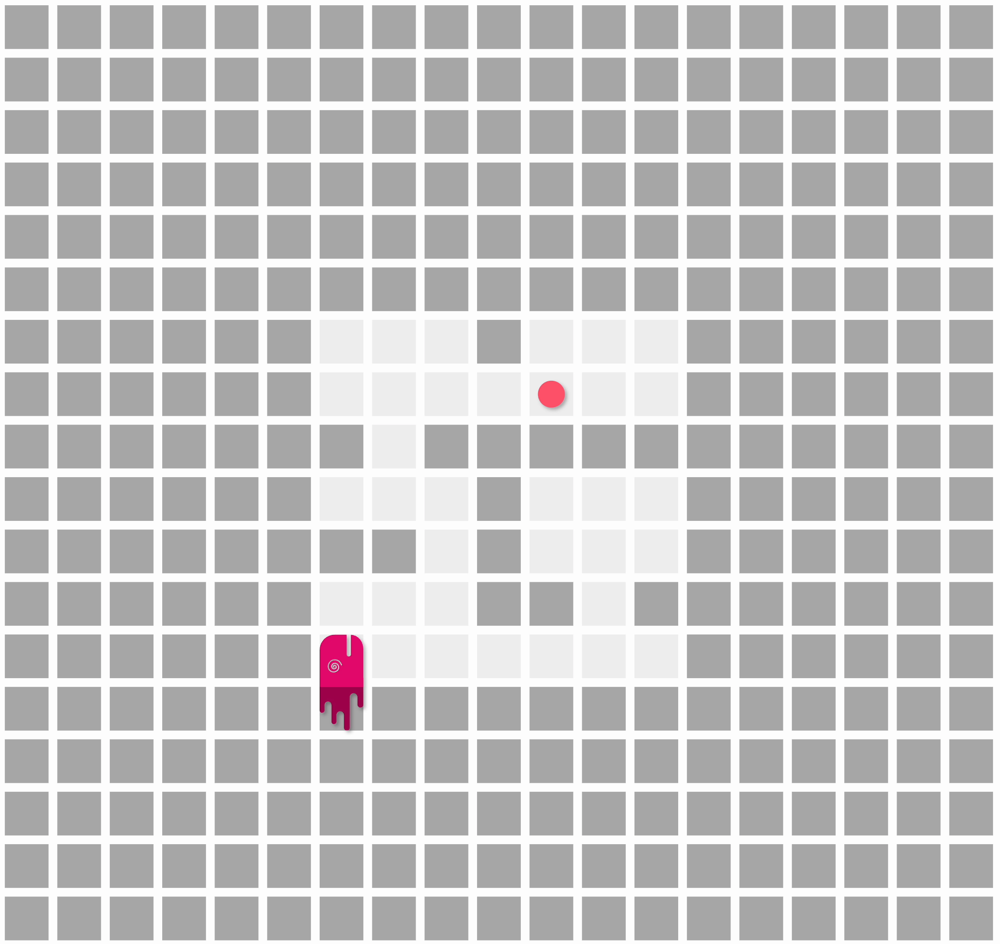

As Summer League 2022 wrapped up and moved into the tournament phase, the development team  focused some new features for Battlesnake!

## New Customizations and Battlesnake Points!

In August, we are introducing a new rewards system called Battlesnake Points. As you explore the Battlesnake platform and complete goals, you will automatically earn points. You can then use those points to unlock new head and tail customizations on the [Customizations](https://play.battlesnake.com/customizations/) page.

As part of this new feature, we have released some previous exclusive customizations and added a few brand new ones!

You can find all the details in the [Battlesnake Points announcement](/battlesnake-points/) post.

## More Game Maps

Now that the Game Maps system in Rules is fully operational and battle tested we are now experimenting with all kinds of new ways to create maps for Battlesnake games.

### Sinkholes!

Starting as an idea for Battlegrounds during a [Battlesnake Codes](https://www.twitch.tv/videos/1531835887) stream, Rob and I have built out a new kind of game map that introduces stacked hazards as a new problem to solve!

The sinkhole map spans a growing area of hazard with new layers of hazards appearing over the previous, much like a heat map. Battlesnakes moving into the depths of the sinkhole will take damage from each hazard stacked on a square.

Try it out yourself with the [Rules CLI](https://github.com/BattlesnakeOfficial/rules) or enter a Battlesnake into the *Sinkhole!* ladder for the August [Battlegrounds](https://play.battlesnake.com/battlegrounds).

### Solo Maze

Solo Maze is the first approved map developed by the community! Experienced Battlesnake developer, [**coreya**](https://play.battlesnake.com/u/coreyja/)**,** has created an ingenious solo experience where your Battlesnake must solve a series of increasingly more complicated mazes in order to find food.
  

Is your Battlesnake smart enough to solve every maze? Try it out using the Rules CLI and prepare for a potential new Challenge coming this fall.

---

That's all for now. If you have any questions, reach out to us on the [Battlesnake Discord](https://discord.battlesnake.com/) server.
