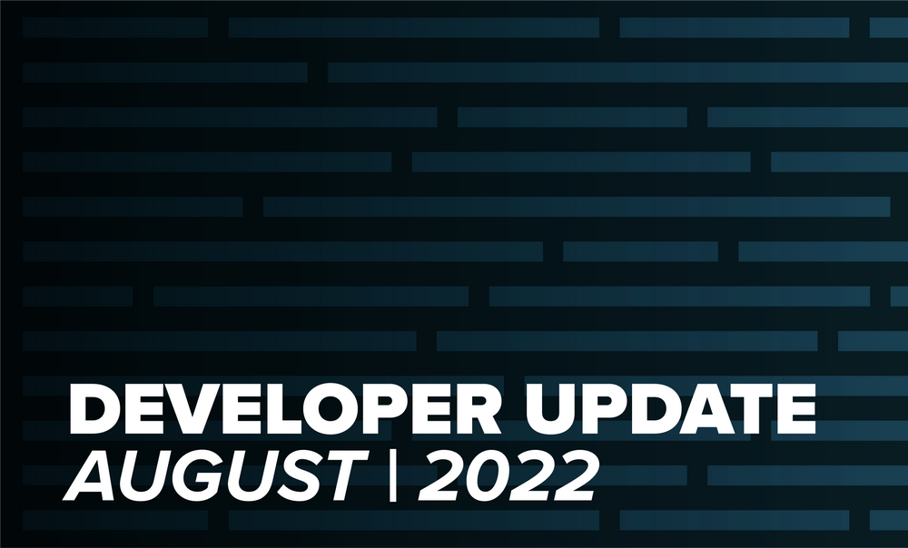
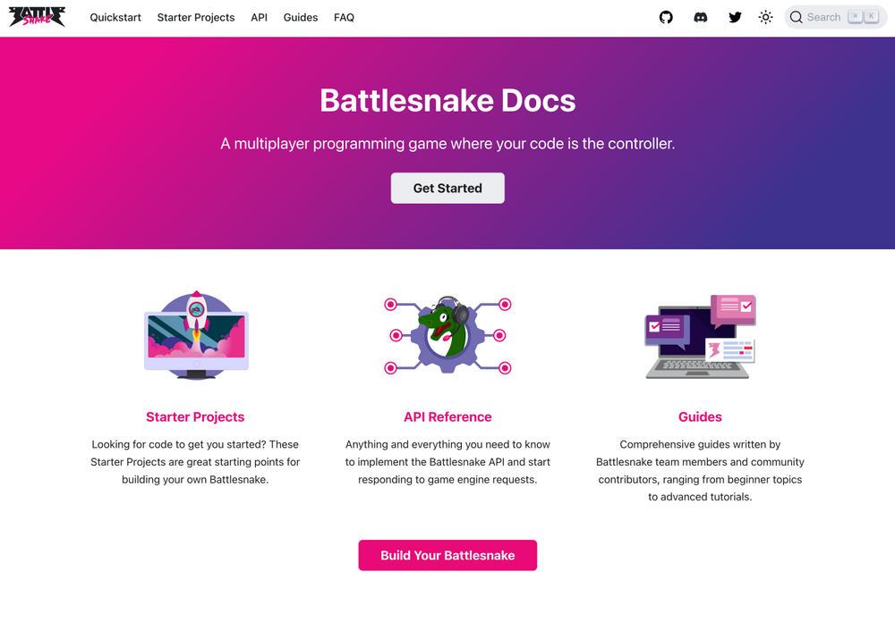
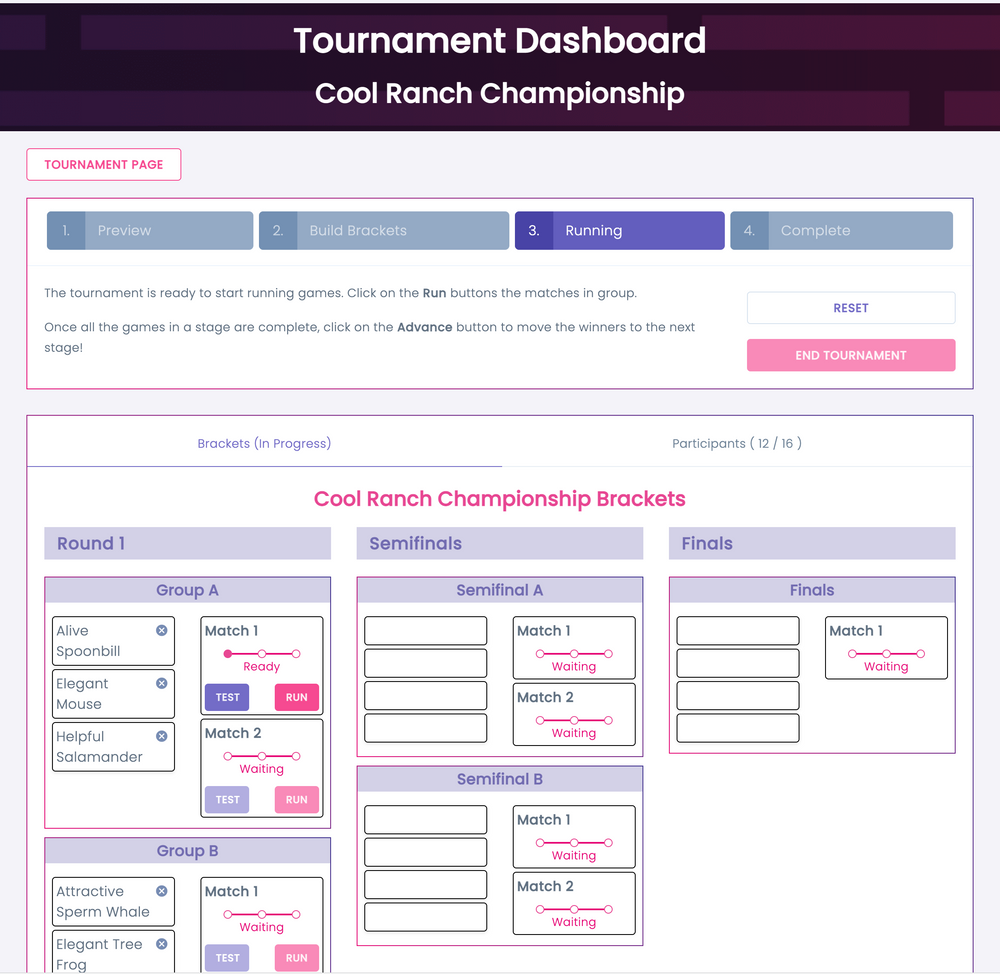
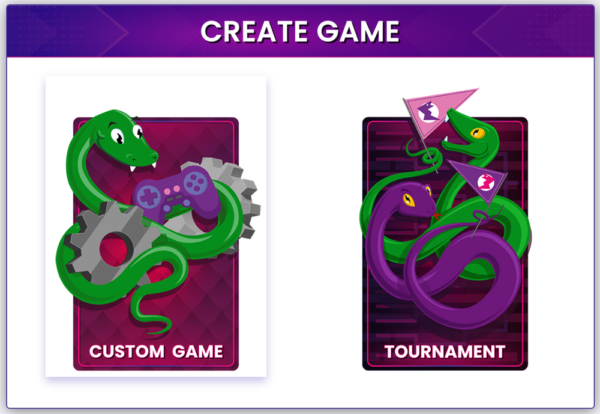
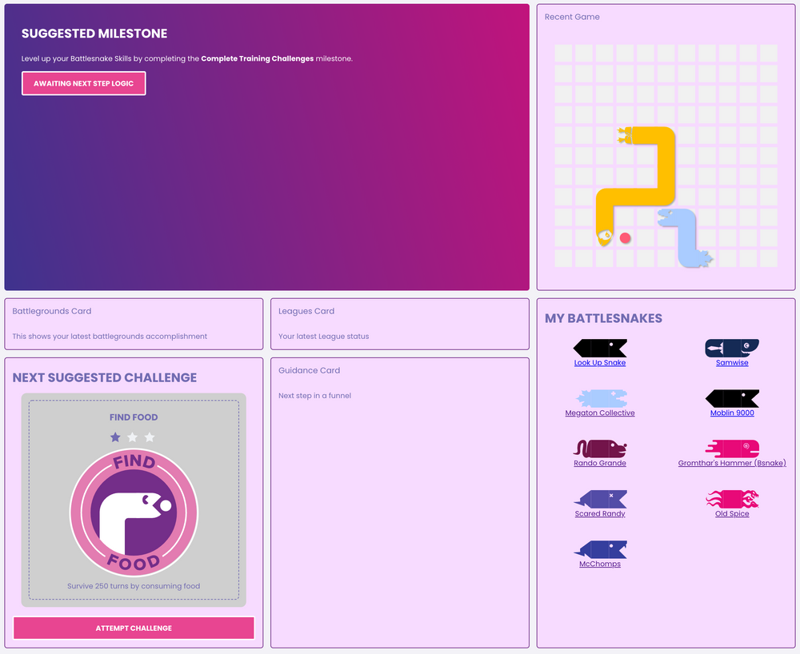

A lot of things came together in August for the Battlesnake team, including improvements to almost every corner of the platform.

## New Docs

We rebuilt and relaunched [docs.battlesnake.com](https://docs.battlesnake.com/) using the [Docusaurus](https://docusaurus.io/) platform. This gave us a lot of power to improve the usability of the docs and provide a solid platform for community members to contribute to the documentation that supports Battlesnake. 

Big thanks to Bultz, Corey, Naomi and the other community members that both assisted in the port and contributed new content to the site!

## Revised Starter Projects

Brad spent a lot of August reviewing and updating the official Battlesnake Starter Projects to be much more approachable. A major part of this was removing a lot of the infrastructure support like Heroku and Replit from the projects on GitHub to make them to make them as simple and portable as possible. 

The docs site has a handy listing of all the [Battlesnake Starter Projects](https://docs.battlesnake.com/starter-projects).

We still do love Replit as a quick way of getting started with Battlesnake and to that end we have created all new Replit templates for each of the starter projects. These templates are designed to rapidly setup Battlesnakes inside of the Replit ecosystem. 

You can find all of the Replit starter templates here: [https://replit.com/@Battlesnake](https://replit.com/@Battlesnake)

## Battlesnake Tournaments

The new tournaments feature we announced earlier this year is now live! This system allows developers to run their own ad hoc tournaments for up to 16 other Battlesnake users. The system supports 7 different game mode and map combinations as well as standard and duels tournament formats!

You can access the Battlesnake Tournament feature by clicking on the Create Game button and then the Tournament button.

For now we are running a trial of the system with a few dozen users, and expand access over the coming weeks. To request access to the Battlesnake Tournaments feature, just fill in the [application form](https://bsnk.io/accesstournaments).

## Custom Game Changes

We have made it easier to test your Battlesnake in custom games! We have added four new "bots" to the Custom Game interface which provide you with opponents that show consistent behavior in games, for when you are first starting out or trying out a new type of algorithm. 

We have also added several new game maps to the form, to give you different ways to challenge your Battlesnake in custom games. 

Lastly there is a new game rule available, *Wrapped + Constrictor*, combining both mechanics into one game board, for interesting results. The September Battlegrounds includes the Constrictor Maze ladder, that combines the new game rule with the Arcade Maze map from Summer League!

## Retry Specific Challenges

We have noticed that some players like to reset their challenges to retry the challenges with different Battlesnakes and to validate new algorithm changes. We have made this workflow much simpler now as any completed challenge can be retried individually using any Battlesnake on your account. Just click on the Retry Challenge link below the card and select the Battlesnake you want to use. The challenge game will be generated immediately!

## Feature Preview: Developer Dashboard

We’ve been busy working on projects related to your previous feedback, one of which is the new ***Account Dashboard*.** This new interface will serve to guide you along your Battlesnake journey, informing you of ongoing events, recent stats, and suggestions for what to try next. 

It's still in the early prototype stage but we are planning to release an initial version in September!

---

That's all for now. If you have any questions, reach out to us on the [Battlesnake Discord](https://discord.battlesnake.com/) server.
