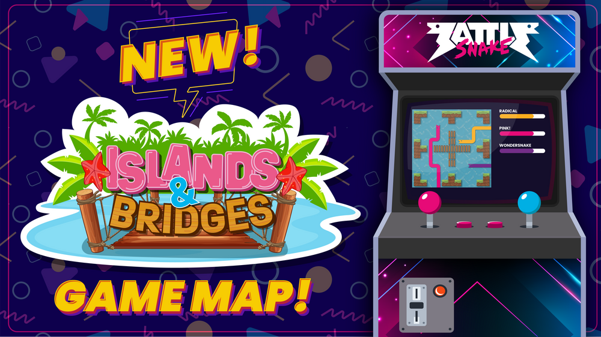

Don't miss your chance to join the *final *public league of the 2022 competitive season! Find out what's new and what's staying the same for Fall League so you'll be ready for battle when the competition begins on **September 30th.**

## [Register for the 2022 Fall League Competition!](https://play.battlesnake.com/league/fall-league-2022/)

:::note New to Competitive Battlesnake?

Be sure to check out our [FAQ page.](https://play.battlesnake.com/league/fall-league-2022/register/#faq)

:::

## **Fall League Game Modes**

### Something Old and Something New

While we are introducing some fun new features this fall, a couple things will mirror Summer League. Deadly walls, wrapped mode, and the $1000 prize pool will remain unchanged.

### Deadly Hazard Walls

Once again, one wrong move could spell **game over** for your Battlesnake. Collisions with a hazard wall are fatal—dealing 100 damage to your Battlesnake.

### Wrapped Mode

Battlesnakes can pass through the outer boundaries of the board by using gaps in the hazard walls to appear on the opposite side. Should another Battlesnake be on the other side of the board at the same time, [standard collision rules apply](https://docs.battlesnake.com/guides/game/rules#collisions).

### Prize Pool

We're giving away a [prize pool of over $1000](https://store.battlesnake.com/collections/prize-packs) worth of Battlensnake goodies including gift cards, trophies, medals and of course eternal bragging rights. 

### Game Board - All New Islands & Bridges Hazard Map

This new maps features four quadrants separated by deadly hazard rivers that are not only impassible by Battlesnakes, but a one-hit kill! Games on this map will be played on an **11x11 game board**.

:::note

Ladders run up to 100 matches daily for 8-hours starting at 10pm PT / 1am ET / 6am GMT. Make sure your Battlesnake is awake and ready!

:::

### Fall League Schedule

Here's a rundown of what's happening this Fall and when to watch the tournaments live on Twitch.  

- **Registration Opens:** NOW!
- **Ladder Opens:** September 30th at 10:00pm PDT / October 1st 1:00pm EDT
- **Snake Pit Live!:** October 15th at 9:00am PDT / 12:00pm EDT
- **Ladder Freeze:** October 29th at 8:00am PDT / 11:00am EDT
- **Platinum Tournament:** Early November 
- **Elite Tournament:** Mid-November

:::note

Add these dates to your Google calendar [here](https://play.battlesnake.com/schedule/).

:::

## **Big Thanks to our Partners**

Our wonderful partners are what makes Battlesnake possible. A big thanks goes out to [DigitalOcean](https://play.battlesnake.com/partner/digitalocean), [Twilio](https://play.battlesnake.com/partner/twilio), [New Relic](https://play.battlesnake.com/partner/newrelic), and [RBC](https://play.battlesnake.com/partner/rbc) for their continued support!

Don't miss all the exciting Battlesnake Streams on [Twitch.](https://twitch.tv/BattlesnakeOfficial)

### [Register for the 2022 Fall League Competition!](https://play.battlesnake.com/league/fall-league-2022/)

---
 
Have something you want to share with us? Reach out to us on [Discord](https://discord.gg/fb4m4Ex7RR), Twitter [@playbattlesnake](https://twitter.com/playbattlesnake), or at [hello@battlesnake.com](mailto:hello@battlesnake.com).
