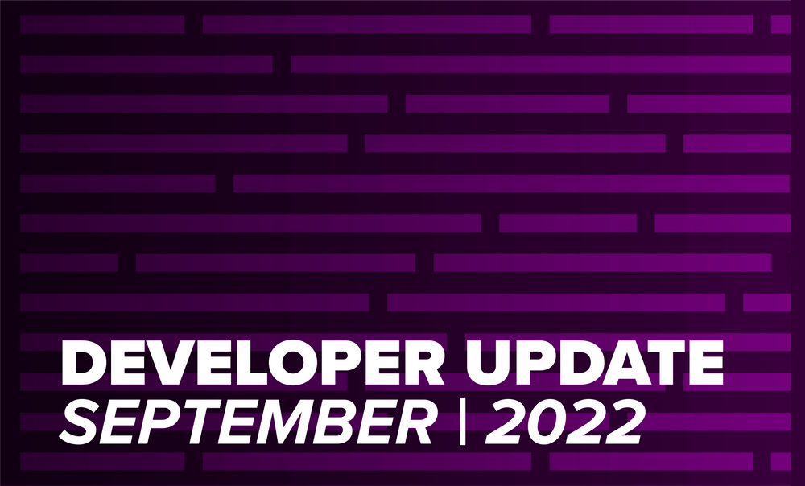
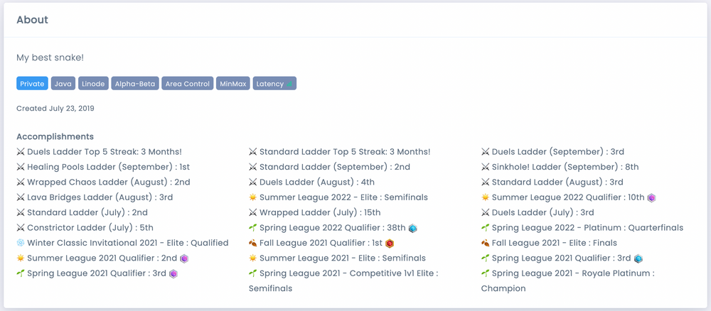
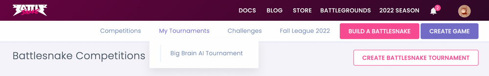
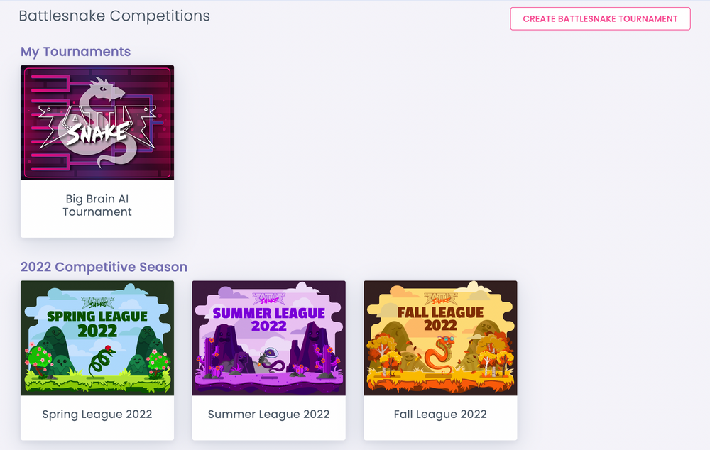
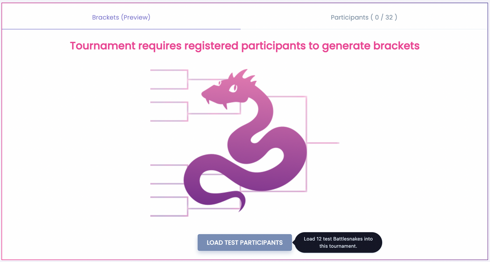

September was a big planning month for Battlesnake. We got the entire remote team together for an onsite to discuss roadmap and brainstorm plans for the 2023 Competitive Season. There are a lot of exciting things coming in the next 6 months!

Around all that planning,  we managed to get a few new features into the platform!

## Community Challenge: Solo Maze

Ever since [coreyja](https://play.battlesnake.com/u/coreyja/) created the Solo Maze Game Map we wanted to utilize it on the site and given that it was designed for a single Battlesnake, it made a lot of sense to make it our first [Community Challenge](https://play.battlesnake.com/challenges/). 

You can now test your Battlesnake against 10 randomized mazes of increasing size and complexity. Your Battlesnake has 100 turns to find the food in the maze and then advance to the next level. Pass through all 10 levels of the Solo Maze to complete the challenge!

We hope to add more community challenges in the future. If you are interested in contributing your own challenge, you can pitch your concept on the [Battlesnake Feedback Discussions](https://github.com/BattlesnakeOfficial/feedback/discussions). 

## Battlesnake Accomplishments 

We are experimenting with displaying a Battlesnake's performance in competitions  as a way to show a story of how a Battlesnake competes over time. To that end, you can now see your Battlesnake's accomplishments listed on the Battlesnake profile page. 

The page now shows a breakdown of how your Battlesnake has done in each League, Tournament and Battlegrounds. In addition, we are showing streaks that your snake may have achieved in the Battlegrounds Standards and Duels ladders!

The feature is in a very alpha state at the moment and we are open to feedback!

## Battlesnake Tournaments

As more developers gain early access to the Battlesnake Tournaments feature, we are regularly adding quality of life improvements to make the process of creating and running tournaments that much easier.

### My Tournaments

We have made the tournaments you create easier to find by adding a new option to the navigation bar to provide quick access. 

Also, the [Competitions page](https://play.battlesnake.com/competitions/) was restructured to show your tournaments at the top, along side the leagues. It will also list the tournament that you are participating in that are being run by other organizers!

### Tournament Testing

There are a variety of ways to configure your tournament and sometimes organizers want to experiment with the settings before they commit to a plan for their custom competition. Unfortunately, testing is difficult without tournament participants so we added a new tool that will let you import a set of special test  Battlesnakes into your tournament. Now you can do some trial runs before inviting competitors to join!

If you are interested in running Battlesnake Tournaments for friends or colleagues  you can [apply for early access](https://bsnk.io/accesstournaments).

---

That's all for now. If you have any questions, reach out to us on the [Battlesnake Discord](https://discord.battlesnake.com/) server.
