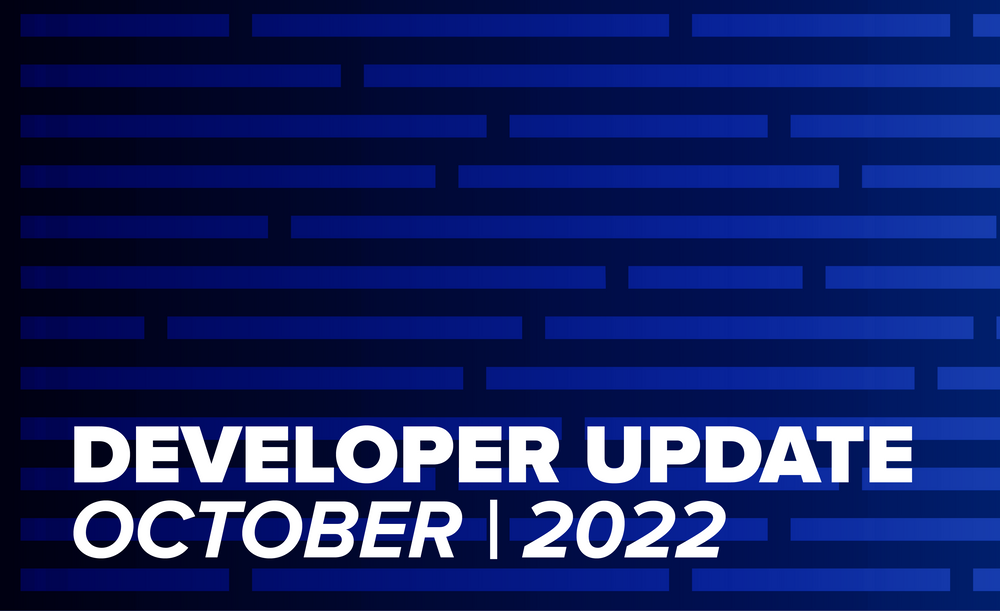
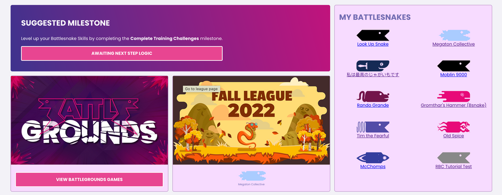
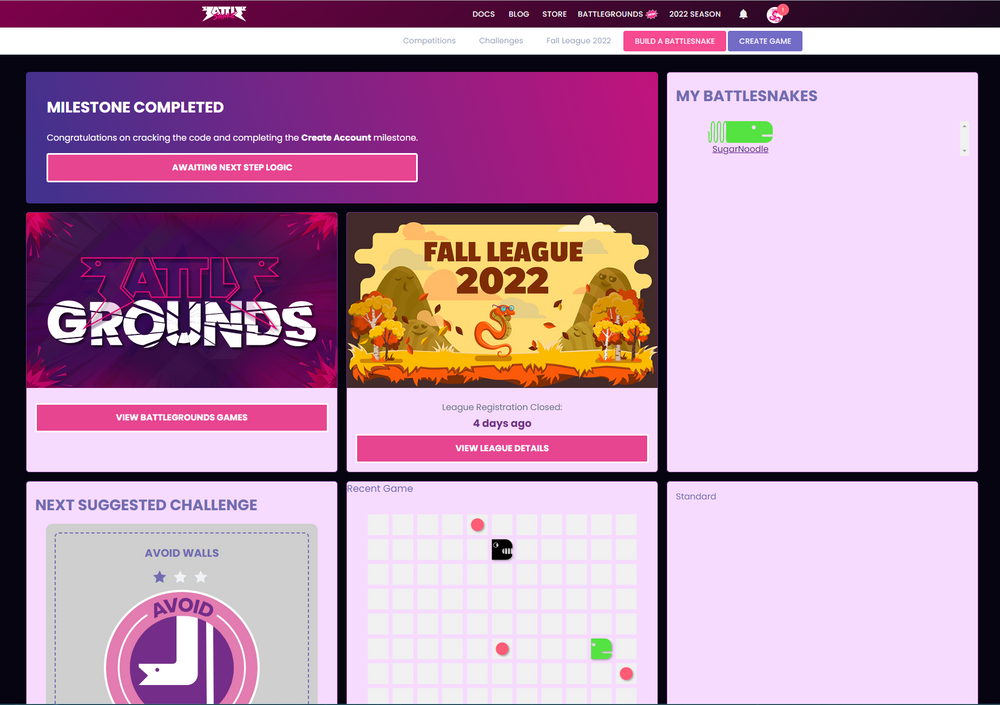
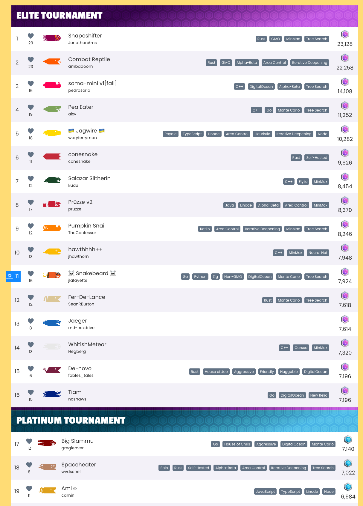
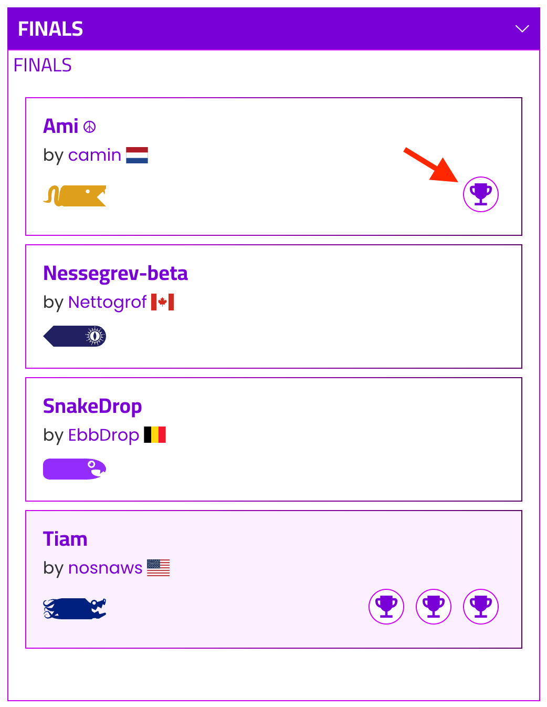

The team spent most of October running Fall League and working on some major new updates for the 2023 Competitive season that will be announced in December and January. Despite that we managed to get a few new improvements out for the platform.

## Account Dashboard

The new **Account Dashboard** is very close to an alpha release, which will likely go live in November. This new interface will serve to guide you along your Battlesnake journey, informing you of ongoing events, recent stats, and suggestions for what to try next.

The team will be iterating on the dashboard regularly over the coming months, adding components to give developers quick insight into how their Battlesnakes are performing. You can check it out for yourself by going to [https://play.battlesnake.com/account/dashboard](https://play.battlesnake.com/account/dashboard)

### Sneak Peak: Dark Mode!

We are actively replacing a lot of old infrastructure with a whole new UI/UX system on the Battlesnake platform. This will help us make the experience more consistent through our feature set and support things like dark mode!

## Weekly Ladder Notifications

In October we introduced new email notifications that summarize how your Battlesnake did over the last week in a league qualification ladder. This is the first in a set of new features we are implementing to give Battlesnake Developers more insight into how their Battlesnakes are performing on the platform. We hope to add more stats as well as some on-demand data that users can interact with in the future. 

In addition, we are building out notifications around tournaments to keep everyone up to date on how league tournaments progress, from qualifications to results. The first of these emails will be sent out when the Fall League Platinum tournament completes on November 3rd!

## League UI/UX Updates

The League Dashboards have got some upgrades! The elite and platinum qualification banners are now back on the leaderboard to help you quickly determine which Battlesnakes are opposing your entry to the tournament!

Speaking of tournaments we have made a long requested update to the tournament brackets. You can now click on the trophy icons on the brackets to review the game associated with that win. This lets developers easily review games in the context of the tournament! 

---

That's all for now. If you have any questions, reach out to us on the [Battlesnake Discord](https://discord.battlesnake.com/) server.
