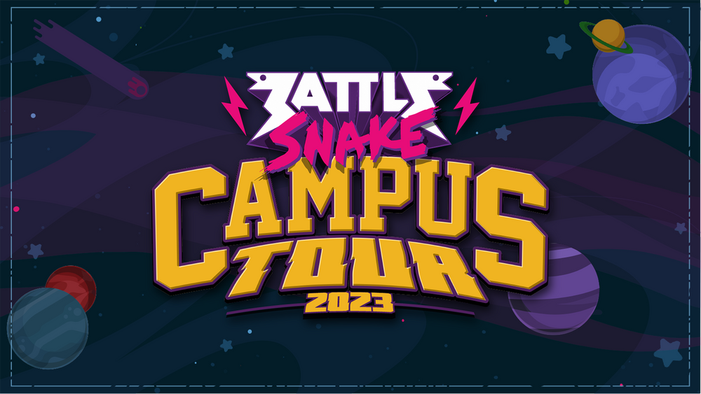

If you've ever wanted to host a Battlesnake hackathon at your North American college or university, there has never been a better time!

:::note TL;DR,

 **We're sponsoring student Battlesnake hackathons!**

:::

The [Battlesnake Campus Tour](http://bsnk.io/campus-tour) is a hackathon sponsorship with a twist. Recipients will receive up to **$2000 USD in funding, prizes, tools, mentors, and more.**

[Campus Tour](http://bsnk.io/campus-tour) sponsorship includes a ton of great benefits including mentors from Battlesnake

## We want to support your awesome event

The Campus Tour is open to anyone looking to run a hackathon for students at the college and university level in **North America **and includes:

- A sponsorship of up to $2000 USD for food, venue, prizes, etc.
- Promo materials crafted by our Design Team (cards, posters, etc.)
- Battlesnake Team mentors to assist you on-site the day of your hackathon.
- Access to the Battlesnake Tournaments tool—makes managing participants and tournament results a breeze!

### [CHECK OUT THE CAMPUS TOUR](http://bsnk.io/campus-tour)

---

### Don't Qualify? Host Your Own Tournament Instead!

If you don't fall into the perfect candidate for the Campus Tour, you can still request access to the Tournaments Tool. It handles registration, scoring, brackets, and allows you to run matches with just a few clicks! [Request access](http://bsnk.io/accesstournaments).

:::note Important Dates

The deadline to [apply](http://bsnk.io/campus-tour) for winter/spring semester is **November 30**, so don't delay!

:::

