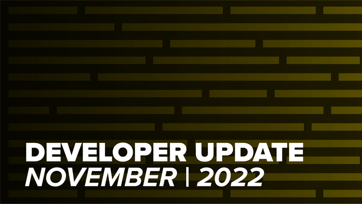

As Fall League finished up, the team was heads down working on infrastructure, with the biggest changes coming in the form of the new Rules 2.0 release!

## Rules 2.0 

We did a big cleanup of the [Rules](https://github.com/BattlesnakeOfficial/rules) project in November with the goal of making a 2.0 release. The goal of this cleanup was to remove a lot of legacy code and rework how the rulesets and maps work to make things a bit more intuitive. Although there are quite a few changes to the package's API, we ended up releasing this version as rules **`1.2.0`**instead, because of some awkward requirements around Go packaging.

### Updated Interface

The previous interface was a bit of a mess handling legacy support for the dedicated Ruleset types along with the newer pipeline approach. Rob went in and removed all the legacy interfaces and settings arguments and built out a simpler, unified ruleset interface along with a variety of easy to use helpers. These new helpers make it much easier to create new rulesets and GameMaps.

### TTLs!

We have added new internal fields for storing Time To Live values for food and hazards, along with generic storage data for maps. This provides a variety of new ways to power interesting Game Map functionality.

### New Pre-Update Hook

We worked with experienced Battlesnake Developers, [JonathanArns](https://play.battlesnake.com/u/jonathanarns/) and [coreyja](https://play.battlesnake.com/u/coreyja/), to add a new hook to the GameMap system to allow for board evaluation before the update step of the workflow runs. The new hook allows for new ways to manipulate state within a GameMap for more advanced map implementations.

### CLI Bug Fixes

We fixed a bug where the body of the last request (i.e. the `/end` request) wasn't being logged in the output file by the CLI.

You can check out all the code changes in the [Release Notes](https://github.com/BattlesnakeOfficial/rules/releases/tag/v1.2.0).

---

That's all for now. If you have any questions, reach out to us on the [Battlesnake Discord](https://discord.battlesnake.com/) server.
