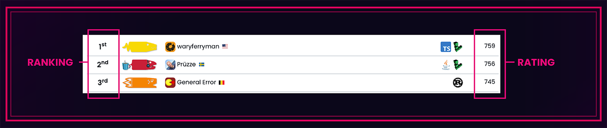
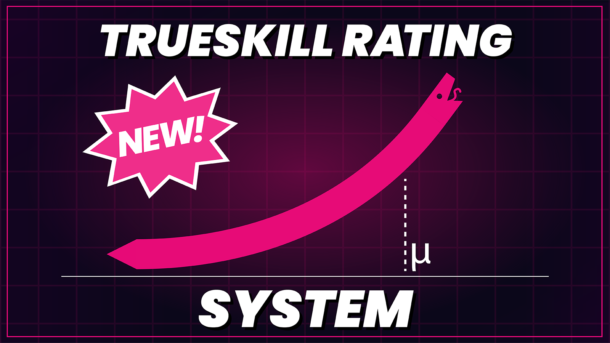

We're thrilled to *finally* be sharing the exciting changes we’ve made to Battlesnake including our website’s new look, new player ranking system, and a new way to compete!

<!--truncate-->

## All New Look.

“New year, new me,” as they say! But instead of getting a new haircut and 
some highlights (or frosted tips), we revamped the website’s visuals and streamlined its navigation. Give it a spin. Let us know what you think!

## Goodbye Leagues & Battlegrounds, 
Hello Leaderboards.

Today we’re launching a new way to play Battlesnake—[Leaderboards](https://play.battlesnake.com/leaderboards). With that we’ll be sun-setting Battlesnake Leagues and Battlegrounds—we'll cover what this all means below.

### **What's happening with Leagues?**

With the launch of Leaderboards, we're sadly saying goodbye to seasonal Leagues (for now).

Leagues were loads of fun and we know they’re a big hit with our more competitive community. We love producing them, and at the same time, they require a lot of effort to operate (stream production, partner relations, prizes, etc.). Seasonal Leagues also create timing barriers for developers that discover Battlesnake mid-league, which is no fun.

We very much hope to re-introduce live competitive play, analysis, tournaments, prizes, etc. into Leaderboard play in the future.

### What are Leaderboards?

[Battlesnake Leaderboards](https://play.battlesnake.com/leaderboards) are fully automated competitive ladders. They are replacing Battlegrounds, and operate in much the same way with a few notable differences. If you're familiar with Battlegrounds, you'll feel right at home in the new Leaderboards!

### **How do Leaderboards work?**

Leaderboards run a set number of games at a given time each day. Games are scored automatically and player ratings are updated daily. Players are then ranked according to their rating, and those ranks are displayed publicly.
**Rating**: The value your Battlesnake earns by winning Leaderboard games.‌ ‌**Ranking**: Refers to your standing in the Leaderboard compared to other developers, sorted by rating.

Each Leaderboard has its own unique game settings (map, board size, timeout, etc.). At the end of each month, developers will be awarded Battlesnake points based on their Leaderboard ranking. The exact distribution of points is still to be determined and will be something we experiment with over the next few months—so stay tuned.

As of today, **there are four [Leaderboards](https://play.battlesnake.com/leaderboards) available**: Standard, Duels, Royale, and Constrictor. You can enter **one Battlesnake** into **each Leaderboard**. We'll do our best to stagger matchmaking times to minimize your Battlesnakes being summoned into concurrent play.

### **How do ratings work?**

Leaderboards use an unmodified [TrueSkill](https://en.wikipedia.org/wiki/TrueSkill) algorithm to track and update player ratings. We've experimented with TrueSkill in the past, and we're excited to re-introduce it as our primary rating system.

### **Why not ELO?**

ELO was designed for 1v1 play, and Battlesnake is not a 1v1 game. TrueSkill was developed by Microsoft as an alternative to ELO specifically with 'free-for-all' and team play in mind, meaning it's a better fit for us. Both systems have strong R&D behind them and many years of use in large-scale gaming applications.

### **Will Leaderboards reset regularly like Battlegrounds?**

No. Leaderboards will remain active indefinitely, although points and achievements will be granted at the end of each month. With the new Trueskill system, there's **no disadvantage to joining a Leaderboard already in progress**, so we feel there's no need to reset them!

### **Will new maps and game modes be supported?**

Yes! We're launching four [Leaderboards](https://play.battlesnake.com/leaderboards) to start, using some of the more popular and hardened maps. We'll introduce additional Leaderboards throughout the year that will use newer and more complex Battlesnake maps.

## What’s on the horizon for Battlesnake? 

Over the coming months, you'll see a re-introduction of challenges, tournaments, and new game maps into the platform. We've stripped this functionality, for now, to make space to make larger changes to how they operate, but our plan is to bring them back bigger and better.

Battlesnake continues to be, above all, an incredible developer community that strives to be collaborative, inclusive, and a whole lot of fun for everyone. We're excited about these changes, and eager to get moving into 2023 and beyond.

📢

Join Brad and Chris this Thursday, Jan 19 on [Twitch](https://www.twitch.tv/BattlesnakeOfficial) @ 11am PT / 2pm ET for a Q&A about all things Battlesnake! If you can't make it but have a question for us, post it on Discord or leave it [here](https://docs.google.com/forms/d/e/1FAIpQLSd9WDDeRHRgV0SatqJ0t6VCcRUUzWp76Ml4-JkZ7-zw6dfdzQ/viewform?usp=sf_link).
