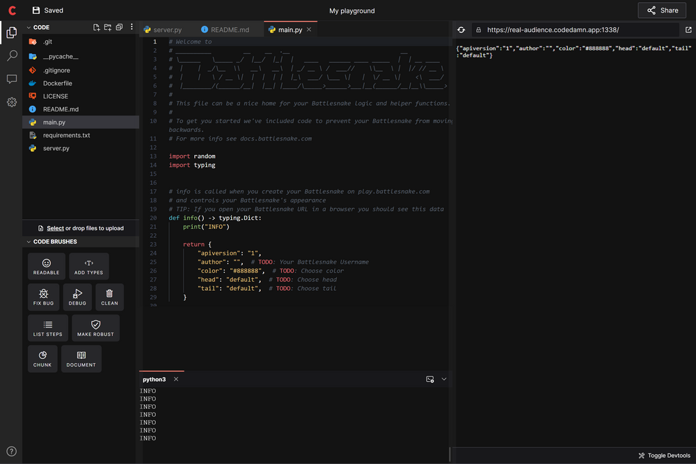
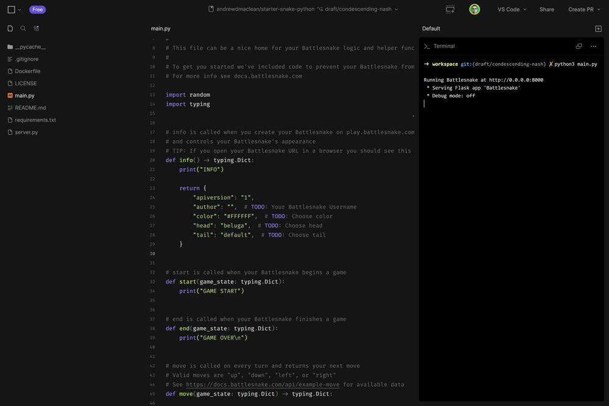
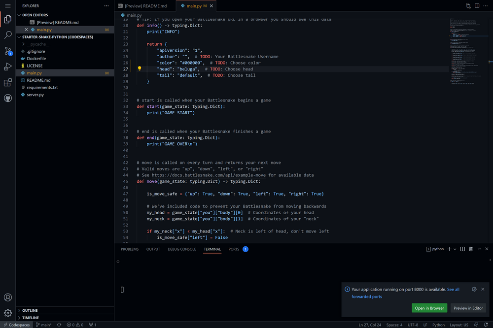
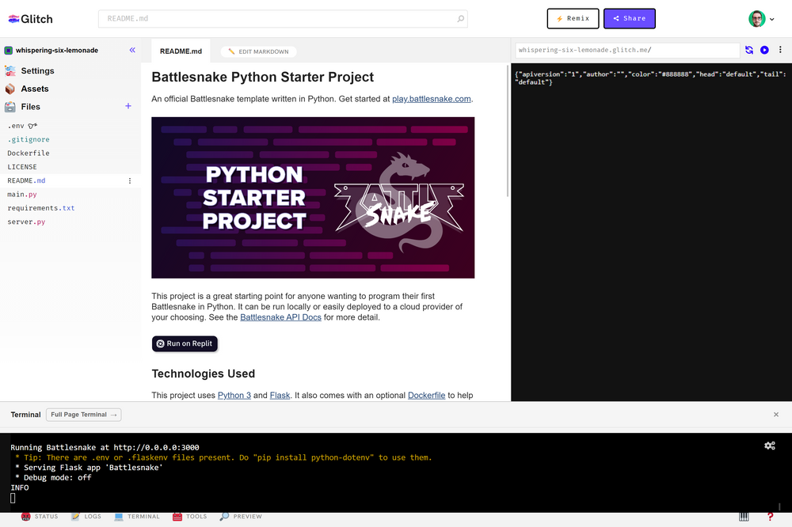
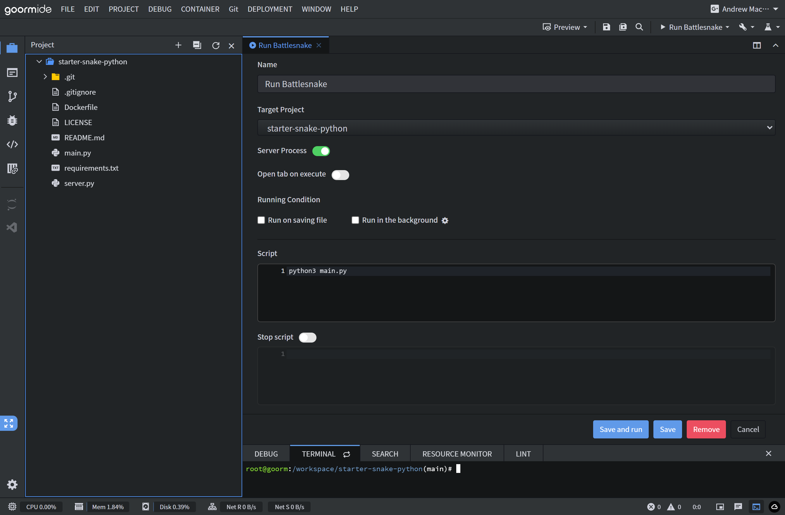
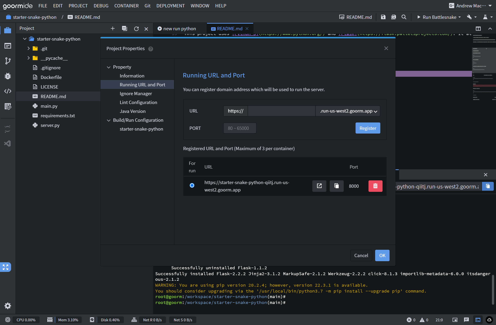
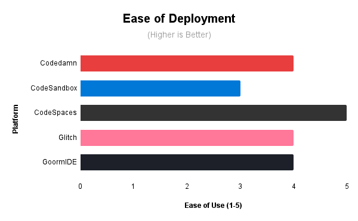
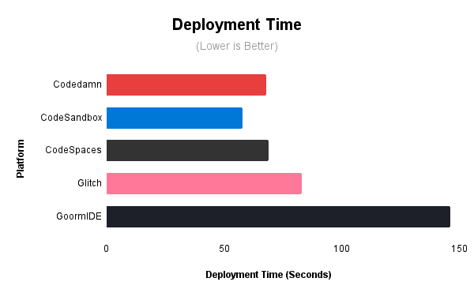

> Banner Art Generated from Blog Post title on NightCafe AI

---
  
Back in August, I published [a blog post](https://blog.battlesnake.com/comparing-5-free-hosting-tiers/) that reviewed deploying a simple Python web application, directly from a [GitHub template repository](https://github.com/BattlesnakeOfficial/starter-snake-python), on five platforms with free tiers: **GitPod**, **Heroku**, **Railway**, **Render**, and **Replit**.

While many things have changed in the intervening months, the steep learning curve between finding useful GitHub repositories and successfully deploying code remains the same, and for many of us doing so without handing over our credit card information has become even more important!

And so I'm back with a reprise, this time investigating the deployment of a simple Python web application in less than 5 minutes, on five new platforms with free tiers that also offer browser-based IDEs: **codedamn**, **CodeSandbox**, **Codespaces**, **Glitch** and **goormIDE**.

<!--truncate-->

---

> ## 👨‍💻 WHO AM I?

As a Community Manager for Battlesnake, hobbyist developer, and teacher, I regularly experience challenges when deploying and making changes to web services from GitHub. With lots of free options out there, I wanted to compare the deployment processes of different platforms for anyone looking to spin up and remix a live web server quickly straight from a GitHub repository.

---

> ## 📊 METHODOLOGY & METRICS

I compared each based on **deployment time**, **performance latency**, and **ease of use**. 

Each test began with a clean fork of the [Battlesnake Python Starter Snake Template](https://github.com/BattlesnakeOfficial/starter-snake-python) (a simple server that implements the Battlesnake API in Python). I was logged into all relevant platform accounts.

> '**Time to Deploy**': was measured from the dashboard creation method to the successful creation of a Battlesnake. (Slightly different than last time when we measured from new account sign-up and customization).

> '**Platform Latency**': was measured as reported by the Battlesnake game engine running in AWS US-WEST-2.

> '**Ease of Use**': was based on my overall experience on the platform using a 5-star scale. 1 start meaning "Very Difficult" and 5 stars "Very Easy". While subjective, I felt it important to include a measure of user experience in this process.

'**Platform Selection**': To be considered for testing, platforms needed:
- A free tier that can host a python web server
- An built-in IDE that requires only the browser
- The ability to deploy directly from a [GitHub template repository](https://github.com/BattlesnakeOfficial/starter-snake-python)
- No credit card required to get started

---

> ## 🚀 DEPLOYMENT TESTING

# codedamn (Playgrounds)
:::info 
[codedamn Playgrounds](https://codedamn.com/)  are free in-browser IDE environments. Use them to code collaboratively with your friends, without downloading anything on your computer.
:::



Learning to code is a challenging endeavor, let alone having to set up your local development environment in a way that accommodates the learning resource you are using. Enter codedamn Playgrounds, a tool that aims to make your developer learning experience as smooth as possible by providing an IDE which integrates directly with the curriculum.

While intended to be used with codedamn curriculum, however, Playgrounds (as it turns out) is also an incredibly powerful standalone tool, allowing you to quickly clone any public GitHub repository and get a web server running in minutes.

Unfortunately codedamn gets a bit ahead of itself with assumptions about the deployment process requirements for a selected GitHub repository, attempting to run the start command without having all the dependencies installed (or in fact even knowing the start command itself...).

Thankfully, after a quick `pip install -r requirements.txt` and a slight change to the port number in `server.py` (see below) we were able to resolve this issue and get our Python web server running smoothly with the `python3 main.py` command:

```python
port = int(os.environ.get("PORT", "8000"))
// Change this line to
port = int(os.environ.get("PORT", "1338"))
```

### 1️⃣ codedamn Review

🧮 **By the Numbers** 
> **Time to Deploy: ** 1 minute 08 seconds  
**Platform Latency: ** 286 ms  
**Ease of Use: **⭐⭐⭐⭐  

✅ **Things I liked:**
> - Curriculum resources
> - Sharability of Playgrounds
> - Integrated chat feature

❌ **Things I disliked:**
> - No ability to add environment variables
> - Attempt to auto-start Web Service
> - Lack of light mode

--- 

# CodeSandbox (Repositories)

:::info 
[CodeSandbox](https://codesandbox.io/) is a cloud development platform that empowers developers to code, collaborate and ship projects of any size from any device in record time.
:::



Sporting a similar aesthetic to a personal favorite from the last round of reviews (i.e. Railway), CodeSandbox can be found near the top of many lists of modern Cloud IDEs. With these lists having led me to CodeSandbox in the past, I was surprised upon importing the GitHub repository to find a new (and somewhat confusing) UI. After some troubleshooting and googling, it turned out the UI was not from a Sandbox at all, but rather from CodeSandbox's newest feature—Repositories.

Aiming to build on the success of their prototyping-focused *Sandboxes *(which landed them on those aforementioned top 10 lists), these new *Repositories* provide an experience centered on speed, collaboration, and various other features which support scalability and growth for full-stack app development.

Presenting a visually simplified UI compared to the original *Sandboxes*, it was here that the simplicity disappeared, with my deployment experience complicated by a lack of understanding of the differences between *Sandboxes* and *Repositories*, the role of branching, and most significantly Nix! 

> Alas, despite its ubiquity in Cloud IDEs today (looking at you Replit) the cross-platform package manager known as *Nix* leaves little to be desired for a novice web developer just looking to get a simple web server up and running.

Fortunately, after a few hours of research and troubleshooting I was able to overcome the seemingly never-ending issues with Nix, and with the commands below was able to get my Battlesnake server up and running fairly quickly:

```sh
nix-env -iA nixpkgs.python39Packages.pip
pip install --user -r requirements.txt
python3 main.py
```

### 2️⃣ CodeSandbox Review

🧮 **By the Numbers** 
> **Time to Deploy:** 58 seconds  
**Platform Latency:** 330 ms  
**Ease of Use: **⭐⭐⭐  

**✅ Things I liked:**
> - Slick modern UI
> - Collaboration features
> - Speedy deployment (following Nix setup)

**❌ Things I disliked:**
> - Nix
> - Automatic branching
> - Repository vs. Sandbox creation from GitHub

--- 

# Codespaces

:::info 
[GitHub Codespaces](https://github.com/features/codespaces) is an instant, cloud-based development environment that uses a container to provide you with common languages, tools, and utilities for development.
:::



While both of the previous platform's sported their own IDE design and feature set, it should be no surprise that Microsoft owned GitHub's entry into the Cloud IDE space would be based on their own proprietary software—namely VS Code.

Looking very similar to a Cloud IDE reviewed in the [last post](https://blog.battlesnake.com/comparing-5-free-hosting-tiers) (looking at you Gitpod), the main difference here (other than the ability to create an environment directly from a GitHub repository) is in the underlying infrastructure responsible for running the code you provide: Gitpod relying on Kubernetes and Codespaces using virtual machines, presumably hosted on Microsoft's Azure Cloud.

Aside from the above, if you enjoyed the experience in Gitpod (or indeed if you enjoy the local development experience using VS Code on your own device) there is little to dislike with Codespaces, with it even removing the need to run `pip install -r requirements.txt`.

One note if looking to use your Codespaces web server on a service outside of GitHub (i.e. Battlesnake) is that ports are `Private` by default. With this in mind, you will need to click on the PORTS tab at the bottom of the screen and change the visibility to `Public` in order to use your web server globally.

### 3️⃣ Codespaces Review

🧮 **By the Numbers** 
> **Time to Deploy:** 1 minute 09 seconds  
**Platform Latency:** 308 ms  
**Ease of Use:** ⭐⭐⭐⭐⭐  

**✅ Things I liked:**
> - Seamless GitHub Integration
> - Use of VS Code
> - Auto-installation of dependencies

**❌ Things I disliked:**
> - So-so server latency
> - No 'Deploy on Codespaces' button
> - Limited differentiation from Gitpod

--- 

# Glitch

:::info 
[Glitch](https://glitch.com/) provides a platform that brings their apps to life and simultaneously offers newcomers a broad foundation of examples to start their own adventures.
:::




While I had heard of Glitch in the past as a *fun* platform for front-end development and prototyping, I was surprised to discover when researching for this blog post that they had recently begun providing functionality for development of full APIs, including the ability to deploy a basic web server.

> With this discovery fresh in my mind, I knew that it had to be included in my review of Cloud IDEs! 

Although I didn't expect much from Glitch based on my previous experiences, I must say that I was pleasantly surprised during this review. Not only had they retained the fun and friendly aesthetic of the platform (along with its community centric nature and share-ability focus) but with only a few small changes to the commands in my Python template's `README.md` file (see below), I was able to get a Battlesnake web server up and running in minutes:

```sh
pip3 install -r requirements.txt
python3 main.py
```

### 4️⃣ Glitch Review

🧮 **By the Numbers** 
> **Time to Deploy:** 1 minute 23 seconds    
**Platform Latency:** 354 ms  
**Ease of Use:** ⭐⭐⭐⭐⭐

**✅ Things I liked:**
> - Intuitive UI & smooth UX
> - Community focus & sharability
> - Logging & status features

❌ **Things I disliked:**
> - So-so server latency
> - Generic help/support Pages
> - Lack of Git version control (although Rewind is cool!)

--- 

# goormIDE

:::info 
[goormIDE](https://ide.goorm.io/) is a cloud-based IDE solution designed to help developers and organizations of all sizes create web or mobile applications.
:::


This last Cloud IDE in the review is probably one that not many in North America have heard of—goormIDE. Yet despite this status as a relative unknown, its parent company goorm has been around since 2013 and has various services including goormEDU, goormLevel and goormDevth completing its family of services available to support developers of all skill levels.

With much of the platform and documentation available primarily in Korean, there was a bit of a learning curve to getting the server up and running with goormIDE. That said, after some troubleshooting (and lots of Google Translate), I was able to successfully navigate the feature set of this evidently powerful platform to get my Battlesnake running smoothly!

It is important to note that as part of this troubleshooting, I did need to manually setup the run command and change the port by selecting `PROJECT->Run->Add Run Command` and `PROJECT->Running URL and Port` from the top menu bar respectively (screenshots below with sample settings).

```
PROJECT->Run->Add Run Command
```
> Set as Server Process  
Set Script as `Python3 main.py`



```
PROJECT->Running URL and Port
```
> Add Port 8000




### 5️⃣ goormIDE Review

🧮 **By the Numbers** 
> **Time to Deploy:** 2 minutes 26 seconds  
**Platform Latency:** 41 ms  
**Ease of Use:** ⭐⭐⭐  

✅ **Things I liked:**
> - Ridiculously low latency
> - Scalability potential
> - Wider goorm ecosystem

❌ **Things I disliked:**
> - Seeming lack of global community
> - Inconsistent UX (sometimes worked, sometimes didn't)
> - Lack of responsiveness from support team

---

> ## 🏆 RESULTS & RECOMMENDATIONS

If you're looking to get started quickly from a GitHub template, all of the platforms I tested in both this and my [last blog post](https://blog.battlesnake.com/comparing-5-free-hosting-tiers/) provide more than enough power to get your project live and editable in less than 5 minutes without a credit card.

As with most modern PaaS offerings, modern Cloud IDE offerings are substantial. They are incredibly powerful and provide features for developers of all experience levels. That said, there are a few options you may want to consider first depending on your requirements.






:::tip My Personal Recommendation(s)

If you are getting started with a basic project, and are looking for an accessible and friendly community, `Glitch` is a great place to start, but if you are anticipating you project to grow in complexity, there is little doubt that `GitHub Codespaces` is the best choice for most.
:::


## Thanks for reading, good luck, and happy deployments! 👩‍💻