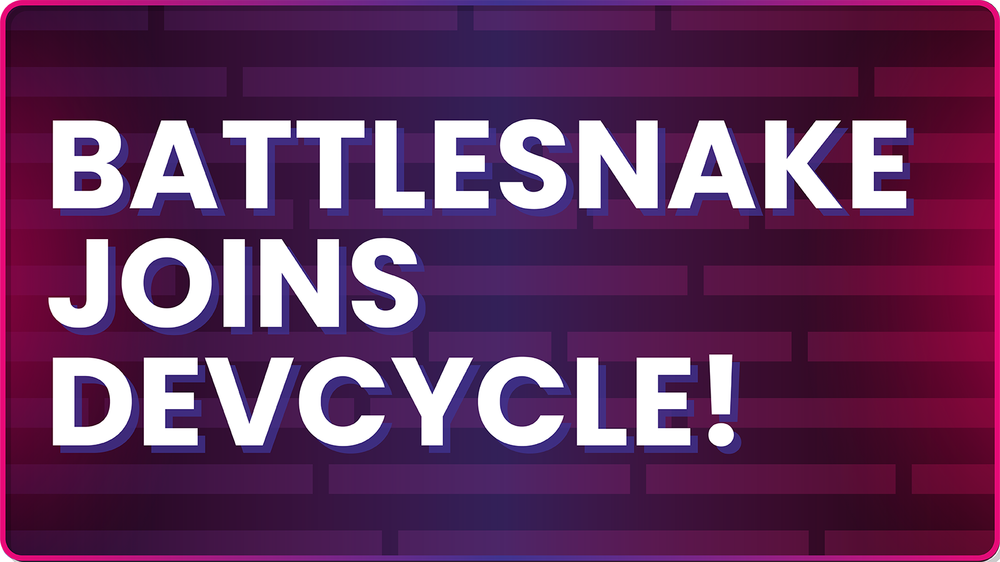

---

We’re very excited to announce that the Battlesnake team is joining [DevCycle](https://devcycle.com/?utm_source=Referral&utm_medium=battlesnake-blog&utm_campaign=acquisition-communication), a leading feature management company. Combined, we’ll be able to support developers from all experiences and backgrounds in becoming better programmers and delivering amazing products worldwide.

<!--truncate-->

### How we got here (and why we're so happy we did!)

Battlesnake was created as a means to connect professional developers with prospective employers. We were tired of employers making hiring decisions based on homework assignments and coding puzzles, and we wanted to create a way for developers to showcase their expertise on their own terms, and on their own schedule.

Since launch, Battlesnake has changed dramatically. Rather than being recruitment focused, it began filling a huge need for an overlooked audience—experienced developers wanting to learn and try something new. Modern programming education tends to be built for novices, not experts, and experienced programmers were coming to Battlesnake specifically to fill this need.

In many ways, Battlesnake evolved to become the “ultimate side project” for experienced developers. And we love that.

As a team, we decided we didn’t want Battlesnake to be another recruiting or personal data aggregation platform – and neither did our players. So instead, we adopted a new mission: to help every developer become a better developer. No recruiters, no data sharing or opt-ins, just awesome programmers building awesome things.

**Joining DevCycle allows us to continue supporting this vision for Battlesnake** as a safe place for experienced developers to learn, share, collaborate, and have fun programming.

### What does this mean for Battlesnake players?

* **The community will continue to be supported.** We’re excited to share that DevCycle will be supporting Battlesnake as part of the acquisition. Developers will still be able to play and compete just as always.

* **Battlesnake will continue to reflect our core values.** Our mission is to help every developer, become a better developer. We believe in supporting developers worldwide and building meaningful communities around programming. Our [mission, values](https://play.battlesnake.com/mission), and [privacy policy](https://play.battlesnake.com/privacy) will not change with this acquisition.

* **As we transition, there will be some changes.** In the upcoming months, some planned events and feature updates will be paused as we work through the transition. We can’t promise you it won’t be a bumpy ride, but we can promise to give Battlesnake the care it deserves.

* **The Battlesnake team isn't going anywhere!** You can find us on Discord, GitHub, and the odd Twitch stream. Reach out to us with any questions you have—just like always. We’d love to hear from you!

### Thank you, for helping us get here.

From day one, our community has been working with us to help shape Battlesnake into what it is today. Many of you have been with us for a long time. You’ve left us over 40,000 messages on Discord, watched our streams on YouTube and Twitch more than 50,000 times, and created over 1,000 public Battlesnake repositories on GitHub. Impressively, you show no signs of slowing down!

The impact your support has had on our team can not be understated. And while the competition is often fierce, you made sure it always remains friendly and welcoming for everyone. Thank you for attending our events, cheering along with our streams, creating amazing tools, and being genuinely awesome to one another.

**The Battlesnake Team**  
Brad, Chris, Aurora, Darcy, Rob, Sherri, Andrew, and Taraneh 💜🐍
