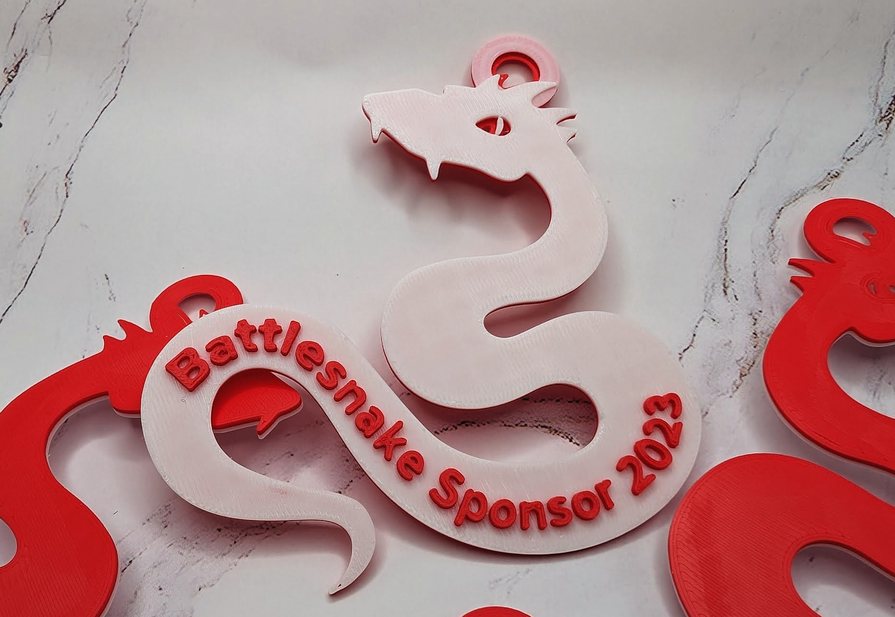

_**TL;DR -** Please consider [sponsoring Battlesnake on GitHub](https://github.com/sponsors/BattlesnakeOfficial) to keep us operational throughout 2024!_

A lot has happened in 2023, and I wanted to take a moment to discuss some important changes for next year.

Earlier this year [our team joined DevCycle](/blog/2023/03/06/battlesnake-is-joining-devcycle), and as a result, we stopped working on Battlesnake full-time. This significantly impacted our ability to produce seasonal leagues and other fun content. It was a good thing, in that we've had to focus on what makes Battlesnake most exciting, but also stressful since we weren't sure how the community would react (spoiler: y’all stuck with us 💃).

Since then, Chris, Kerri, myself, and a few core community members (thanks Rob, Andrew, Corey, Joe, Aileen, and Xtagon!) have kept Battlesnake operational while DevCycle paid our bills. It’s been convenient, but also not ideal, and a few months ago I decided to make a big change.

<!--truncate-->

## In 2024 we’re doing things differently.

For the first time ever, Battlesnake will operate entirely independently. No investors or corporate partners, just myself and a small team of core volunteers that want to make Battlesnake better _**on our own terms**_, with no outside demands or influence.

This is a big, scary change, but I believe it is the right one for this community that I've grown to love so much.

As part of this plan, Battlesnake is now solely responsible for our own expenses, including the hosting costs required to keep the game engines and servers running, the services required to operate, our annual accounting and legal fees, etc. This is where we need your help 🙂

## How you can support Battlesnake.

I'm humbly asking the community to help by considering sponsoring Battlesnake directly - either as an individual or an organization. I can’t offer much in return, apart from a promise that Battlesnake will continue to exist, and that I will continue to build it [in a way that I believe in](/policies/mission).

As part of this ask, I've enabled our [GitHub sponsorship page](https://github.com/sponsors/BattlesnakeOfficial) with some suggested amounts. If you’re having fun playing, or have enjoyed Battlesnake in the past, even a $5 or $10 subscription goes a long way. My immediate goal is $1,000/month to comfortably cover our operating costs. My ultimate goal is to get back to a place where I can work on Battlesnake full-time.

If you’re a supportive organization or tech company that would like to help, I’d be deeply grateful. I'm open to new ideas and we have a few unique rewards we can offer, such as custom designed Battlesnake heads and tails. To be clear though, we are not selling advertising slots or recruiting opportunities at this time.

Oganizations can support us through [GitHub sponsorship](https://github.com/sponsors/BattlesnakeOfficial) or by contacting me directly on [Discord](https://play.battlesnake.com/discord) or [Twitter](https://twitter.com/bvanvugt).

**To everyone that’s helped Battlesnake get to this point, I’m so very grateful.** It’s because of you all that I remain driven to build and grow this community - I believe that collectively, Battlesnake makes the world a better place 💜 🐍

---

## Update: Gifts for sponsors!

[Xtagon has been working hard](https://www.instagram.com/p/C0qHDlFryd1/) and has very kindly offered to create some 3D printed gifts for anyone that sponsors Battlesnake **before January 27th, 2024**! These look just _awesome_, and I can't wait to receive mine in the coming weeks 😍

Everyone who sponsors with a monthly subscription of $5 or more is eligible to receive a 3D printed Battlesnake!

**Further, the first 10 sponsors will also receive a bonus gift** &mdash; your very own first ever limited holiday edition (and possibly the only edition) "Battleflake"! (naming is hard, don't hate me.)

**Important Details:** Gifts are only available to US and Canadian residents, although this may change in the future. To claim yours, [sponsor BattlesnakeOfficial on GitHub](https://github.com/sponsors/BattlesnakeOfficial) with a monthly subscription of $5 or more before January 27th, 2024, and we'll be in touch at the end of January to collect shipping information. Supplies are not infinite, and if needed we'll be offering them to folks on a first-come-first-serve basis.

We really like this idea as a way to say thank you to the community for your support, and, if it goes well, we'll improve on it for next year 👍

If you have any questions or concerns, please reach out to Xtagon or myself on Discord!

Thanks!  
Brad
