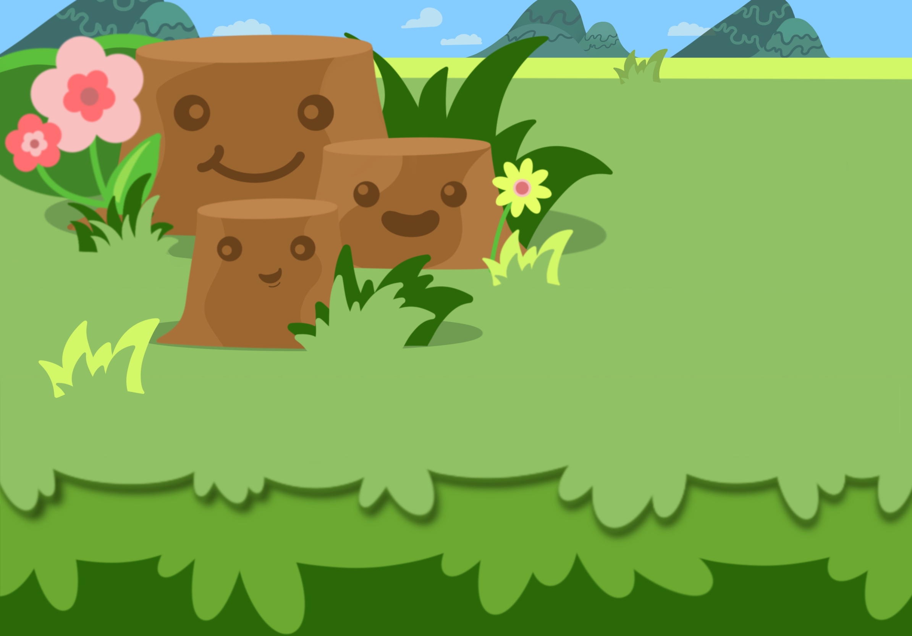

<!--  -->

## 2023 Community Tournament #2: Snail Mode

| **Primary Tournament Details** |                                                                      |
|--------------------------------|----------------------------------------------------------------------|
| Date                           | Saturday May 6th at 12pm EST                                         |
| Number of Competitors          | Up to 64                                                             |
| Registration Page              | Coming Soon!                                                         |

| **Second Chance Tournament Details** |                                                                      |
|--------------------------------|----------------------------------------------------------------------|
| Date                           | Saturday May 13th at 12pm EST                                         |
| Number of Competitors          | Up to 32 (Everyone knocked out in the first round of the 'Primary' Tournamnet)|

| **Game Mode Details** |                      |
|-----------------------|----------------------|
| Map                   | [Snail Mode](/guides/playing/maps.md#snail-mode-experimental)           |
| Board Size            | 11x11                |
| Number of Snakes      | 4                    |
| Game Mode             | Standard Non-Wrapped |

### Details

This will be our second community led tournament of 2023!
We are going to do Snail Mode again!!

This time we are going to be hosting TWO tournaments, on back to back weekends.
On **May 6th** we'll host the Primary Tournament with all competitors, up to 64!
We may run the first round of games off stream, but stay tuned for more details as
we see how the brackets fill out.

If you get eliminated in the first round on the 6th, don't worry! We've got a **Second Chance** Tournament on **May 13th**! We'll have a chance to see some of the snakes we didn't get a chance to see much last weekend.
